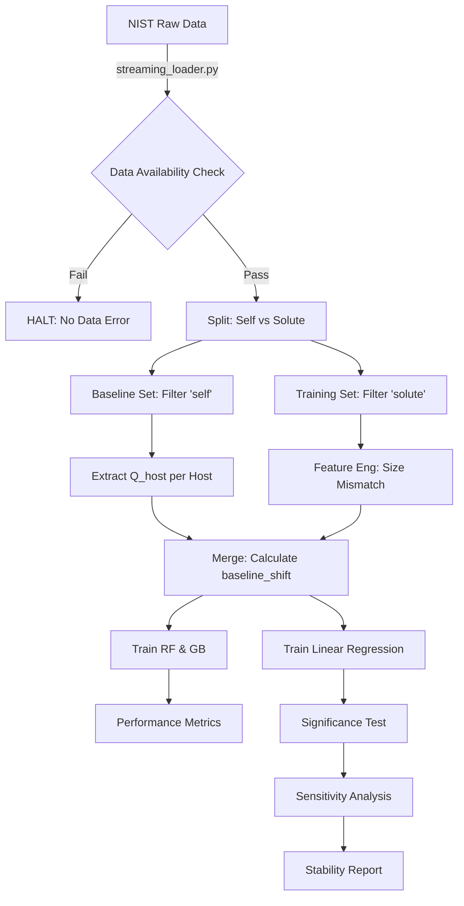

# Data Model: Predicting the Impact of Alloying on the Diffusion Activation Energy in FCC Metals

## Entity Definitions

### DiffusionRecord
Represents a single experimental data point.
*   **host_element**: string (e.g., "Ni", "Al")
*   **solute_element**: string (e.g., "Cu", "Fe")
*   **crystal_structure**: string (Enum: "FCC", "BCC", "HCP")
*   **diffusion_mode**: string (Enum: "self", "solute", "impurity")
*   **concentration_at_percent**: float
*   **activation_energy_eV**: float
*   **temperature_range_K**: string (optional, e.g., "800-1200")
*   **source_id**: string (Reference to original NIST entry)

### AtomicDescriptor
Computed features for a specific solute-host pair.
*   **host_radius_angstrom**: float
*   **solute_radius_angstrom**: float
*   **host_electronegativity**: float
*   **solute_electronegativity**: float
*   **size_mismatch**: float (Derived: `(solute_radius - host_radius) / host_radius`)
*   **electronegativity_diff**: float (Derived: `abs(host_electronegativity - solute_electronegativity)`)
*   **valence_electron_count**: int

### ModelArtifact
Representation of a trained model.
*   **model_type**: string (Enum: "RandomForest", "GradientBoosting", "LinearRegression")
*   **hyperparameters**: JSON object
*   **metrics**: JSON object (R², RMSE, MAE)
*   **coefficients**: JSON object (for Linear Regression)
*   **timestamp**: ISO8601
*   **seed**: int

## File Schema

### Input: `data/raw/nist_diffusion_raw.csv`
*   Source: NIST SRD 150 (or verified mirror).
*   Format: CSV.
*   Content: Raw experimental data.

### Output: `data/curated/baselines.csv`
*   **Filter Criteria**: `crystal_structure == "FCC"` AND `diffusion_mode == "self"`.
*   **Columns**:
    *   `host_element`
    *   `activation_energy_eV` (Pure host $Q_{host}$)

### Output: `data/curated/filtered.csv` (Single Source of Truth)
*   **Filter Criteria**: `crystal_structure == "FCC"` AND `diffusion_mode == "solute"`.
*   **Columns**:
    *   `host_element`
    *   `solute_element`
    *   `concentration_at_percent`
    *   `activation_energy_eV`
    *   `size_mismatch`
    *   `electronegativity_diff`
    *   `baseline_shift_eV` (Calculated: `activation_energy_eV` - `Q_host` from `baselines.csv`)

### Output: `models/final_rf.pkl`
*   Format: Pickle.
*   Content: Trained Random Forest model.

### Output: `models/linear_coef.json`
*   Format: JSON.
*   Content: Coefficients, p-values, and confidence intervals.

### Output: `validation/stability_index_report.json`
*   Format: JSON.
*   Content: Threshold sweep data and calculated stability index.

## Data Flow Diagram

## Assumptions & Constraints

*   **Atomic Radii**: Derived from a fixed version of the `periodictable` library (0.20.1).
*   **Baseline**: Pure host activation energy is sourced from `diffusion_mode == 'self'` rows in the same dataset.
*   **No PII**: No personally identifiable information is present in scientific diffusion data.