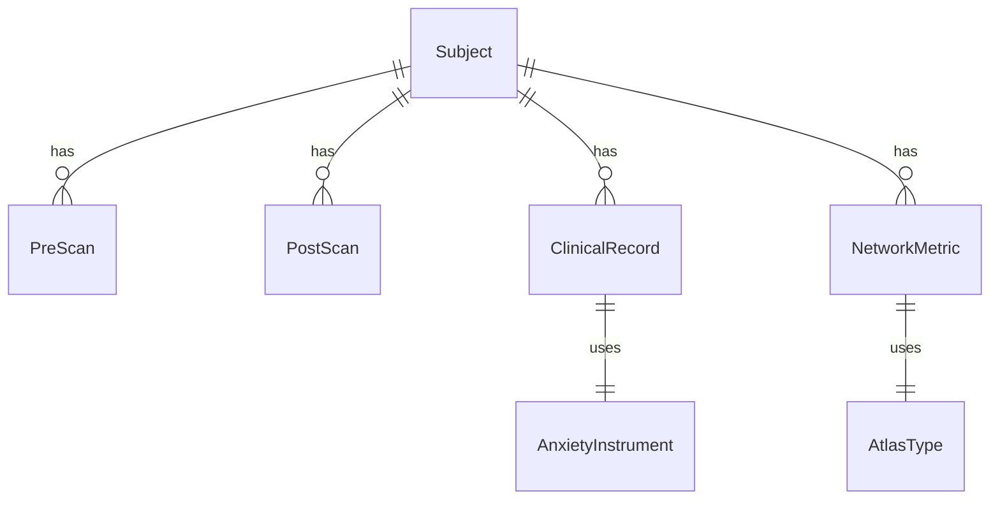

# Data Model: Investigate Brain Network Dynamics and VR Therapy Response

## Entity Relationship Diagram (Conceptual)

## Core Entities

### 1. Subject
Represents a single participant in the study.
- `subject_id` (string): Unique identifier (e.g., `sub-001`).
- `age` (int): Age in years.
- `gender` (string): 'M', 'F', 'Other'.
- `medication_status` (string): 'None', 'SSRI', 'Benzodiazepine', 'Unknown'.
- `exclusion_reason` (string or null): Reason for exclusion (e.g., "Motion > 3mm").

### 2. Scan
Represents a pre- or post-treatment fMRI scan.
- `scan_id` (string): Unique identifier.
- `subject_id` (string): FK to Subject.
- `timepoint` (string): 'pre' or 'post'.
- `file_path` (string): Path to NIfTI file.
- `motion_fd` (float): Mean Framewise Displacement.
- `quality_flag` (boolean): True if quality passes (motion < threshold).

### 3. ClinicalRecord
Represents clinical assessment scores.
- `record_id` (string): Unique identifier.
- `subject_id` (string): FK to Subject.
- `timepoint` (string): 'pre' or 'post'.
- `instrument` (string): 'GAD-7', 'HAM-A'.
- `score` (float): Raw score.
- `validation_status` (string): 'Validated', 'Invalid' (if instrument not in whitelist).

### 4. NetworkMetric
Represents computed graph-theoretic metrics.
- `metric_id` (string): Unique identifier.
- `subject_id` (string): FK to Subject.
- `timepoint` (string): 'pre' (baseline metrics used for prediction).
- `atlas` (string): 'AAL', 'Schaefer-100', 'Schaefer-200'.
- `modularity_q` (float): Modularity value.
- `global_efficiency` (float): Global efficiency.
- `local_efficiency` (float): Local efficiency.
- `connectivity_matrix_path` (string): Path to the correlation matrix file.

### 5. AnalysisResult
Represents the output of the statistical model.
- `result_id` (string): Unique identifier.
- `model_type` (string): 'ANCOVA', 'Ridge', 'Univariate', 'PCA'.
- `predictor` (string): e.g., 'modularity_q' or 'PC1'.
- `coefficient` (float): Beta coefficient.
- `p_value_uncorrected` (float).
- `p_value_corrected` (float).
- `effect_size_cohen_d` (float).
- `vif` (float or null).

### 6. TreatmentResponse
Represents the clinical outcome (Change Score) for reporting.
- `subject_id` (string): FK to Subject.
- `pre_score` (float): Pre-treatment score.
- `post_score` (float): Post-treatment score.
- `delta_score` (float): Change score ($Y_{post} - Y_{pre}$).
- `instrument` (string): 'GAD-7', 'HAM-A'.

**Note on Outcome Definition**: The primary regression model uses $Y_{post}$ as the outcome to avoid regression to the mean artifacts. The `TreatmentResponse` entity (change score) is used for descriptive reporting and visualization only.

## File Formats

- **Raw Data**: NIfTI (`.nii.gz`) stored in `data/raw/`.
- **Processed Data**: NIfTI (`.nii.gz`) stored in `data/processed/`.
- **Metrics**: CSV (`data/metrics/network_metrics.csv`) with columns: `subject_id, atlas, modularity_q, global_efficiency, local_efficiency`.
- **Clinical Data**: CSV (`data/metrics/clinical_scores.csv`) with columns: `subject_id, timepoint, instrument, score`.
- **Results**: JSON (`reports/statistical_results.json`) and Markdown (`reports/sensitivity_analysis.md`).
- **Verified Sources**: JSON (`data/verified_sources.json`) with dataset ID and validation log.