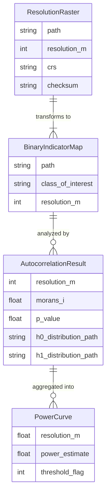

# Data Model: Assessing the Impact of Data Resolution on Statistical Power

## Overview

This document defines the data structures, file formats, and schemas used in the project. All data is stored locally in the `data/` directory.

## Entity Relationship Diagram (Conceptual)

## Data Files & Formats

### 1. Raw Input Data
-   **File**: `data/raw/nlcd_30m_co.tif`
-   **Format**: GeoTIFF
-   **Schema**:
    -   `band_1`: Integer (Land Cover Class ID)
    -   `crs`: EPSG:5070 (NAD83 / Conus Albers)
    -   `resolution`: 30 meters

### 2. Derived Rasters
-   **Pattern**: `data/derived/nlcd_{resolution}m_co.tif`
-   **Resolutions**: 60, 120, 240, 480
-   **Format**: GeoTIFF
-   **Transformation**: Nearest-neighbor resampling from 30m source.

### 3. Binary Indicator Maps
-   **Pattern**: `data/derived/binary_{class}_{resolution}m_co.tif`
-   **Values**: 0 (Other), 1 (Class of Interest, e.g., Forest)
-   **Format**: GeoTIFF (Byte/Int16)

### 4. Analysis Results (CSV)
-   **File**: `data/results/morans_i_results.csv`
-   **Columns**:
    -   `resolution_m` (int)
    -   `observed_morans_i` (float)
    -   `p_value` (float)
    -   `n_permutations` (int)
    -   `power_estimate` (float)
    -   `threshold_below_080` (bool)

### 5. Power Curve Data
-   **File**: `data/results/power_curve.csv`
-   **Columns**:
    -   `resolution_m` (int)
    -   `power` (float)
    -   `is_below_threshold` (bool)

## Checksums

All files in `data/` are checksummed using SHA-256. The manifest is stored in `state/`.
