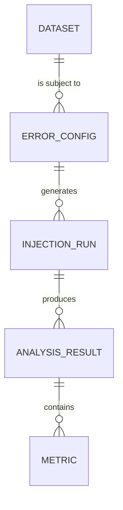

# Data Model: Evaluating the Robustness of Statistical Methods to Common Data Errors

## Overview

This document defines the data structures used throughout the simulation pipeline. The model supports the ingestion of raw datasets, the configuration of error injection, and the storage of simulation results.

## Entity Relationship Diagram (Conceptual)

## Core Entities

### 1. Dataset
Represents a source of data (clean or corrupted).
- **id**: Unique identifier (e.g., `uci-har-001`).
- **source_url**: Verified URL from which the dataset was downloaded.
- **type**: `numerical`, `categorical`, `mixed`.
- **checksum**: SHA-256 hash of the raw file.
- **parameters**: Dictionary of ground-truth parameters (if synthetic) or sample stats (if real).

### 2. ErrorConfiguration
Defines the parameters for a specific error injection run.
- **error_type**: `replacement`, `misclassification`, `mcar`.
- **rate**: Float (0.01, 0.05, 0.10, 0.20).
- **seed**: Integer for reproducibility.
- **target_columns**: List of column names to apply error to.

### 3. InferenceResult
A single record of a statistical test performed on a dataset.
- **dataset_id**: Reference to the dataset used.
- **config_id**: Reference to the error configuration used.
- **test_type**: `t-test`, `anova`, `chi-squared`, `linear_regression`.
- **p_value**: Float.
- **ci_lower**: Float.
- **ci_upper**: Float.
- **effect_size_estimate**: Float (e.g., Cohen's d, beta coefficient).
- **type_i_event**: Boolean (True if $p < 0.05$ and Null is True).
- **ci_covered**: Boolean (True if CI contains true parameter).

## File Formats

### Input: Raw Datasets
- **Format**: CSV or Parquet.
- **Structure**: Tabular data with headers. No nested structures.

### Output: Simulation Results (JSON)
- **Format**: JSON Lines (`.jsonl`) or a single JSON array.
- **Structure**: Array of `InferenceResult` objects.

### Output: Visualization Data (CSV)
- **Format**: CSV.
- **Structure**: Aggregated metrics (Error Rate vs. Type I Error Rate) for plotting.

## Constraints & Validation
- **Rate**: Must be in $[0.0, 1.0]$.
- **Seed**: Must be a positive integer.
- **Test Type**: Must be one of the four specified types.
- **Data Integrity**: All derived files must reference the checksum of their source.
