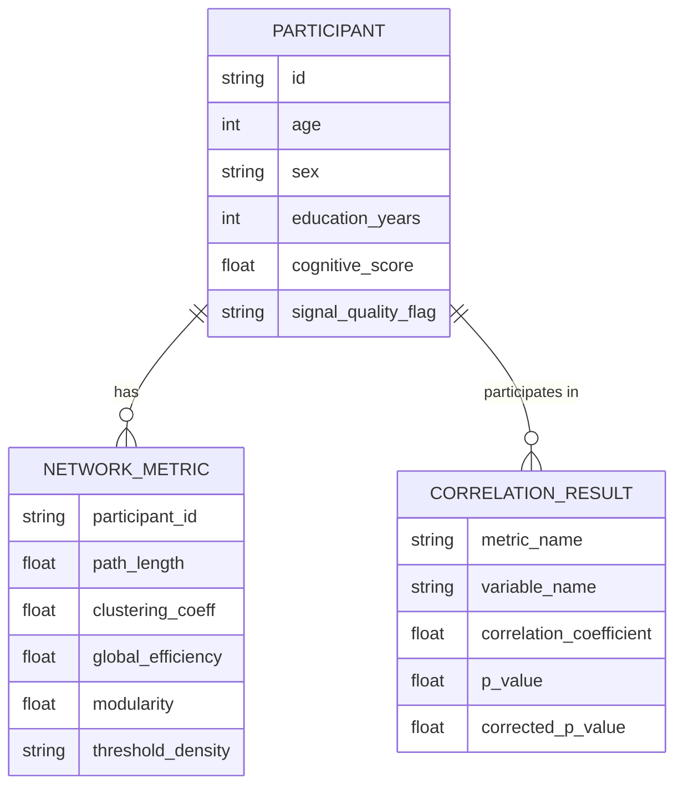

# Data Model: The Impact of Network Efficiency on Age-Related Changes in Resting-State EEG

## Entity Relationship Diagram (Conceptual)

## Data Flow

1.  **Raw Input**: The TUH EEG Corpus is distributed as EDF/JSON/Text files. The `01_download_data.py` script fetches these raw files and converts them to Parquet format for efficient I/O and batch processing.
2.  **Processed**: `data/processed/metrics.csv` (One row per participant).
3.  **Results**: `results/correlations.json`, `results/regression_summary.json`.

## Schema Definitions

### Participant Metadata
- `id`: Unique string identifier.
- `age`: Integer (years).
- `sex`: String ("M", "F", "Other").
- `education_years`: Integer.
- `cognitive_score`: Float (MMSE/MoCA) or `null`.
- `signal_quality_flag`: String ("Valid", "Low SNR", "Excessive Artifact").

### Network Metrics
- `path_length`: Float.
- `clustering_coeff`: Float.
- `global_efficiency`: Float.
- `modularity`: Float.
- `threshold_density`: Float (e.g., 0.1).

### Statistical Results
- `metric_name`: String (e.g., "global_efficiency").
- `variable_name`: String (e.g., "age").
- `correlation_coefficient`: Float.
- `p_value`: Float.
- `corrected_p_value`: Float (Bonferroni adjusted).