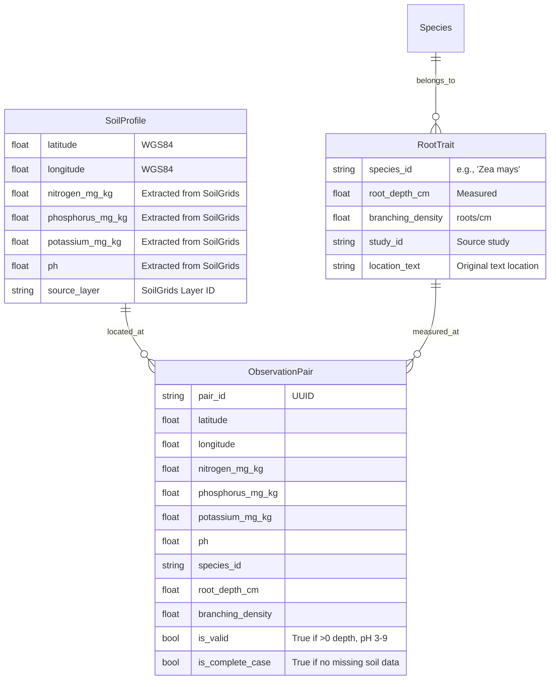

# Data Model: Predicting Plant Root Architecture from Soil Nutrient Profiles

## Entity Relationship Diagram (Conceptual)

## Data Dictionary

### SoilProfile
| Attribute | Type | Description | Constraints |
|-----------|------|-------------|-------------|
| latitude | float | WGS84 Latitude | [-90, 90] |
| longitude | float | WGS84 Longitude | [-180, 180] |
| nitrogen_mg_kg | float | Total Nitrogen | ≥ 0 |
| phosphorus_mg_kg | float | Available Phosphorus | ≥ 0 |
| potassium_mg_kg | float | Available Potassium | ≥ 0 |
| ph | float | Soil pH | [3.0, 9.0] |

### RootTrait
| Attribute | Type | Description | Constraints |
|-----------|------|-------------|-------------|
| species_id | string | Species Name | Non-empty |
| root_depth_cm | float | Max rooting depth | > 0 |
| branching_density | float | Roots per cm | ≥ 0 |
| study_id | string | Source identifier | Non-empty |

### ObservationPair (Merged)
| Attribute | Type | Description | Constraints |
|-----------|------|-------------|-------------|
| pair_id | string | Unique ID | UUID |
| latitude | float | Coordinated | [-90, 90] |
| longitude | float | Coordinated | [-180, 180] |
| nitrogen_mg_kg | float | Soil N | ≥ 0 |
| phosphorus_mg_kg | float | Soil P | ≥ 0 |
| potassium_mg_kg | float | Soil K | ≥ 0 |
| ph | float | Soil pH | [3.0, 9.0] |
| species_id | string | Species | Non-empty |
| root_depth_cm | float | Target 1 | > 0 |
| branching_density | float | Target 2 | ≥ 0 |
| is_valid | boolean | Filter flag | True if all non-null & plausible |
| is_complete_case | boolean | Missing data flag | True if no soil "No Data" values |

## Data Flow

1.  **Ingestion**:
    *   `Raw Soil Raster` + `Coordinates` -> `Extracted Soil Values` (SoilProfile)
    *   `Raw Trait CSV` -> `Filtered Trait Records` (RootTrait)
2.  **Alignment**:
    *   `SoilProfile` + `RootTrait` (via Coordinates) -> `ObservationPair`
3.  **Validation**:
    *   `ObservationPair` -> Filtered Dataset (where `is_valid` = True AND `is_complete_case` = True for primary analysis)
    *   Excluded records logged separately.
4.  **Modeling**:
    *   Filtered Dataset -> `Features` (N, P, K, pH, Species) + `Targets` (Depth, Branching)
    *   Output: `Model Artifacts` + `Metrics`