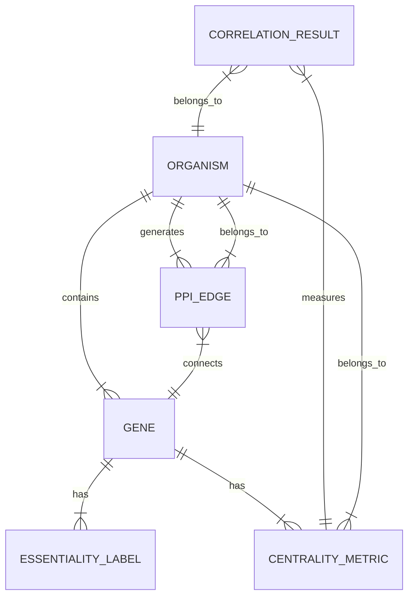

# Data Model: Predicting Gene Essentiality from Protein Interaction Network Topology

## 1. Entity Relationship Diagram (Conceptual)

## 2. Data Schema Definitions

### 2.1 Organism Profile
Represents a single species configuration.
- `organism_id`: string (e.g., "9606" for Human)
- `scientific_name`: string
- `common_name`: string
- `phylogenetic_position`: string (for PGLS)

### 2.2 Gene Node
A node in the PPI network.
- `gene_id`: string (mapped identifier)
- `essentiality`: integer (0=Non-essential, 1=Essential)
- `degree_centrality`: float
- `betweenness_centrality`: float
- `eigenvector_centrality`: float

### 2.3 PPI Edge
An interaction between two proteins.
- `source_gene`: string
- `target_gene`: string
- `confidence_score`: integer (0-1000)

### 2.4 Correlation Result
Aggregated statistical output.
- `organism_id`: string
- `metric_type`: string (degree, betweenness, eigenvector)
- `threshold`: integer
- `spearman_rho`: float
- `p_value`: float
- `sample_size`: integer
- `significant`: boolean

## 3. Data Flow

1.  **Raw Input**: `raw/string_[org].tsv`, `raw/deg_[org].csv`
2.  **Mapping**: `processed/mapped_genes_[org].csv` (joined on Ensembl ID)
3.  **Graph Construction**: `processed/graph_[org].graphml` (NetworkX object serialized)
4.  **Metrics**: `processed/centrality_[org].csv`
5.  **Results**: `results/correlation_summary.csv`, `results/pgls_output.csv`

## 4. Constraints & Validation
- **Uniqueness**: `gene_id` must be unique within an organism's mapped dataset.
- **Range**: `confidence_score` must be 0-1000.
- **Completeness**: `essentiality` must be 0 or 1; missing values trigger exclusion.
- **Connectivity**: Graphs with < 500 edges trigger a "Sparse Network" warning but proceed.
