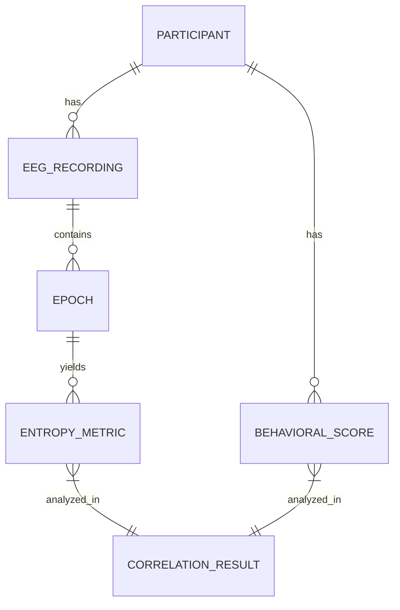

# Data Model: Neural Entropy and Cognitive Flexibility

## Overview

This document defines the data structures, schemas, and flow for the neural entropy analysis pipeline. All data is stored in the `data/` directory, with raw data immutable and derived data versioned.

## Entity Relationship Diagram (Conceptual)

## Data Entities

### 1. Participant
*   **ID**: `participant_id` (String)
*   **Attributes**: `age` (Int), `education_years` (Int), `neurological_condition` (Boolean), `medication_status` (String), `dataset_source` (String)

### 2. EEG Recording
*   **ID**: `recording_id` (String)
*   **Attributes**: `sampling_rate` (Float), `duration_seconds` (Float), `channel_count` (Int), `quality_flag` (Enum: Pass/Fail)
*   **Derived**: `snr_db` (Float) - Median SNR relative to 1-45 Hz band power.

### 3. Epoch
*   **ID**: `epoch_id` (String)
*   **Attributes**: `start_time` (Float), `duration` (Float), `artifact_rejected` (Boolean)

### 4. Entropy Metric
*   **ID**: `metric_id` (String)
*   **Attributes**: `participant_id`, `frequency_band` (Enum: delta, theta, alpha, beta, gamma), `entropy_type` (Enum: sampen, apen), `value` (Float)

### 5. Behavioral Score
*   **ID**: `score_id` (String)
*   **Attributes**: `participant_id`, `wcst_perseverative_errors` (Int), `task_accuracy` (Float), `test_type` (String)

### 6. Correlation Result
*   **ID**: `result_id` (String)
*   **Attributes**: `entropy_band`, `entropy_type`, `partial_r` (Float), `p_value` (Float), `p_value_fdr` (Float), `covariates_used` (List), `vif` (Float)

## File Formats

*   **Raw Data**: Parquet (compressed) or CSV.
*   **Derived Data**: Parquet (for efficiency) or JSONL.
*   **Config**: YAML.

## Data Flow

1.  **Ingest**: Download from verified HuggingFace URLs -> `data/raw/`.
2.  **Preprocess**: Filter, ICA, Epoch -> `data/processed/`.
3.  **Compute**: Entropy -> `data/derived/entropy.parquet`.
4.  **Analyze**: OLS, FDR -> `data/derived/correlations.parquet`.
5.  **Report**: Aggregate -> `data/derived/report.json`.