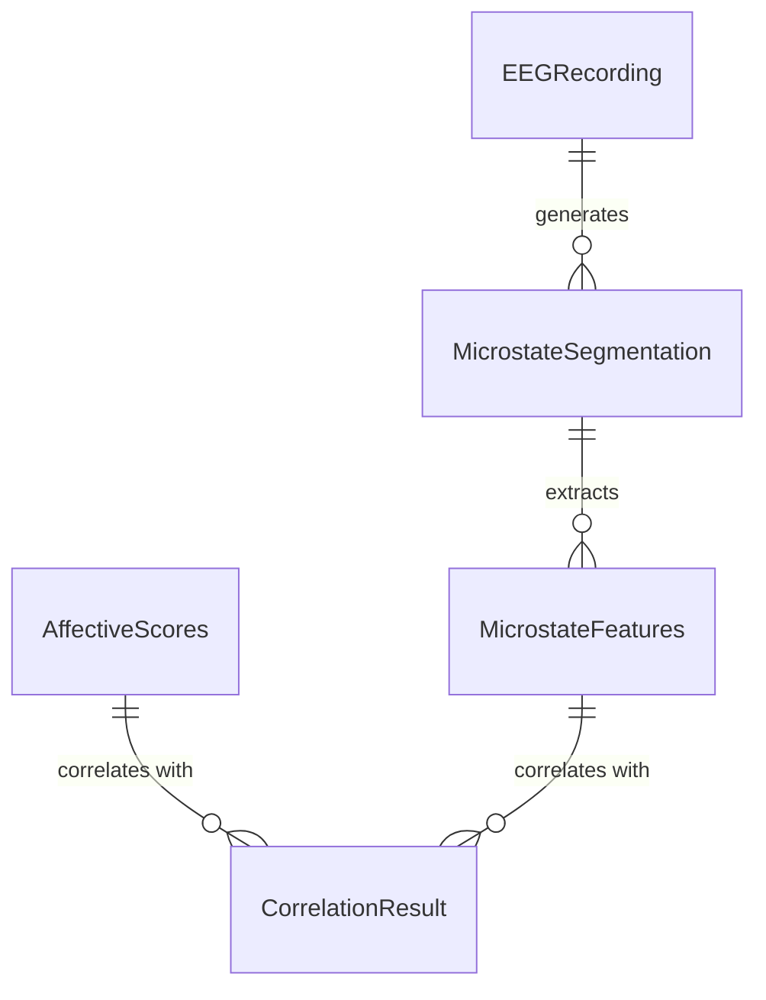

# Data Model: Decoding Affective State from Resting-State EEG Microstates

## 1. Entity Relationship Diagram (Conceptual)

## 2. Entity Definitions

### EEGRecording
*Raw input data.*
- `subject_id`: string (Unique identifier)
- `dataset_source`: string (e.g., "openneuro_ds003501")
- `sampling_rate`: int (Hz, ≥128)
- `duration_seconds`: float
- `electrode_count`: int
- `file_path`: string (Local path to raw file)
- `checksum`: string (SHA-256 of raw file)

### MicrostateSegmentation
*Intermediate processed data.*
- `subject_id`: string
- `class_labels`: array of int (Timepoint labels 0-3)
- `global_explained_variance`: float (GEV, ≥0.75)
- `convergence_iterations`: int
- `filter_params`: object (e.g., `{"low": 1, "high": 40}`)
- `ica_components_removed`: array of int
- `template_source`: string (e.g., "literature_lehmann_2024")

### MicrostateFeatures
*Extracted metrics.*
- `subject_id`: string
- `microstate_class`: int (0-3)
- `mean_duration_ms`: float
- `occurrence_rate_per_s`: float
- `coverage_percent`: float
- `transition_probabilities`: array of float (16 values, flattened 4x4)

### AffectiveScores
*Questionnaire data.*
- `subject_id`: string
- `valence_score`: float (1-9)
- `arousal_score`: float (1-9)
- `instrument_type`: string (PANAS, SAM)
- `completion_timestamp`: string (ISO8601)
- `completion_rate`: float (≥0.80)

### CorrelationResult
*Final analysis output.*
- `microstate_class`: int
- `feature_type`: string (duration, occurrence, coverage, transition)
- `affective_dimension`: string (valence, arousal)
- `correlation_coefficient`: float (r)
- `p_value`: float (uncorrected)
- `p_corrected`: float (Holm-Bonferroni or FDR)
- `effect_size`: float (Cohen's d)
- `confidence_interval`: object (`{"lower": float, "upper": float}`)
- `analysis_type`: string ("associational")
- `bootstrap_stability`: object (`{"mean": float, "std": float, "ci_95": [float, float], "n_subjects": int, "stability_flag": string}`)
- `sensitivity_sweep`: object (optional, results from threshold sweep)

## 3. Data Flow

1.  **Ingestion**: `EEGRecording` loaded from verified URLs.
2.  **Validation**: Check for linked `AffectiveScores`. If missing, halt correlation phase.
3.  **Preprocessing**: `EEGRecording` → `MicrostateSegmentation` (Filter, ICA, Re-ref, Template Apply).
4.  **Segmentation**: `MicrostateSegmentation` → `MicrostateFeatures` (Feature calc).
5.  **Join**: `MicrostateFeatures` joined with `AffectiveScores` on `subject_id`.
6.  **Analysis**: Join result → `CorrelationResult` (Corr, Holm/FDR, Bootstrap, Sensitivity).
7.  **Output**: `CorrelationResult` saved to CSV/JSON and validated against schema.
