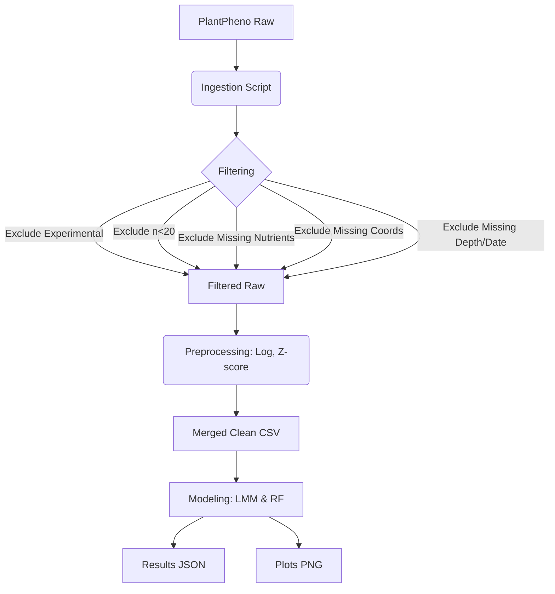

# Data Model: 001-predict-root-architecture

## Entity Relationship Diagram (Conceptual)

The data model consists of three primary entities: `RootPhenotypeRecord`, `SoilNutrientRecord`, and `MergedDataset`.

1.  **RootPhenotypeRecord**: Represents a single root architecture observation.
2.  **SoilNutrientRecord**: Represents soil chemical properties at a specific location.
3.  **MergedDataset**: The joined entity containing both root metrics and nutrient levels, plus metadata.

## Schema Definitions

### 1. RootPhenotypeRecord
*Source*: PlantPheno (Hugging Face)
*   `species` (string): Taxonomic name of the plant.
*   `root_length` (float): Total root length (mm or cm).
*   `branching_density` (float): Number of branches per unit length.
*   `surface_area` (float): Total root surface area.
*   `experimental_id` (string): Unique identifier for the experimental run.
*   `data_source_type` (string): "observational" or "experimental".
*   `latitude` (float): Geographic latitude.
*   `longitude` (float): Geographic longitude.

### 2. SoilNutrientRecord
*Source*: PlantPheno (if P/N present) or Verified Fallback
*   `phosphorus_concentration` (float): P concentration (mg/kg).
*   `nitrogen_concentration` (float): N concentration (mg/kg).
*   `latitude` (float): Geographic latitude.
*   `longitude` (float): Geographic longitude.
*   `depth` (float): Soil depth (cm).
*   `measurement_date` (string): Date of measurement.

### 3. MergedDataset (Processed)
*Target*: `data/processed/merged_clean.csv`
*   `species` (string): Categorical.
*   `root_length_log` (float): Log-transformed root length.
*   `branching_density_log` (float): Log-transformed branching density.
*   `surface_area_log` (float): Log-transformed root surface area.
*   `phosphorus_z` (float): Z-score normalized P.
*   `nitrogen_z` (float): Z-score normalized N.
*   `species_id` (int): Integer encoding for random effects.
*   `data_source_type` (string): Filtered to "observational" only.
*   `latitude` (float): Geographic latitude (required for geospatial logic).
*   `longitude` (float): Geographic longitude (required for geospatial logic).

## Preprocessing Pipeline

1.  **Ingestion**: Load raw data from Hugging Face.
2.  **Filtering**:
    *   Exclude rows where `phosphorus_concentration` or `nitrogen_concentration` is null (no imputation). Log exclusion count.
    *   Exclude rows where `data_source_type` == "experimental" (FR-012). **Log exclusion count**.
    *   Exclude rows where `latitude` or `longitude` is missing (cannot perform geospatial merge). Log exclusion count.
    *   Group by `species`; exclude groups with count < 20 (FR-001). Log exclusion count.
    *   **Handle `depth` and `measurement_date`**: If these fields are present in the source data but not required for the final model, they are dropped. If they are required for geospatial matching (e.g., to filter by depth), they are used in the filtering step. If they are missing and required, the record is excluded.
3.  **Transformation**:
    *   **Log-Transform**: `log(root_metric + 1e-6)` to handle zeros (FR-003).
    *   **Normalization**: `z_score(nutrient)` globally across all species.
    *   **No Imputation**: Missing nutrient values result in row exclusion.
4.  **Encoding**: Convert `species` to integer for model input.

## Logging Requirements

The ingestion and preprocessing scripts must log the following exclusion counts:
*   Number of species excluded due to n < 20.
*   Number of rows excluded due to missing P/N values.
*   Number of rows excluded due to experimental data type.
*   Number of rows excluded due to missing coordinates.
*   Number of rows excluded due to missing `depth` or `measurement_date` (if required).
*   Total number of rows in the final cleaned dataset.

Example log output:
```
[INFO] Ingestion started.
[INFO] Loaded PlantPheno: 5000 rows.
[INFO] Merging datasets...
[INFO] Merged dataset: 5000 rows.
[INFO] Filtering experimental data...
[INFO] Excluded 500 rows (experimental).
[INFO] Filtering missing nutrients...
[INFO] Excluded 1000 rows (missing P/N).
[INFO] Filtering missing coordinates...
[INFO] Excluded 200 rows (missing lat/lon).
[INFO] Filtering missing depth/date...
[INFO] Excluded 50 rows (missing depth/date).
[INFO] Filtering species with n < 20...
[INFO] Excluded 20 species (100 rows).
[INFO] Final dataset: 3200 rows.
```

## Data Flow

