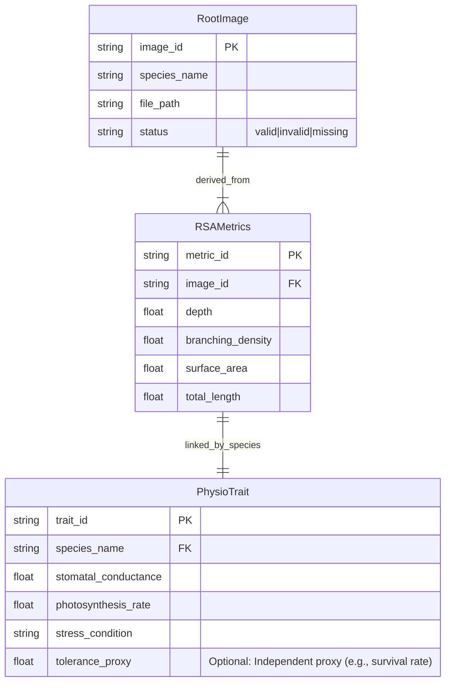

# Data Model: Predicting Plant Drought Tolerance from RSA Data

## Entity Relationship Overview

The data model consists of three primary entities: `RootImage`, `RSAMetrics`, and `PhysioTrait`. These are linked via `species` and `image_id`.

## Schema Definitions

### 1. RootImage (Raw Input)
- **Source**: Local file system or NPPN (if available).
- **Format**: PNG/JPG.
- **Metadata**: `image_id` (derived from filename), `species_name` (parsed from filename or metadata).

### 2. RSAMetrics (Derived)
- **Source**: `extract_rsa.py` output.
- **Format**: CSV.
- **Columns**:
  - `image_id`: Unique identifier (string).
  - `species_name`: Species name (string).
  - `depth`: Maximum root depth (mm).
  - `branching_density`: Number of branches per unit length (branches/mm).
  - `surface_area`: Estimated root surface area (mm²).
  - `total_length`: Total root length (mm).

### 3. PhysioTrait (External)
- **Source**: TRY database (`try.csv`).
- **Format**: CSV.
- **Columns**:
  - `species_name`: Species name (string, primary key for joining).
  - `stomatal_conductance`: Stomatal conductance (mol m⁻² s⁻¹).
  - `photosynthesis_rate`: Photosynthetic rate (µmol m⁻² s⁻¹).
  - `stress_condition`: "water_stress" or "optimal" (string).
  - `tolerance_proxy`: Optional independent measure of drought tolerance (float).

### 4. MergedDataset (Analysis Ready)
- **Source**: `merge_data.py`.
- **Format**: CSV.
- **Columns**:
  - `species_name`: Join key.
  - `depth`, `branching_density`, `surface_area`: RSA features.
  - `total_length`: Size control covariate.
  - `stomatal_conductance`, `photosynthesis_rate`: Targets.
  - `drought_tolerance_class`: **Optional**. Binary (0/1) derived from `tolerance_proxy` median split. Only present if `tolerance_proxy` exists.
  - `pca_components`: JSON string or separate columns (PC1, PC2, ...) if PCA applied.
  - `phylo_eigen_vectors`: **Optional**. Eigenvectors used in PVR if Open Tree of Life API fails.

## Data Flow

1. **Ingestion**: Raw images -> `data/raw/nppn_images/`.
2. **Extraction**: Images -> `data/derived/rsametrics.csv`.
3. **Merge**: `rsametrics.csv` + `try.csv` -> `data/derived/merged_data.csv`.
4. **Transformation**: `merged_data.csv` -> `data/derived/pca_components.csv` (if collinearity detected).
5. **Model Input**: `pca_components.csv` or `merged_data.csv` -> Model Training.