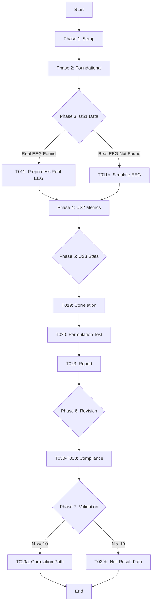
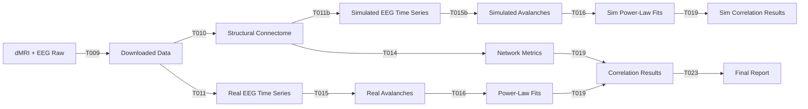

# Workflow Diagram

## High-Level Pipeline

## Data Flow

## Component Interactions

- **T009** (Download) → **T010** (Preprocess dMRI)
- **T010** → **T011** (Real EEG) OR **T011b** (Sim EEG)
- **T011** → **T015** (Real Avalanches)
- **T011b** → **T015b** (Sim Avalanches)
- **T010** & **T015/T015b** → **T014** & **T016** (Metrics & Fitting)
- **T014** & **T016** → **T019** (Stats)
- **T019** → **T020** (Permutation) → **T023** (Report)
- **T023** → **T029a/T029b** (Validation)

## Parallel Execution Opportunities

- **Phase 1**: T001, T002, T003 (Setup)
- **Phase 2**: T004, T005, T006, T007, T008 (Foundational)
- **Phase 3**: T009, T010, T011, T011b (US1 - conditional paths)
- **Phase 4**: T014, T015, T015b, T016 (US2 - independent metric computation)
- **Phase 5**: T019, T020, T021, T022 (US3 - sequential dependencies)
