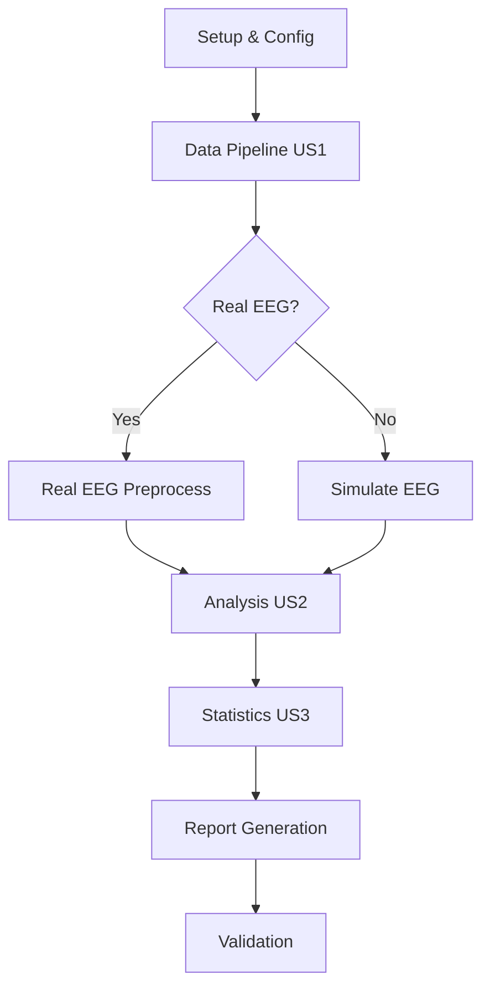

# System Architecture

## High-Level Overview

The pipeline is designed as a modular, stage-based workflow. Each stage corresponds to a User Story and can be executed independently or as part of the full chain.

## Module Responsibilities

### 1. `code/config.py`
- **Role**: Central configuration hub.
- **Responsibilities**: Defines paths, seeds, and Wilson-Cowan parameters. Ensures deterministic runs.

### 2. `code/data/` (US1)
- **Role**: Data acquisition and preprocessing.
- **Modules**:
 - `download.py`: Fetches raw dMRI/EEG. Implements fallback logic.
 - `preprocess_dMRI.py`: Converts tractography to adjacency matrices.
 - `simulate_EEG.py`: Generates synthetic time-series.
 - `store.py`: Persists processed data to disk.

### 3. `code/analysis/` (US2 & US3)
- **Role**: Metric computation and statistical inference.
- **Modules**:
 - `metrics.py`: Graph theory metrics (Degree, Clustering, Rich-Club).
 - `avalanches.py`: Spatiotemporal event detection.
 - `fitting.py`: Power-law model fitting.
 - `stats.py`: Correlation, permutation tests, VIF.
 - `sensitivity.py`: Threshold robustness sweep.
 - `report.py`: Final report generation with causal language check.

### 4. `code/utils/`
- **Role**: Shared utilities.
- **Modules**:
 - `logger.py`: Structured logging and custom exceptions.
 - `env_config.py`: Environment variable management.
 - `data_setup.py`: Checksum verification.

### 5. `code/main.py`
- **Role**: Orchestration.
- **Responsibilities**: Parses arguments, runs the pipeline stages, handles the "Null Result Protocol" if N < 10.

## Data Flow

1. **Input**: Raw dMRI (`.tck`) and EEG (`.fif`) in `data/raw/`.
2. **Processing**:
 - dMRI -> `preprocess_dMRI.py` -> `data/processed/connectomes/` (`.npy`).
 - EEG -> `simulate_EEG.py` -> `data/processed/eeg/` (`.csv`).
3. **Analysis**:
 - Connectomes -> `metrics.py` -> `data/results/metrics.csv`.
 - EEG -> `avalanches.py` -> `data/results/avalanches/`.
 - Metrics + Fits -> `stats.py` -> `data/results/correlation_report.csv`.
4. **Output**: `data/results/report.md`.

## Error Handling Strategy

- **Fail Loudly**: If real data is required but missing, raise `DataLoadError` immediately.
- **Graceful Degradation**: If real EEG is missing, switch to simulation (primary path).
- **Validation**: If N < 10, trigger `run_null_result_protocol` to generate a null report instead of a correlation report.
