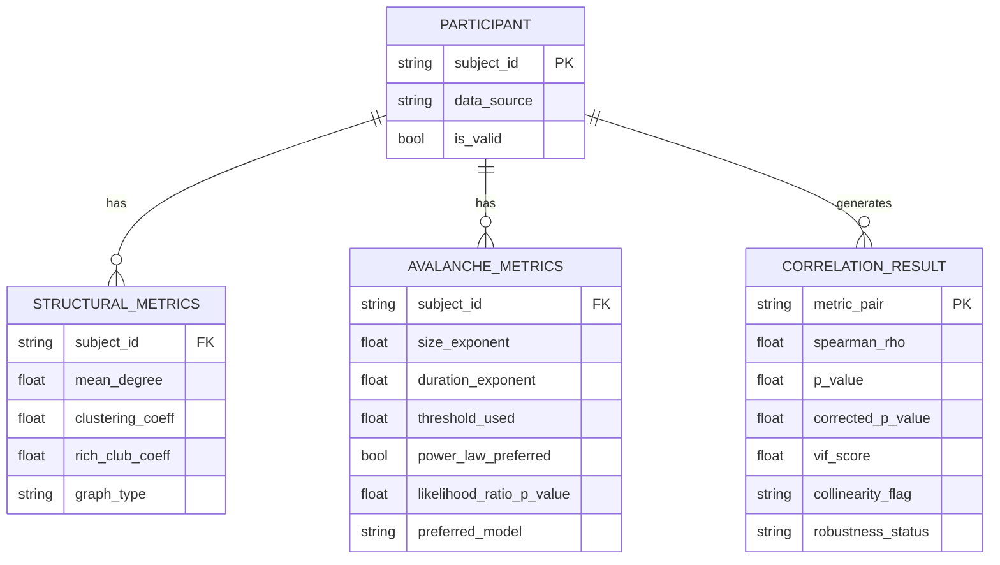

# Data Model: Investigating the Impact of Network Structure on Neural Avalanche Dynamics

## 1. Entity Relationship Overview

The data model centers on the **Participant** entity, linking structural and simulated functional data.

## 2. Detailed Data Definitions

### 2.1 Participant
- `subject_id`: Unique identifier (string).
- `data_source`: Source dataset name (e.g., "OpenNeuro-ds003813").
- `is_valid`: Boolean flag indicating if the participant passed quality control (e.g., sufficient data, connected graph).

### 2.2 Structural Metrics
- `mean_degree`: Average node degree in the structural connectome.
- `clustering_coeff`: Mean clustering coefficient.
- `rich_club_coeff`: Rich-club coefficient at a specific k-level (or mean).
- `graph_type`: "weighted" or "binary".

### 2.3 Avalanche Metrics
- `size_exponent`: Scaling exponent (τ) for avalanche size distribution.
- `duration_exponent`: Scaling exponent (α) for avalanche duration distribution.
- `threshold_used`: The percentile threshold used (e.g., 0.75).
- `power_law_preferred`: Boolean indicating if the power-law model was statistically preferred over exponential/log-normal.
- `likelihood_ratio_p_value`: P-value from the likelihood ratio test comparing power-law to alternative models.
- `preferred_model`: Name of the preferred model ("power_law", "exponential", "log_normal").

### 2.4 Correlation Results
- `metric_pair`: Name of the pair (e.g., "degree_vs_size_exponent").
- `spearman_rho`: Correlation coefficient.
- `p_value`: Raw p-value.
- `corrected_p_value`: Permutation-corrected p-value.
- `vif_score`: Variance Inflation Factor if applicable.
- `collinearity_flag`: "high_collinearity" if VIF ≥ 5, else "low_collinearity".
- `robustness_status`: "stable", "sensitive", or "inconclusive".

## 3. File Formats

- **Input**: BIDS (dMRI), JSON (per-subject metrics).
- **Intermediate**: JSON (per-subject metrics), Pickle (preprocessed EEG epochs - if RAM allows, else JSON).
- **Output**: CSV (aggregated results), YAML (summary statistics).