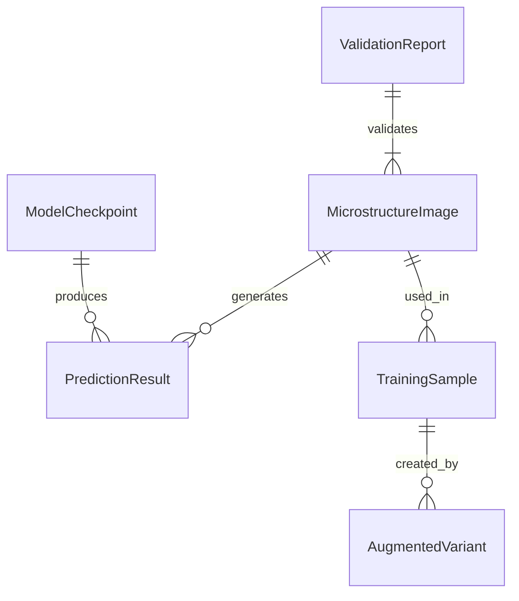

# Data Model: Predicting Material Strength from Microstructure Images

## Entity Relationship Diagram (Conceptual)

## Core Entities

### MicrostructureImage
Represents a 2D EBSD map of a polycrystalline material.
*   **id**: `str` (UUID, derived from filename)
*   **filepath**: `str` (relative path in `data/raw/` or `data/processed/`)
*   **width**: `int` (224 after preprocessing)
*   **height**: `int` (224 after preprocessing)
*   **bit_depth**: `int` (8)
*   **grain_size_mean**: `float` (optional, if available in metadata)
*   **yield_strength**: `float` (Target variable, MPa)
*   **split**: `enum` ("train", "val", "test")

### PredictionResult
Output of the model inference.
*   **image_id**: `str`
*   **predicted_strength**: `float` (MPa)
*   **actual_strength**: `float` (MPa)
*   **error**: `float` (predicted - actual)
*   **squared_error**: `float`
*   **confidence_interval**: `tuple(float, float)` (95% CI)
*   **heatmap_path**: `str` (path to Grad-CAM overlay)

### ValidationReport
Summary of data integrity checks.
*   **total_images**: `int`
*   **valid_pairs**: `int`
*   **invalid_pairs**: `int`
*   **invalid_ratio**: `float`
*   **status**: `enum` ("PASS", "FAIL")
*   **errors**: `list(str)` (list of specific error messages)

## Data Flow

1.  **Ingestion**: Raw ZIP -> `MicrostructureImage` (raw).
2.  **Validation**: `MicrostructureImage` -> `ValidationReport`.
3.  **Preprocessing**: `MicrostructureImage` (raw) -> `MicrostructureImage` (processed, 224x224).
4.  **Augmentation**: `MicrostructureImage` (processed) -> `AugmentedVariant` (on-the-fly).
5.  **Training**: `AugmentedVariant` -> `ModelCheckpoint`.
6.  **Inference**: `ModelCheckpoint` + `MicrostructureImage` (test) -> `PredictionResult`.

## Storage Schema

*   **Raw Data**: `data/raw/data_synth_ebsd.zip` (unchanged).
*   **Processed Data**: `data/processed/` (directory structure: `train/`, `val/`, `test/`).
*   **Manifest**: `data/processed/manifest.json` (JSON list of `MicrostructureImage` records).
*   **Results**: `results/` (JSON/CSV for metrics, PNG for heatmaps).
