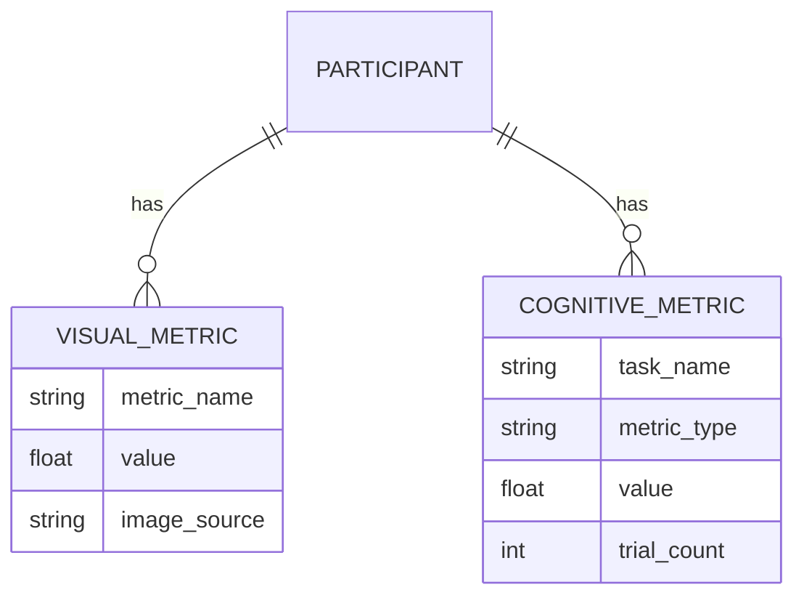

# Data Model: The Impact of Visual Distraction on Cognitive Control in Remote Work Environments

## Overview

This document defines the data structures used throughout the project, from raw ingestion to final analysis output. The model is designed to support the synthetic data generation strategy while remaining compatible with real-world data if available.

## Entity-Relationship Diagram

## Schema Definitions

### 1. Participant Record (Intermediate)

Represents a single unit of analysis after data merging. Includes metadata required by Constitution Principle VII (Ecological Sampling Integrity).

| Field | Type | Description | Constraints |
| :--- | :--- | :--- | :--- |
| `participant_id` | `string` | Unique identifier (e.g., "P001") | PK, Not Null |
| `reaction_time` | `float` | Mean reaction time (ms) | ≥ 0, ≤ 5% missing |
| `accuracy` | `float` | Mean accuracy (0.0 - 1.0) | [0.0, 1.0], ≤ 5% missing |
| `error_rate` | `float` | 1 - accuracy | Derived |
| `workspace_image_path` | `string` | Relative path to image | Not Null |
| `lighting_condition` | `string` | Simulated lighting (low/medium/high) | Required for Principle VII |
| `room_type` | `string` | Simulated room type | Required for Principle VII |
| `demographic_group` | `string` | Simulated demographic group | Required for Principle VII |

### 2. Visual Complexity Metrics (Derived)

Computed per participant.

| Field | Type | Description | Constraints |
| :--- | :--- | :--- | :--- |
| `participant_id` | `string` | FK to Participant | PK |
| `edge_density` | `float` | Normalized edge proportion | [0.0, 1.0] |
| `color_entropy` | `float` | Shannon entropy of color hist. | ≥ 0.0 |
| `object_count` | `int` | Count of detected objects | ≥ 0, Can be NaN if detection fails |

### 3. Analysis Output (Final)

Results of the statistical pipeline.

| Field | Type | Description |
| :--- | :--- | :--- |
| `metric_pair` | `string` | e.g., "edge_density_vs_reaction_time" |
| `correlation_r` | `float` | Pearson r value |
| `p_value_raw` | `float` | Raw p-value |
| `p_value_adj` | `float` | Holm-Bonferroni adjusted p-value |
| `beta_coef` | `float` | Regression coefficient (if significant) |
| `ci_lower` | `float` | 95% CI lower bound |
| `ci_upper` | `float` | 95% CI upper bound |
| `bootstrap_ci` | `list` | [lower, upper] from 1000 resamples |
| `vif_score` | `float` | Variance Inflation Factor (if multi-reg) |
| `pca_component_1` | `float` | First principal component score (if VIF ≥ 5) |

## Data Flow

1.  **Ingestion**: Synthetic generator creates `raw/participants.csv` and `raw/images/` (using Pillow).
2.  **Processing**: `02_visual_metrics.py` reads images, computes metrics, writes `processed/visual_metrics.csv`.
3.  **Merging**: `01_data_acquisition.py` merges participant cognitive data with visual metrics on `participant_id`.
4.  **Analysis**: `03_analysis.py` consumes merged data, outputs `results/statistics.json`.
5.  **Validation**: `tests/contract/` validates `results/statistics.json` against `contracts/analysis_output.schema.yaml`.
