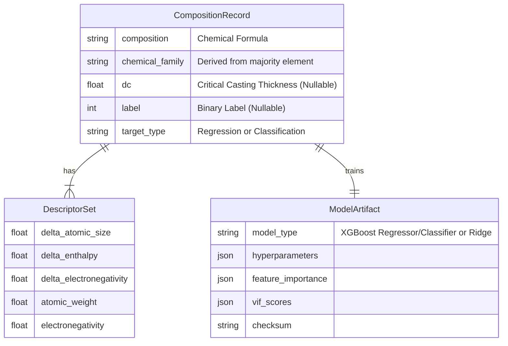

# Data Model: Predicting Glass Formation Tendency

## 1. Entity Relationship Diagram (Conceptual)

## 2. Data Dictionary

### CompositionRecord (Primary Dataset)
| Field | Type | Description | Constraints |
| :--- | :--- | :--- | :--- |
| `id` | string | Unique identifier (UUID or hash) | Not null, Unique |
| `composition` | string | Chemical formula (e.g., "Zr50Cu40Al10") | Not null, Valid Hill notation |
| `chemical_family` | string | Derived from majority element (e.g., "Zr-based") | Not null |
| `dc` | float | Critical casting thickness (mm) | Nullable (if regression not applicable) |
| `label` | int | Binary label (0=Crystal, 1=Glass) | Nullable (if classification not applicable) |
| `target_type` | string | "regression" or "classification" | Enum |
| `source` | string | Origin dataset (e.g., "Figshare-EXPERIMENTAL") | Not null |
| `checksum` | string | SHA-256 of the row data | Not null |

### DescriptorSet (Computed Features)
| Field | Type | Description | Constraints |
| :--- | :--- | :--- | :--- |
| `record_id` | string | FK to CompositionRecord | Not null |
| `delta_atomic_size` | float | Atomic size mismatch (Std Dev) | Not null, >= 0 |
| `delta_enthalpy` | float | Mixing enthalpy (kJ/mol) | Not null |
| `delta_electronegativity` | float | Electronegativity difference (Variance) | Not null, >= 0 |
| `mean_atomic_weight` | float | Weighted average atomic weight | Not null |
| `mean_electronegativity` | float | Weighted average electronegativity | Not null |

### ModelArtifact (Trained Model)
| Field | Type | Description | Constraints |
| :--- | :--- | :--- | :--- |
| `model_id` | string | Unique identifier | Not null |
| `model_type` | string | "XGBRegressor", "XGBClassifier", or "Ridge" | Enum |
| `hyperparameters` | json | Model configuration | Not null |
| `performance_metrics` | json | R², AUC, Accuracy, etc. | Not null |
| `feature_importance` | json | Ranked features | Not null |
| `vif_scores` | json | Collinearity diagnostics | Not null |
| `power_analysis` | json | MDES, Power | Not null |
| `circularity_check` | json | Permutation test results | Not null |
| `checksum` | string | SHA-256 of the artifact | Not null |

## 3. Data Flow

1.  **Ingestion**: Raw CSV/JSON from Verified Experimental Source (or local file) -> `data/raw/`.
2.  **Validation**: Check for missing columns, chemical balance, **and circularity** -> `data/validated/`.
3.  **Computation**: `pymatgen` descriptor calculation -> `data/computed/`.
4.  **Training**: Split (Adaptive LOGO) -> Train XGBoost/Ridge -> `models/trained/`.
5.  **Evaluation**: CV, Power Analysis, VIF -> `models/artifacts/`.
6.  **Reporting**: Generate `report.md` with associational framing.

## 4. Integrity Constraints

- **Chemical Balance**: Sum of atomic percentages must be within [99.0, 101.0].
- **Target Consistency**: If `target_type` is "regression", `dc` must be non-null. If "classification", `label` must be non-null.
- **Descriptor Validity**: No NaN or Inf values allowed in descriptors.
- **Circularity**: Permutation test R² < 0.95 * Real R².
- **Family Derivation**: `chemical_family` must be derived from the majority element in the composition.