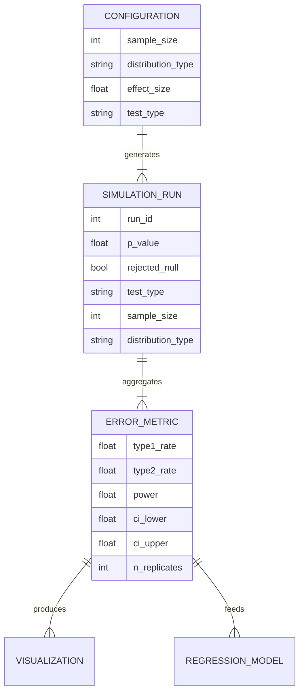

# Data Model: Assessing the Sensitivity of Common Statistical Tests to Dataset Size

## Entity Relationship Diagram (Conceptual)

## Data Definitions

### Configuration
Defines the parameters for a batch of simulations.
- `sample_size`: Integer (10 to 1000).
- `distribution_type`: String ("normal", "uniform", "log-normal").
- `effect_size`: Float (0.0 for null, 0.5 for alternative).
- `test_type`: String ("t-test", "anova", "chi-squared").

### SimulationRun
Represents a single iteration of data generation and testing.
- `run_id`: Unique identifier.
- `p_value`: The p-value returned by the statistical test.
- `rejected_null`: Boolean (True if p < $\alpha$).
- `ground_truth`: Boolean (True if $H_0$ is actually true).
- `error_type`: String ("Type I", "Type II", "Correct", "None").

### ErrorMetric
Aggregated statistics for a specific configuration.
- `configuration_id`: Composite key (sample_size, distribution, test, effect_size).
- `type1_rate`: Proportion of Type I errors (if $H_0$ true).
- `type2_rate`: Proportion of Type II errors (if $H_1$ true).
- `power`: $1 - \text{type2\_rate}$.
- `ci_lower`: Lower bound of 95% bootstrap CI.
- `ci_upper`: Upper bound of 95% bootstrap CI.
- `n_replicates`: Total number of replicates run for this config.

### RegressionInput
Prepared data for the Binomial GLM model.
- `error_rate`: The observed error rate (proportion).
- `log_n`: $\log(\text{sample\_size})$.
- `dist_cat`: Categorical encoding of distribution.
- `test_cat`: Categorical encoding of test type.

## File Formats

### Raw Data (Generated)
- `data/raw/simulation_runs_{timestamp}.csv`: Contains individual `SimulationRun` records.
  - Columns: `run_id`, `sample_size`, `distribution`, `test`, `p_value`, `rejected`, `ground_truth`, `error_type`.
  - Checksum: MD5 recorded in state file.

### Processed Data (Aggregated)
- `data/processed/error_rates.csv`: Contains `ErrorMetric` records.
  - Columns: `sample_size`, `distribution`, `test`, `effect_size`, `type1_rate`, `type2_rate`, `power`, `ci_lower`, `ci_upper`, `n_replicates`.

### Output Artifacts
- `data/visualizations/error_rate_curves.png`: Plot of error rate vs. sample size.
- `data/visualizations/power_curves.png`: Plot of power vs. sample size.
- `data/analysis/regression_results.yaml`: Regression coefficients and pseudo-$R^2$.