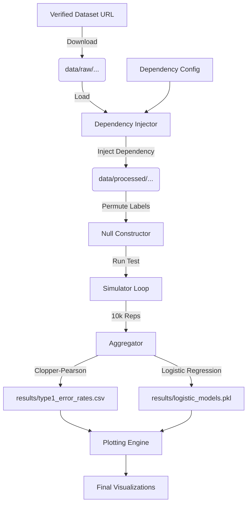

# Data Model: Evaluating the Robustness of Common Statistical Tests to Non-Independence in Public Datasets

## 1. Overview

This document defines the data structures, schemas, and storage formats used in the simulation pipeline. All data flows from `data/raw` (source) to `data/processed` (injected) to `results/` (aggregated metrics).

## 2. Entity Definitions

### 2.1 Dataset (Raw)
The source data downloaded from verified UCI repositories.
- **Format**: Parquet or CSV.
- **Content**: Rows of observations, columns of variables.
- **Constraints**: No PII. Checksummed.

### 2.2 DependencyConfiguration
A JSON/YAML object defining the injection parameters.
- **Fields**: `type` (ar1, cluster_effect), `strength` (float), `block_size` (int, if applicable).
- **Traceability**: This entity is read by `code/dependency_injector.py` (FR-003).

### 2.3 SimulationRun
A single execution of the Monte Carlo loop for a specific configuration.
- **Fields**: `dataset_id`, `test_type`, `dependency_config`, `n_replications`, `seed`.

### 2.4 SimulationResult
The output of a single replication.
- **Fields**: `p_value`, `significant` (bool), `test_statistic`.

### 2.5 AggregatedMetric
The summary of results for a configuration.
- **Fields**: `observed_error_rate`, `lower_ci`, `upper_ci`, `power`, `n_significant`, `n_total`.

## 3. File Formats

### 3.1 Input Data
- **Path**: `data/raw/{dataset_name}.{ext}`
- **Schema**: Inferred from source.
- **Checksum**: SHA-256 stored in `state.yaml`.

### 3.2 Dependency Manifest
- **Path**: `data/dependency_manifest.yaml`
- **Format**: YAML.
- **Content**: List of configurations used.
```yaml
configurations:
  - id: config_01
    dataset_id: uci_wine
    test_type: t_test
    dependency:
      type: cluster_effect
      strength: 0.3
    n_replications: 10000
    seed: 42
```

### 3.3 Output Results (CSV)
- **Path**: `results/type1_error_rates.csv`
- **Columns**: `dataset_id`, `test_type`, `dependency_type`, `strength`, `n_replications`, `n_significant`, `observed_rate`, `ci_lower`, `ci_upper`.

### 3.4 Performance Log
- **Path**: `results/perf_log.json`
- **Format**: JSON.
- **Content**: Execution time, memory peak, CPU usage.

### 3.5 Logistic Regression Models
- **Path**: `results/logistic_models.pkl`
- **Format**: Pickle.
- **Content**: Coefficients from logistic regression of significance vs. dependency strength (Constitution VII).

## 4. Data Flow Diagram



## 5. Constraints & Validations

- **Memory**: Intermediate datasets in `data/processed` must not exceed 6GB.
- **Reproducibility**: Every file in `results/` must be traceable to a specific `seed` and `manifest` entry.
- **Integrity**: `results/perf_log.json` must be generated for every run (T032b).
