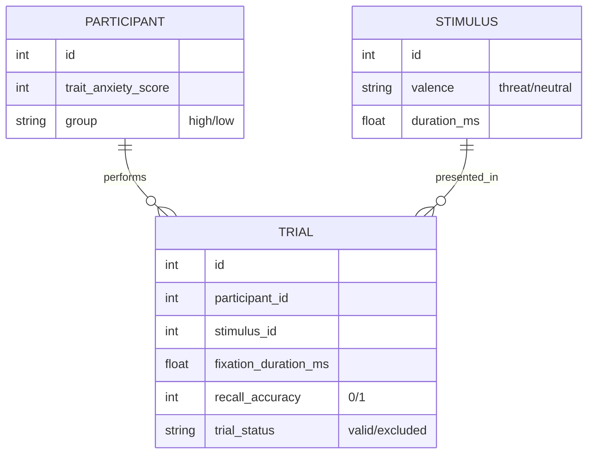

# Data Model: The Impact of Visual Attention on Recall of Emotional Stimuli in Rapid Visual Sequences

## Overview

This document defines the data structures used throughout the pipeline, from raw ingestion to final analysis. The model is designed to be schema-compliant and validated against the contracts defined in `contracts/`.

## Entity Relationship Diagram (Conceptual)

## Data Flow

1.  **Raw Ingestion**: Download raw files (e.g., `.csv`, `.tsv`, `.json`) from the source.
2.  **Preprocessing**:
    -   Parse eye-tracking coordinates.
    -   Apply I-VT algorithm to extract fixations.
    -   Map stimulus IDs to valence.
    -   Merge participant STAI scores.
    -   Filter invalid trials (missing data, excessive blinks).
3.  **Analysis-Ready**: Generate a single `analysis.csv` with one row per trial.
4.  **Model Input**: `analysis.csv` is loaded into the statistical model.
5.  **Output**: Model coefficients, p-values, and diagnostic logs.

## Schema Definitions

### Raw Data (Hypothetical)

-   **Eye-tracking**: `participant_id`, `timestamp`, `x`, `y`, `pupil_diameter`.
-   **Stimulus**: `stimulus_id`, `onset_time`, `duration_ms`, `valence_label` (if available).
-   **Recall**: `participant_id`, `stimulus_id`, `recall_response` (binary).
-   **STAI**: `participant_id`, `score`.

### Analysis-Ready Schema (`analysis.csv`)

| Column | Type | Description | Constraints |
|--------|------|-------------|-------------|
| `participant_id` | int | Unique participant identifier | Not null |
| `stimulus_id` | int | Unique stimulus identifier | Not null |
| `fixation_duration_ms` | float | Duration of fixation in milliseconds | ≥ 0, ≤ 1000 (typical RSVP) |
| `valence` | categorical | Emotional valence of the stimulus | "threat", "neutral" |
| `recall_accuracy` | int | Binary recall outcome | 0 (fail), 1 (success) |
| `trait_anxiety_score` | int | STAI trait anxiety score | 20-80 |
| `group` | categorical | Anxiety group based on median split | "high", "low" |
| `trial_id` | int | Unique trial identifier | Not null |
| `trial_status` | string | Indicates if the trial was valid or excluded. | "valid", "excluded" |

### Model Output Schema

-   **Coefficients**: Fixed effects estimates, standard errors, z-values, p-values.
-   **Random Effects**: Variance components for participant and stimulus.
-   **Diagnostics**: Convergence status, dispersion parameter, AIC/BIC.
