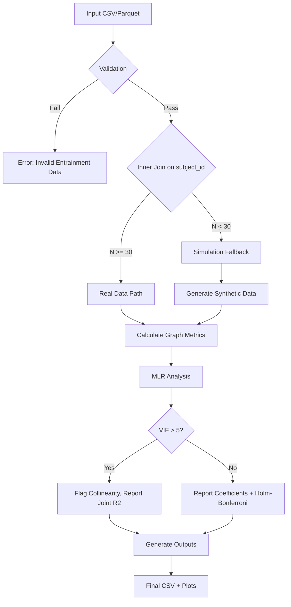

# Data Model: Investigating the Impact of Network Topology on Neural Entrainment to Rhythmic Stimuli

## Overview

This document defines the data entities, relationships, and schemas used in the analysis pipeline. The data flow is: **Input (CSV/Parquet) -> Validation -> Join -> Simulation Fallback (if needed) -> Graph Metrics -> Statistical Analysis -> Output (CSV/JSON/Plots)**.

## Entities

### 1. Subject
Represents an individual participant.
- **Primary Key**: `subject_id` (string)
- **Attributes**:
  - `atlas_type` (string): "Schaefer", "AAL", or "Power"
  - `source` (string): "Real" or "Simulated"

### 2. TopologyMetric
Network properties derived from the fMRI connectivity matrix.
- **Foreign Key**: `subject_id`
- **Attributes**:
  - `clustering_coefficient` (float): Weighted clustering coefficient.
  - `characteristic_path_length` (float): Average shortest path length.
  - `matrix_size` (int): Dimension of the adjacency matrix (e.g., 200).

### 3. EntrainmentMetric
The strength of neural response to rhythmic stimuli.
- **Foreign Key**: `subject_id`
- **Attributes**:
  - `entrainment_strength` (float): Phase-locking value or simulated equivalent.
  - `ground_truth_r` (float): Only present if simulated; the target correlation used in generation.

## Data Flow Diagram

## Schema Definitions

### Input Schema
- **File Format**: CSV or Parquet
- **Required Columns**: `subject_id`, `entrainment_metric` (if provided externally)
- **Validation Rules**:
  - `subject_id`: Non-empty string.
  - `entrainment_metric`: Numeric (float/int).
  - Missing values: Rows with missing `subject_id` or `entrainment_metric` are dropped.

### Output Schema
- **File Format**: CSV
- **Columns**:
  - `subject_id`
  - `atlas_type`
  - `clustering_coefficient`
  - `characteristic_path_length`
  - `entrainment_strength`
  - `source`
  - `model_r_squared`
  - `beta_clustering`
  - `beta_path_length`
  - `vif_clustering`
  - `vif_path_length`
  - `p_value_raw_clustering`
  - `p_value_adj_clustering`
  - `p_value_raw_path_length`
  - `p_value_adj_path_length`
  - `collinearity_warning` (boolean)
  - `power_warning` (boolean)
  - `status` (string): "OK", "Non-informative", "Simulated"
