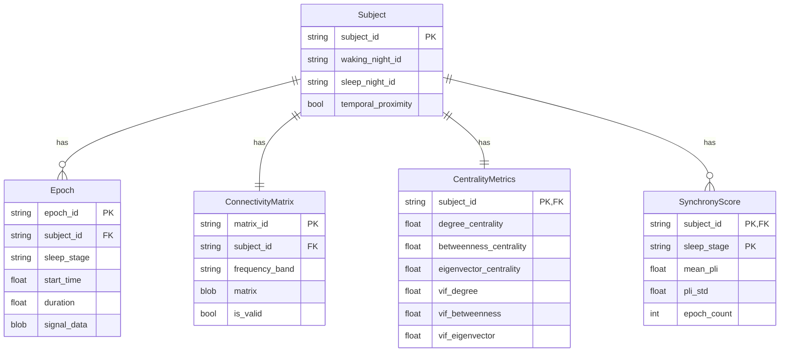

# Data Model

This document describes the data entities, relationships, and flow within the **llmXive** pipeline for investigating network centrality and neural synchrony.

## Core Entities

### 1. Subject
Represents an individual participant in the Sleep-EDF dataset.

**Attributes:**
- `subject_id` (str): Unique identifier (e.g., "SC001").
- `waking_night_id` (str): Identifier for the waking recording night.
- `sleep_night_id` (str): Identifier for the sleep recording night.
- `temporal_proximity` (bool): Flag indicating if waking and sleep data are from the same night.

### 2. Epoch
A segmented time window of EEG data, labeled by sleep stage.

**Attributes:**
- `epoch_id` (str): Unique identifier.
- `subject_id` (str): Foreign key to `Subject`.
- `sleep_stage` (str): Label (Wake, N1, N2, N3, REM).
- `start_time` (float): Start time in seconds.
- `duration` (float): Duration in seconds.
- `signal_data` (ndarray): Preprocessed EEG signal array.

### 3. ConnectivityMatrix
Functional connectivity matrix derived from waking EEG data.

**Attributes:**
- `matrix_id` (str): Unique identifier.
- `subject_id` (str): Foreign key to `Subject`.
- `frequency_band` (str): Theta (4-8 Hz) or Alpha (8-13 Hz).
- `matrix` (ndarray): Symmetric matrix of coherence values (0-1).
- `is_valid` (bool): Validation status (symmetry, value range).

### 4. CentralityMetrics
Network centrality measures computed from the connectivity matrix.

**Attributes:**
- `subject_id` (str): Foreign key to `Subject`.
- `degree_centrality` (float): Average degree centrality.
- `betweenness_centrality` (float): Average betweenness centrality.
- `eigenvector_centrality` (float): Average eigenvector centrality.
- `vif_degree` (float): Variance Inflation Factor for degree centrality.
- `vif_betweenness` (float): VIF for betweenness centrality.
- `vif_eigenvector` (float): VIF for eigenvector centrality.

### 5. SynchronyScore
Neural synchrony measure derived from sleep epochs.

**Attributes:**
- `subject_id` (str): Foreign key to `Subject`.
- `sleep_stage` (str): Sleep stage label.
- `mean_pli` (float): Mean Phase Lag Index across electrode pairs.
- `pli_std` (float): Standard deviation of PLI.
- `epoch_count` (int): Number of epochs used.

## Data Flow

1. **Acquisition**: Raw EDF files are downloaded from PhysioNet into `data/raw`.
2. **Preprocessing**: Signals are filtered, cleaned (ICA), and segmented into epochs (`data/processed`).
3. **Metric Computation**:
 - Waking connectivity matrices are computed from theta/alpha coherence.
 - Centrality metrics are derived from these matrices.
 - PLI is computed for each sleep epoch and aggregated to synchrony scores.
4. **Analysis**: Statistical models (LME) are fitted to relate centrality to synchrony.
5. **Reporting**: Results are compiled into JSON and Markdown reports.

## Relationships

- **Subject** 1:1 **ConnectivityMatrix** (per subject, per band)
- **Subject** 1:N **Epoch** (multiple epochs per subject)
- **Subject** 1:1 **CentralityMetrics**
- **Subject** 1:N **SynchronyScore** (one per sleep stage)

## File Artifacts

| Path | Entity | Description |
|------|--------|-------------|
| `data/raw/*.edf` | Raw Data | Original EDF files from Sleep-EDF |
| `data/processed/*.npz` | Epoch | Preprocessed epoch data |
| `data/metrics/SubjectMetrics.csv` | Aggregated Metrics | Centrality + Synchrony per subject |
| `data/results/analysis_results.json` | Analysis | LME coefficients, p-values, FDR |
| `reports/final_report.md` | Report | Human-readable summary |

## Validation Rules

- **ConnectivityMatrix**: Must be symmetric; values in [0, 1].
- **Epochs**: No NaN values allowed in signal data.
- **CentralityMetrics**: VIF > 5.0 flags collinearity.
- **SynchronyScore**: Missing sleep stages are excluded from aggregation.

## Schema Diagram

