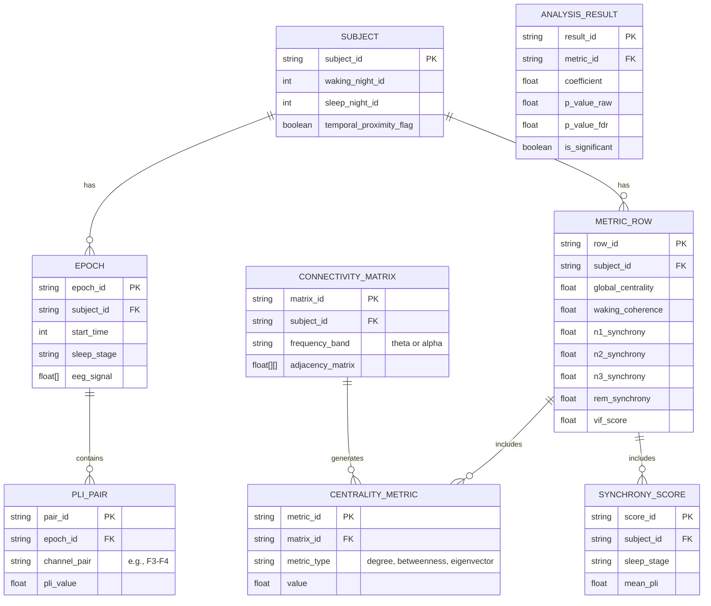

# Data Model Diagram

This document describes the data flow and entity relationships in the Network Centrality and Neural Synchrony project.

## Entity Relationship Diagram (Mermaid)

## Data Flow Description

1. **Ingestion**: Raw `.edf` files are ingested from `data/raw` and mapped to `SUBJECT` entities.
2. **Segmentation**: Continuous EEG is split into `EPOCH` entities based on annotations.
3. **Connectivity**: `CONNECTIVITY_MATRIX` is computed for waking data using coherence.
4. **Network Analysis**: `CENTRALITY_METRIC` values are derived from the connectivity matrix.
5. **Synchrony**: `PLI_PAIR` values are calculated per epoch, aggregated into `SYNCHRONY_SCORE` per stage.
6. **Aggregation**: All metrics are flattened into a `METRIC_ROW` per subject.
7. **Analysis**: `ANALYSIS_RESULT` is generated via LME modeling on the aggregated metrics.

## File Artifacts Mapping

| Entity Group | Output File | Location |
|:--- |:--- |:--- |
| Raw Data | `*.edf` | `data/raw/` |
| Epochs | `*_epochs.fif` | `data/processed/` |
| Metrics | `SubjectMetrics.csv` | `data/metrics/` |
| Results | `analysis_results.json` | `data/results/` |
| Report | `final_report.md` | `reports/` |
