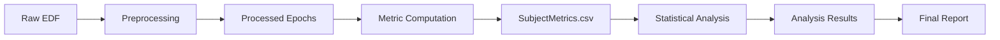

# Quickstart Guide

## Installation

1. Clone the repository:
 ```bash
 git clone
 cd llmXive-sleep-synchrony
 ```

2. Create a virtual environment (recommended):
 ```bash
 python -m venv venv
 source venv/bin/activate # On Windows: venv\Scripts\activate
 ```

3. Install dependencies:
 ```bash
 pip install -r code/requirements.txt
 ```

## Usage

### Running the Full Pipeline

The main entry point is `code/main.py`. It orchestrates the entire pipeline:
1. Data Download
2. Preprocessing
3. Metric Computation
4. Statistical Analysis
5. Report Generation

```bash
python code/main.py
```

This will:
- Download Sleep-EDF data from PhysioNet (if not present)
- Preprocess EEG signals (filtering, ICA)
- Compute centrality and synchrony metrics
- Run LME analysis with FDR correction
- Generate `data/results/analysis_results.json` and `reports/final_report.md`

### Running Individual Stages

You can also run specific stages independently:

- **Download**: `python code/download.py`
- **Preprocess**: `python code/preprocess.py`
- **Metrics**: `python code/metrics.py`
- **Analysis**: `python code/analysis.py`
- **Report**: `python code/report.py`

### Memory Constraints

The pipeline enforces a memory limit of 4 GB RAM by default. If the process exceeds this, it will terminate with an error. You can adjust this limit in `code/main.py` (variable `MAX_RAM_GB`).

## Data Model

The project uses the following data structure:

- **Raw Data**: `data/raw/` (Downloaded EDF files)
- **Processed Data**: `data/processed/` (Filtered, epoched data)
- **Metrics**: `data/metrics/SubjectMetrics.csv` (Centrality and synchrony scores)
- **Results**: `data/results/` (Analysis JSONs, diagnostics)
- **Reports**: `reports/` (Final Markdown report)

### Data Flow



## Verification

To verify the installation and pipeline execution:

```bash
python code/quickstart_validator.py
```

This script checks:
- Dependencies are installed
- All pipeline stages run successfully
- Output files are generated in the correct locations
- No NaN values in processed data

## Troubleshooting

- **Missing Dependencies**: Ensure `code/requirements.txt` is installed.
- **Memory Errors**: Reduce the dataset size or increase the RAM limit in `main.py`.
- **Data Corruption**: The pipeline automatically skips corrupted EDF files and logs warnings.

## Next Steps

- Review `README.md` for detailed documentation.
- Check `docs/data_model.md` for the full data schema.
- Run `tests/unit/` and `tests/integration/` to verify the codebase.
