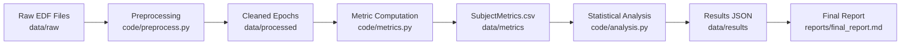

# Quickstart Guide: Network Centrality & Neural Synchrony Analysis

This guide walks you through setting up the environment, downloading the Sleep-EDF dataset, running the full preprocessing pipeline, computing metrics, and generating the final statistical report.

## Prerequisites

- Python 3.11+
- pip (Python package installer)
- At least 4GB of RAM available for processing
- Internet connection (required for initial dataset download)

## Installation

1. **Clone the repository**:
 ```bash
 git clone
 cd PROJ-489-investigating-the-impact-of-network-cent
 ```

2. **Create and activate a virtual environment**:
 ```bash
 python -m venv venv
 source venv/bin/activate # On Windows: venv\Scripts\activate
 ```

3. **Install dependencies**:
 ```bash
 pip install -r code/requirements.txt
 ```

## Usage

The pipeline is modular. You can run individual stages or the full validation script.

### Option 1: Run the Full Validation Script (Recommended)

The `quickstart_validator.py` script automates the entire flow: downloading data, preprocessing, computing metrics, running analysis, and generating reports.

```bash
python code/quickstart_validator.py
```

**Expected Output**:
- `data/raw/`: Downloaded Sleep-EDF `.edf` files.
- `data/processed/`: Cleaned EEG epochs and metadata.
- `data/metrics/SubjectMetrics.csv`: Centrality and synchrony scores.
- `data/results/analysis_results.json`: Statistical analysis output.
- `reports/final_report.md`: Human-readable summary.

### Option 2: Run Stages Individually

If you prefer to run stages manually:

#### 1. Download Data
Fetches Sleep-EDF data from PhysioNet.
```bash
python code/download.py
```

#### 2. Preprocess Data
Applies bandpass filtering, ICA artifact removal, and epoching.
```bash
python code/preprocess.py
```

#### 3. Compute Metrics
Calculates network centrality and neural synchrony (PLI).
```bash
python code/metrics.py
```

#### 4. Statistical Analysis
Runs Linear Mixed Effects (LME) models and FDR correction.
```bash
python code/analysis.py
```

#### 5. Generate Report
Creates the final JSON and Markdown reports.
```bash
python code/report.py
```

## Data Model Overview

The project follows a strict data flow:



### Key Entities

- **Subject**: A single participant in the Sleep-EDF dataset.
- **Epoch**: A 30-second segment of EEG data labeled with a sleep stage.
- **Connectivity Matrix**: A symmetric matrix representing functional connectivity (coherence) between EEG channels.
- **Centrality**: Network metrics (Degree, Betweenness, Eigenvector) derived from the connectivity matrix.
- **Synchrony (PLI)**: Phase Lag Index, measuring the consistency of phase differences between channels.

## Troubleshooting

- **Memory Errors**: Ensure you have at least 4GB of RAM. Close other applications if the pipeline fails with an OOM error.
- **Missing Dependencies**: If `mne` or `statsmodels` cannot be imported, verify that `code/requirements.txt` was installed correctly.
- **Download Failures**: The script relies on PhysioNet. If downloads fail, check your internet connection or try running `python code/download.py` again.

## Next Steps

- Review `reports/final_report.md` for the study findings.
- Check `data/results/analysis_results.json` for detailed statistical coefficients.
- Consult `docs/` for deeper documentation on specific modules.
