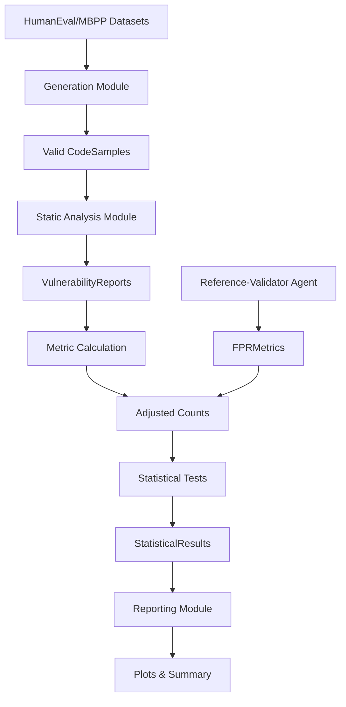

# Data Model: Evaluating the Impact of Code Generation Models on Code Vulnerability Density

## 1. Overview

This document defines the data models for the project, including input datasets, intermediate processing artifacts, and output statistics. All data is stored in `data/` and `results/` directories, with checksums recorded in `state/`.

## 2. Entity Definitions

### 2.1 CodeSample

Represents a single unit of code (generated or human) with attributes.

| Attribute | Type | Description | Source |
| :--- | :--- | :--- | :--- |
| `sample_id` | `str` | Unique identifier (e.g., `humaneval-001-starcoder-01`) | Generated |
| `source_type` | `str` | `LLM` or `Human` | Specified |
| `model_name` | `str` | Name of the model (e.g., `starcoder`, `codegen`) | Specified |
| `benchmark_name` | `str` | `HumanEval`, `MBPP` | Specified |
| `task_id` | `str` | Task identifier from benchmark | Benchmark |
| `code_content` | `str` | Full code content (truncated in storage) | Generated/Downloaded |
| `lines_of_code` | `int` | Number of lines in the code sample | Calculated |
| `is_valid` | `bool` | Whether the sample passed benchmark tests | `validate_samples.py` |
| `vulnerability_count` | `int` | Raw count of vulnerabilities found | `run_bandit.py` |
| `adjusted_vulnerability_count` | `float` | Count adjusted for false positive rate | Calculated |
| `cwe_ids` | `list[str]` | List of CWE IDs found | `run_bandit.py` |
| `validity_profile` | `str` | "valid" or "invalid" (for sensitivity analysis) | `validate_samples.py` |

### 2.2 VulnerabilityReport

Represents the output of a static analysis tool for a specific file.

| Attribute | Type | Description | Source |
| :--- | :--- | :--- | :--- |
| `file_path` | `str` | Path to the analyzed file | `run_bandit.py` |
| `cwe_id` | `str` | Common Weakness Enumeration ID (e.g., `CWE-79`) | Bandit output |
| `severity` | `str` | `LOW`, `MEDIUM`, `HIGH`, `CRITICAL` | Bandit output |
| `line_number` | `int` | Line number where vulnerability was found | Bandit output |
| `confidence` | `float` | Confidence score (if available) | Bandit output |

### 2.3 StatisticalResult

Represents the outcome of a hypothesis test.

| Attribute | Type | Description | Source |
| :--- | :--- | :--- | :--- |
| `test_type` | `str` | `ZINB` or `Permutation` | `statistical_tests.py` |
| `comparison_group` | `str` | `LLM_vs_Human` or `Category_X` | Specified |
| `p_value` | `float` | Raw p-value from the test | Calculated |
| `adjusted_p_value` | `float` | P-value after multiple-comparison correction (BH) | Calculated |
| `effect_size` | `float` | Incidence Rate Ratio (IRR) or Risk Ratio | Calculated |
| `confidence_interval` | `list[float]` | 95% CI for effect size | Calculated |
| `convergence_status` | `str` | `CONVERGED` or `FAILED` | `statistical_tests.py` |
| `power_achieved` | `float` | Achieved power (if applicable) | `power_analysis.py` |
| `sample_size_tasks` | `int` | Number of valid tasks (unit of analysis). | Calculated |
| `unit_of_analysis` | `str` | Description of the unit of analysis (e.g., 'Individual Code Sample'). | Specified |
| `underpowered` | `bool` | True if power < 0.80. | Calculated |

### 2.4 FPRMetrics

Represents the False Positive Rate metrics from the Reference-Validator Agent.

| Attribute | Type | Description | Source |
| :--- | :--- | :--- | :--- |
| `source_type` | `str` | `LLM` or `Human` | Specified |
| `total_audited` | `int` | Total number of samples audited | `validator_agent.py` |
| `false_positives` | `int` | Number of false positives detected | `validator_agent.py` |
| `fpr` | `float` | False Positive Rate (false_positives / total_audited) | Calculated |

## 3. Data Flow

## 4. File Formats

### 4.1 Input Datasets (Raw)
- **Format**: Parquet
- **Location**: `data/raw/humaneval/`, `data/raw/mbpp/`
- **Checksum**: SHA-256 recorded in `state/checksums.json`

### 4.2 Intermediate Data (Processed)
- **Format**: CSV, JSON
- **Location**: `data/processed/`
- **Files**:
  - `vulnerability_counts.csv`: Aggregated counts per sample.
  - `fpr_metrics.json`: False Positive Rate metrics from Reference-Validator.
  - `validator_flags.csv`: Raw flags from the Reference-Validator Agent.
  - `statistical_results.json`: Aggregated test results.

### 4.3 Output Artifacts (Results)
- **Format**: PNG, SVG, Markdown
- **Location**: `results/`
- **Files**:
  - `boxplot_vuln_density.png`: Distribution comparison.
  - `bar_chart_vuln_types.png`: Top 5 vulnerability types.
  - `summary.md`: Final report with statistics and image paths.

## 5. Constraints & Rules

- **Immutability**: Raw data in `data/raw` is never modified. Derived files in `data/processed` are new files.
- **Checksums**: All files in `data/` must have a corresponding SHA-256 hash in `state/checksums.json`.
- **PII**: No Personally Identifiable Information is allowed in any data file. PII scan is run as a CI gate.
- **Traceability**: Every statistic in `summary.md` must reference a specific row in `data/processed/statistical_results.json` or `data/processed/fpr_metrics.json`.
- **Single Source of Truth**: `generate_report.py` reads *only* from `data/processed` and `results/plots`. No hardcoded values are permitted.
- **Real Data**: All statistical results must be derived from actual pipeline execution. No simulated or hardcoded values are allowed.