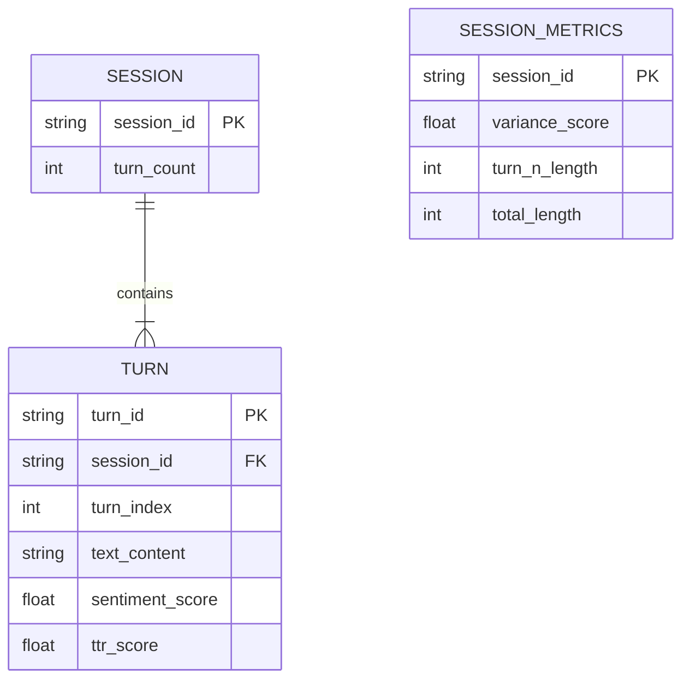

# Data Model: The Impact of Perceived AI Personality Consistency on User Trust (Revised Scope)

## Entity Relationship Diagram (Conceptual)

## Data Flow

1.  **Raw Input**: `DailyDialog.parquet` (Turn-level data).
2.  **Filtering**: Remove sessions with < 3 turns.
3.  **Metric Engine**:
    - Aggregate turns by session.
    - Compute Sentiment & TTR for each turn.
    - Compute Variance (Turns 1 to N-1).
    - Compute Outcome (Turn N length).
4.  **Processed Output**: `sessions_metrics.csv` (Session-level aggregated data).
5.  **Analysis Input**: `sessions_metrics.csv` -> GLM/Linear Regression.
6.  **Final Output**: `results.json`, `figures/*.png`.

## Schema Definitions

### 1. Raw Session Schema (Input)
- **Source**: DailyDialog `parquet`.
- **Fields**:
  - `session_id`: Unique identifier for the conversation.
  - `turns`: List of turn objects (text, speaker).

### 2. Processed Metrics Schema (Intermediate)
- **File**: `data/processed/sessions_metrics.csv`
- **Fields**:
  - `session_id` (string): Unique ID.
  - `turn_count` (int): Total turns in session.
  - `sentiment_variance` (float): Variance of sentiment scores (Turns 1 to N-1).
  - `ttr_variance` (float): Variance of Type-Token Ratio (Turns 1 to N-1).
  - `variance_score` (float): Composite 0-1 score (1 - normalized variance).
  - `turn_n_length` (int): Word count of Turn N (Outcome).
  - `total_length` (int): Total word count of session (Control).
  - `proxy_validity_flag` (boolean): **REMOVED**. This field is no longer applicable.

### 3. Analysis Results Schema (Output)
- **File**: `output/results.json`
- **Fields**:
  - `model_type` (string): "GLM" or "Linear".
  - `outcome` (string): e.g., "turn_n_length".
  - `predictors` (list): List of predictor names.
  - `coefficients` (dict): Map of predictor -> coefficient.
  - `p_values` (dict): Map of predictor -> p-value (FDR corrected).
  - `r_squared` (float): Variance explained.
  - `power_analysis` (object): Sample size, effect size, power.

## Data Hygiene Rules

1.  **Immutability**: Raw data is never modified. All transformations create new files.
2.  **Checksums**: `sha256` of raw files recorded in `state/...yaml`.
3.  **PII**: Regex scan for email/phone patterns in `text_content`. If found, redact before processing.
4.  **Null Handling**: Missing ratings/frequency handled as `null` in pandas; excluded from specific model fits where required.