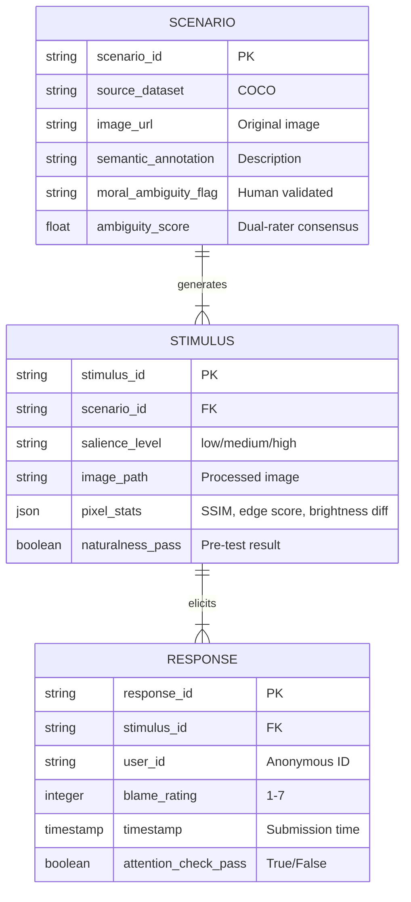

# Data Model: The Influence of Visual Salience on Moral Judgments

## Overview

This document defines the data structures for the project, ensuring alignment with the Constitution (Principles III, IV, V) and the Functional Requirements (FR-001 to FR-007). All data is stored in local files (`data/`) with checksums.

## Entity Relationship Diagram (Conceptual)

## Detailed Schemas

### 1. Scenario Metadata (`data/raw/scenarios.csv`)
Contains the curated list of morally ambiguous scenarios.

| Column | Type | Description |
|--------|------|-------------|
| `scenario_id` | string | Unique ID (e.g., `SCN_001`) |
| `source_dataset` | string | "COCO" |
| `image_url` | string | Original image URL or path |
| `semantic_annotation` | string | Human-written description of the event |
| `target_object_id` | string | ID of the non-causal object to manipulate |
| `moral_ambiguity_flag` | boolean | True if validated as ambiguous |
| `ambiguity_score` | float | Mean score from dual-rater annotation (1-7) |
| `causal_validation_flag` | boolean | True if independent annotator confirmed 'non-causal' role |

### 2. Stimulus Manifest (`data/processed/stimuli_manifest.csv`)
Links scenarios to generated variants and records manipulation stats.

| Column | Type | Description |
|--------|------|-------------|
| `stimulus_id` | string | Unique ID (e.g., `STI_001_L`) |
| `scenario_id` | string | FK to `scenario_id` |
| `salience_level` | string | "low", "medium", "high" |
| `image_path` | string | Relative path to processed image |
| `ssim_score` | float | SSIM vs. original (non-target regions) |
| `edge_discontinuity_score` | float | Gradient difference at manipulation boundary |
| `brightness_delta` | float | Mean brightness change in target region |
| `artifact_flag` | boolean | True if realism check failed |
| `naturalness_pass` | boolean | True if passed the Naturalness Pre-test |

### 3. Survey Responses (`data/survey_responses/responses.csv`)
Raw data collected from participants.

| Column | Type | Description |
|--------|------|-------------|
| `response_id` | string | Unique ID |
| `stimulus_id` | string | FK to `stimulus_id` |
| `user_id` | string | Anonymous session ID |
| `blame_rating` | integer | 1-7 Likert scale |
| `timestamp` | datetime | ISO 8601 |
| `attention_check_pass` | boolean | Passed catch question? |
| `completion_status` | string | "complete", "incomplete", "flagged" |

## Data Flow

1.  **Ingestion**: `dataset_loader.py` downloads COCO metadata → `data/raw/scenarios.csv` (pre-screened).
2.  **Annotation**: `annotation_pipeline.py` (human-in-the-loop) filters scenarios → `data/raw/scenarios.csv` (final).
3.  **Manipulation**: `stimulus_gen.py` reads `scenarios.csv`, generates images, computes stats (SSIM, Edge Score) → `data/processed/stimuli_manifest.csv` + images.
4.  **Pre-test**: `pre_test.py` (optional) runs Naturalness Pre-test → updates `naturalness_pass` in manifest.
5.  **Collection**: `survey_server.py` reads `stimuli_manifest.csv`, serves images, writes to `data/survey_responses/responses.csv`.
6.  **Analysis**: `analysis.py` reads `responses.csv` and `stimuli_manifest.csv` for statistical testing (One-way ANOVA, GLMM).