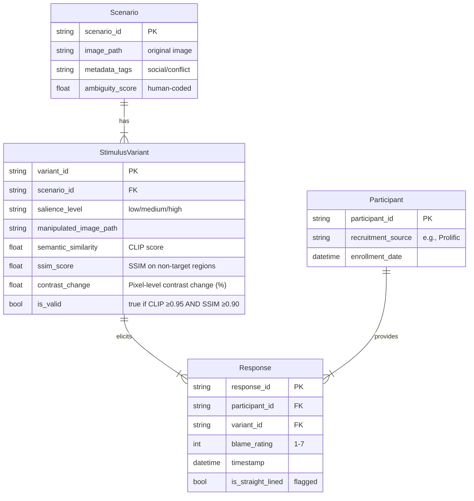

# Data Model: The Influence of Visual Salience on Moral Judgments of Simulated Scenarios

## Overview

This document defines the data structures for the project, including raw datasets, processed stimuli, survey responses, and analysis outputs. All data follows the project's data hygiene principles (checksummed, no in-place modifications, PII-free).

## Entity-Relationship Diagram

## Data Schemas

### 1. Scenario Metadata

**File**: `data/interim/scenarios.csv`  
**Purpose**: Store morally ambiguous scenarios identified via two-stage filtering.

| Column | Type | Description | Constraints |
|--------|------|-------------|-------------|
| `scenario_id` | string | Unique identifier | PK, non-null |
| `image_path` | string | Path to original image | non-null, relative to `data/raw/` |
| `metadata_tags` | string | Comma-separated tags (e.g., "social,conflict") | non-null |
| `ambiguity_score` | float | Human-coded ambiguity score (1-7) | nullable, 1≤x≤7 |
| `is_ambiguous` | boolean | True if ≥2 annotators agree (κ ≥0.6) | non-null, default false |

**Validation**: `ambiguity_score` must be in range 1-7; `is_ambiguous=true` only if κ ≥0.6.

### 2. Stimulus Variants

**File**: `data/processed/stimuli.csv`  
**Purpose**: Store manipulated image variants with salience levels.

| Column | Type | Description | Constraints |
|--------|------|-------------|-------------|
| `variant_id` | string | Unique identifier | PK, non-null |
| `scenario_id` | string | FK to scenarios | non-null, FK |
| `salience_level` | string | "low", "medium", or "high" | non-null, enum |
| `manipulated_image_path` | string | Path to manipulated image | non-null, relative to `data/processed/stimuli/` |
| `semantic_similarity` | float | CLIP cosine similarity | non-null, ≥0.95 required |
| `ssim_score` | float | SSIM on non-target regions | non-null, ≥0.90 required |
| `is_valid` | boolean | True if CLIP ≥0.95 AND SSIM ≥0.90 | non-null, default false |
| `contrast_change` | float | Pixel-level contrast change (%) | non-null |

**Validation**: `semantic_similarity` ≥0.95 AND `ssim_score` ≥0.90 for `is_valid=true`; `salience_level` must be one of ["low", "medium", "high"].

### 3. Participant Data

**File**: `data/processed/participants.csv`  
**Purpose**: Store participant metadata (anonymized).

| Column | Type | Description | Constraints |
|--------|------|-------------|-------------|
| `participant_id` | string | Unique anonymized ID | PK, non-null |
| `recruitment_source` | string | e.g., "Prolific", "University Pool" | non-null |
| `enrollment_date` | datetime | Date of enrollment | non-null |

**Validation**: No PII; `participant_id` is random UUID.

### 4. Survey Responses

**File**: `data/processed/responses.csv`  
**Purpose**: Store blame ratings and metadata.

| Column | Type | Description | Constraints |
|--------|------|-------------|-------------|
| `response_id` | string | Unique identifier | PK, non-null |
| `participant_id` | string | FK to participants | non-null, FK |
| `variant_id` | string | FK to stimuli | non-null, FK |
| `blame_rating` | integer | 1-7 Likert scale | non-null, 1≤x≤7 |
| `timestamp` | datetime | Response timestamp | non-null |
| `is_straight_lined` | boolean | Flagged if all ratings identical | non-null, default false |

**Validation**: `blame_rating` integer between 1 and 7; `is_straight_lined` set by `07_data_cleaning.py`.

### 5. Analysis Outputs

**File**: `data/processed/analysis_results.json`  
**Purpose**: Store statistical analysis results (LMM).

| Field | Type | Description |
|-------|------|-------------|
| `model_type` | string | "Linear_Mixed_Effects_Model" |
| `fixed_effects` | object | Dictionary of fixed effect coefficients |
| `random_effects_variance` | object | Dictionary of random effect variances |
| `p_value` | number | Raw p-value for salience effect |
| `p_value_corrected` | number | Bonferroni-corrected p-value |
| `effect_size` | object | Dictionary containing marginal_r_squared, conditional_r_squared, ci_95_lower, ci_95_upper |
| `post_hoc_tests` | array | Array of pairwise comparison results |
| `exclusion_rate` | number | Proportion of straight-liners excluded |
| `sample_size` | integer | Final N after exclusions |
| `convergence_status` | string | "converged", "warning", or "failed" |

**Validation**: All fields non-null; `post_hoc_tests` includes corrected p-values.

## Data Flow

1. **Raw Data**: `data/raw/visual_genome_subset/` (original images + metadata).
2. **Interim**: `data/interim/scenarios.csv` (filtered candidates, human coding results).
3. **Processed**: 
   - `data/processed/stimuli.csv` + `data/processed/stimuli/` (manipulated images).
   - `data/processed/participants.csv` + `data/processed/responses.csv` (survey data).
4. **Outputs**: `data/processed/analysis_results.json` (statistical results).

## Data Hygiene

- **Checksums**: All files in `data/` checksummed; recorded in `state/projects/PROJ-507-...yaml`.
- **No In-Place Modification**: Raw data preserved; derivations write new files.
- **PII-Free**: Participant IDs anonymized; no names/emails stored.
- **Versioning**: Content hashes updated on artifact changes by `09_versioning_update.py`.