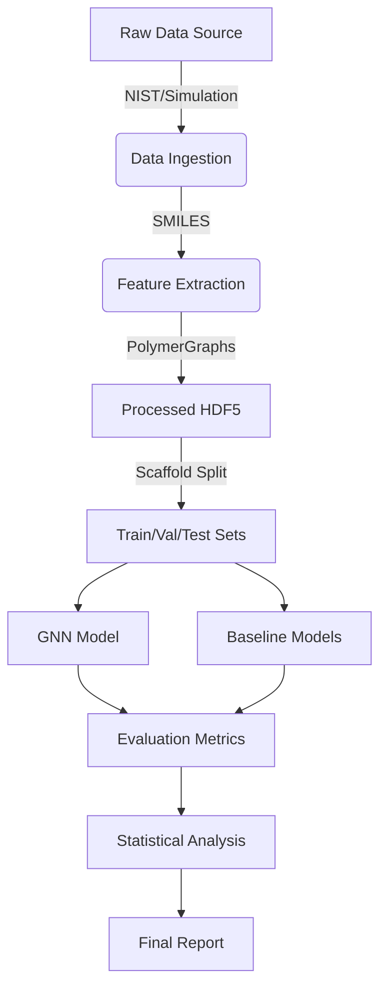

# Architecture Overview

This document outlines the high-level architecture of the PROJ-512 pipeline.

## Component Diagram

## Data Flow

1. **Ingestion**: Data is fetched from NIST or generated via `simulation.py`. SMILES strings are parsed into `PolymerGraph` objects.
2. **Preprocessing**: Features are extracted (2D only), and the dataset is cleaned (duplicates removed, MW checked).
3. **Splitting**: Murcko scaffold splitting ensures that molecules with the same core structure do not appear in both training and test sets.
4. **Training**: The GNN and baselines are trained using the split data. Early stopping and gradient clipping are applied.
5. **Evaluation**: Metrics (R2, MAE, Pearson) are computed. Statistical tests (Wilcoxon, VIF) are performed.
6. **Reporting**: A final JSON report is generated summarizing all results.

## Module Responsibilities

- `data/ingestion.py`: Handles external data fetching, SMILES parsing, and initial cleaning.
- `data/preprocessing.py`: Extracts graph features and performs scaffold splitting.
- `models/gnn.py`: Defines the GNN architecture (Message Passing layers).
- `models/baselines.py`: Implements RF, Linear, and Topology Control baselines.
- `models/trainer.py`: Manages the training loop, callbacks, and optimization.
- `evaluation/metrics.py`: Calculates performance metrics.
- `evaluation/stats.py`: Performs statistical validation.
- `evaluation/report.py`: Aggregates results into a final report.

## Dependencies

- **RDKit**: For chemical graph parsing and feature extraction.
- **PyTorch Geometric**: For GNN implementation.
- **Scikit-learn**: For baselines and statistical tools.
- **H5Py**: For efficient data storage.
- **Numpy/Pandas**: For data manipulation.

## Future Considerations

- Potential integration of 3D features if FR-001 is updated.
- Extension to multi-property prediction (e.g., selectivity).
- Deployment of the model as a web service.
