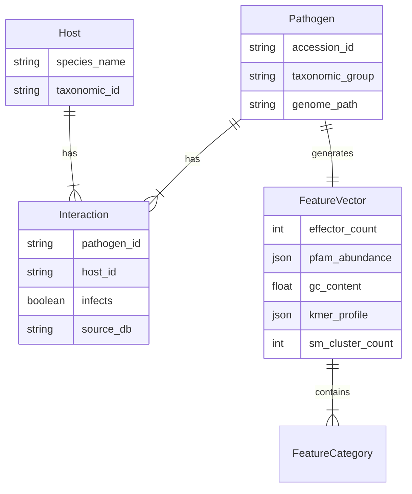

# Data Model: Predicting Plant Pathogen Host Range

## 1. Entity Relationship Diagram (Conceptual)

## 2. Data Schemas (Contracts)

The system enforces the following schemas via `contracts/` YAML files.

### 2.1. Interaction Record Schema
Defines the structure of the host-pathogen interaction records.
*   **Dynamic Labeling**: The `infects` field is derived based on the active **Scenario Mode**:
    *   `PRIMARY`: `infects` is 1 if observed, 0 if explicitly observed as non-infecting. Missing records are excluded from the training matrix entirely.
    *   `SENSITIVITY`: `infects` is 1 if observed, 0 if explicitly observed as non-infecting OR if missing (imputed as negative).
*   **Contract**: The `interaction.schema.yaml` defines the raw record structure. The processed matrix used for training is generated by `preprocess.py` based on the mode.

### 2.2. Genomic Feature Vector Schema
Defines the structure of the extracted features for a single pathogen.
*   **Constraint**: `effector_count` MUST be derived from EffectorP 3.0. `sm_cluster_count` MUST be derived from antiSMASH 7.0.

### 2.3. Model Output Schema
Defines the structure of the prediction output and model artifacts.

### 2.4. Data Quality Report Schema
Defines the structure of the missing data report (FR-013).

### 2.5. Sensitivity Analysis Schema
Defines the structure of the sensitivity analysis report (FR-016).

### 2.6. Bias Awareness Schema
Defines the structure of the bias awareness report (FR-018).

*(See `contracts/` directory for full YAML definitions)*

## 3. Data Flow

1.  **Ingestion**: Raw FASTA (NCBI) + CSV (PHI-base) → `data/raw/`.
2.  **Processing**:
    *   `download.py`: Validates accessions.
    *   `preprocess.py`: 
        *   Merges interactions.
        *   Generates **Primary Matrix** (missing=excluded) and **Sensitivity Matrix** (missing=0).
        *   Computes VIF/PCA (nested).
    *   `feature_extractor.py`: Generates `FeatureVector` (Offline only).
3.  **Storage**:
    *   `data/processed/interaction_matrix_primary.csv`
    *   `data/processed/interaction_matrix_sensitivity.csv`
    *   `data/processed/feature_matrix.csv`
    *   `data/reports/data_quality_report.json`
    *   `data/reports/sensitivity_analysis.json`
    *   `data/reports/bias_awareness.json`
4.  **Modeling**:
    *   `train.py`: Outputs `model.pkl`, `scaler.pkl` (one per scenario).
    *   `evaluate.py`: Outputs `significant_features.tsv`, `sensitivity_analysis.json`.
    *   `interpret.py`: Outputs `bias_awareness.json`, `host_range_breadth.csv`.

## 4. Constraints & Validation Rules

*   **Pathogen ID**: Must match NCBI Accession (e.g., `GCA_000000000.1`).
*   **Interaction**: `infects` must be 0 or 1. 
    *   **Primary Mode**: Missing → excluded from training.
    *   **Sensitivity Mode**: Missing → imputed as 0.
*   **Features**: All numeric. `kmer_profile` must be a normalized vector summing to 1.0.
*   **Collinearity**: Features with VIF ≥ 5 must be removed before model fitting. PCA ([deferred] variance) applied to k-mers first.
*   **Missingness**: If a pathogen has 0 interactions after merging, it is **excluded** (Critical Error).
*   **Provenance**: `effector_count` and `sm_cluster_count` MUST be logged with tool versions (EffectorP 3.0, antiSMASH 7.0).
*   **Scenario Distinction**: The pipeline MUST explicitly log which Scenario Mode was used for each model training step to ensure the sensitivity analysis is valid.