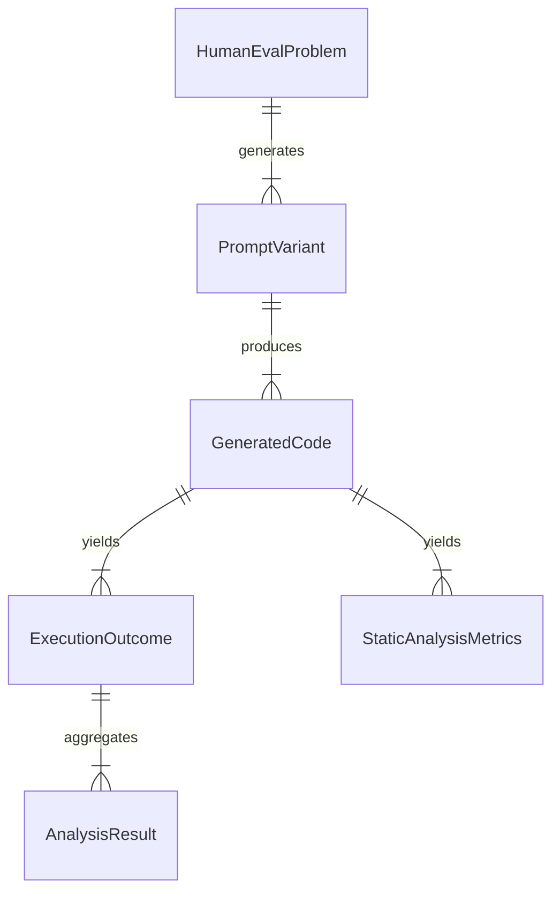

# Data Model: Evaluating the Impact of Prompt Complexity on LLM Code Generation Performance

## 1. Entity Relationship Overview

The data model tracks the flow from raw HumanEval problems to generated code, execution results, and statistical analysis.

## 2. Entity Definitions

### HumanEvalProblem
*Source: `data/raw/humaneval_problems.jsonl`*
- `problem_id` (string): Unique identifier (e.g., "HumanEval/0").
- `prompt` (string): Original problem statement.
- `canonical_solution` (string): Reference solution code.
- `unit_tests` (string): Test suite code.
- `language` (string): "python".

### PromptVariant
*Source: `data/processed/prompt_variants.parquet`*
- `variant_id` (string): Unique ID (e.g., "HumanEval/0_simple").
- `problem_id` (string): FK to HumanEvalProblem.
- `complexity_level` (string): One of {simple, moderate, complex, very_complex, degenerate}. **Defined by structural elements.**
- `prompt_text` (string): The full prompt text.
- `token_count` (integer): Count via `tiktoken`. **Covariate.**
- `structural_elements` (integer): Count of examples, constraints, steps. **Primary predictor.**

### GeneratedCode
*Source: `data/processed/generated_code.parquet`*
- `code_id` (string): Unique ID.
- `variant_id` (string): FK to PromptVariant.
- `generated_code` (string): The LLM output.
- `generation_latency` (float): Time in seconds.
- `model_version` (string): Model identifier.

### ExecutionOutcome
*Source: `data/results/execution_results.parquet`*
- `outcome_id` (string): Unique ID.
- `code_id` (string): FK to GeneratedCode.
- `pass_count` (integer): Number of passed tests.
- `fail_count` (integer): Number of failed tests.
- `status` (string): One of {pass, fail, timeout, error}.
- `error_message` (string): Details if failed.

### StaticAnalysisMetrics
*Source: `data/results/static_analysis.parquet`*
- `code_id` (string): FK to GeneratedCode.
- `cyclomatic_complexity` (integer): McCabe metric.
- `lines_of_code` (integer).
- `security_vulnerabilities` (integer): Count from `ruff`.
- `readability_score` (float).

### AnalysisResult
*Source: `data/results/analysis_summary.json`*
- `metric_name` (string): e.g., "pass_rate", "complexity_effect".
- `value` (number).
- `confidence_interval` (array).
- `p_value` (float).
- `method` (string): e.g., "LMM", "Tukey".

## 3. Data Flow & Transformation

1.  **Load**: `code/data/loader.py` reads `human-eval` package data -> `data/raw/humaneval_problems.jsonl`.
2.  **Transform**: `code/data/preprocessing.py` generates variants (structural definition) -> `data/processed/prompt_variants.parquet`.
3.  **Process**: `code/services/executor.py` runs code -> `data/results/execution_results.parquet`.
4.  **Analyze**: `code/analysis/stats.py` fits models (with collinearity check) -> `data/results/analysis_summary.json`.
5.  **Review**: `code/analysis/manual_review.py` flags issues -> `data/results/manual_review_queue.csv`.

## 4. Versioning & Integrity

- All files in `data/` are checksummed (SHA-256).
- Checksums are stored in `state/projects/PROJ-527-evaluating-the-impact-of-prompt-complexi.yaml`.
- No file in `data/` is overwritten; new derivations create new filenames with timestamps.
