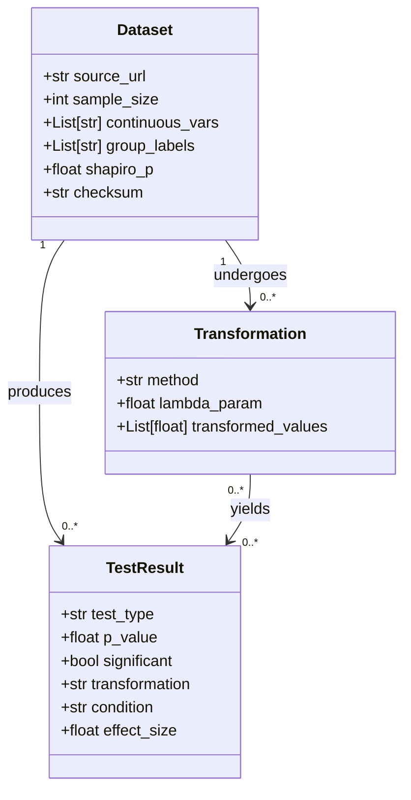

# Data Model Specification: Data Transformation Sensitivity Analysis

This document defines the core data entities and their relationships for the project
"Evaluating the Impact of Data Transformation on Statistical Test Sensitivity".

## Overview

The system processes real-world datasets, applies statistical transformations, and
records the results of hypothesis tests to determine if transformations improve
sensitivity or control Type I error rates.

## Entities

### 1. Dataset

Represents a single dataset loaded from an external source (e.g., UCI, OpenML) or
generated for simulation purposes.

**Attributes:**

| Attribute | Type | Description |
|:--- |:--- |:--- |
| `source_url` | `str` | The URL or identifier where the dataset was retrieved. |
| `sample_size` | `int` | The total number of observations (rows) in the dataset. |
| `continuous_vars` | `List[str]` | A list of column names identified as continuous variables. |
| `group_labels` | `List[str]` | A list of unique labels for the grouping variable (if applicable). |
| `shapiro_p` | `float` | The p-value from the Shapiro-Wilk normality test on the primary variable. |
| `checksum` | `str` | The SHA-256 hash of the raw dataset file to ensure data integrity. |

**Relationships:**
- A `Dataset` can undergo multiple `Transformation` instances.
- A `Dataset` is the subject of multiple `TestResult` instances.

### 2. Transformation

Represents a specific mathematical operation applied to a dataset's variables to
alter its distribution (e.g., to achieve normality).

**Attributes:**

| Attribute | Type | Description |
|:--- |:--- |:--- |
| `method` | `str` | The name of the transformation method (e.g., "box_cox", "yeo_johnson", "rank_inverse_normal"). |
| `lambda_param` | `float` | The optimal lambda parameter found for the transformation (if applicable). |
| `transformed_values` | `List[float]` | The resulting array of transformed values for the target variable. |

**Relationships:**
- A `Transformation` is applied to a specific `Dataset`.
- A `Transformation` produces results used in `TestResult` instances.

### 3. TestResult

Represents the outcome of a statistical hypothesis test performed on a dataset,
potentially after a transformation.

**Attributes:**

| Attribute | Type | Description |
|:--- |:--- |:--- |
| `test_type` | `str` | The type of statistical test performed (e.g., "t_test", "anova", "shapiro_wilk", "friedman"). |
| `p_value` | `float` | The calculated p-value from the test. |
| `significant` | `bool` | Whether the result is statistically significant (p < alpha, default 0.05). |
| `transformation` | `str` | The method used on the data prior to this test (e.g., "none", "box_cox"). |
| `condition` | `str` | The experimental condition (e.g., "null_simulated", "real_world", "power_analysis"). |
| `effect_size` | `float` | The calculated effect size (e.g., Cohen's d) if applicable. |

**Relationships:**
- A `TestResult` is associated with a `Dataset`.
- A `TestResult` may be associated with a specific `Transformation`.

## Relationships Diagram

## Data Flow

1. **Ingestion**: A raw file is downloaded, checksummed, and represented as a `Dataset`.
2. **Preprocessing**: Missing values are imputed; non-normal datasets are identified via `shapiro_p`.
3. **Transformation**: `Transformation` objects are created by applying methods (Box-Cox, etc.) to the `Dataset`.
4. **Testing**: Statistical tests are run on the transformed data, generating `TestResult` objects.
5. **Aggregation**: `TestResult` objects are aggregated to compare sensitivity across transformations.

## Implementation Notes

- These entities map directly to the dataclasses defined in `code/utils/data_model.py`.
- `checksum` must be a 64-character hexadecimal string (SHA-256).
- `shapiro_p` is specifically for the normality check of the primary continuous variable.
- `transformation` in `TestResult` defaults to "none" if no transformation was applied.