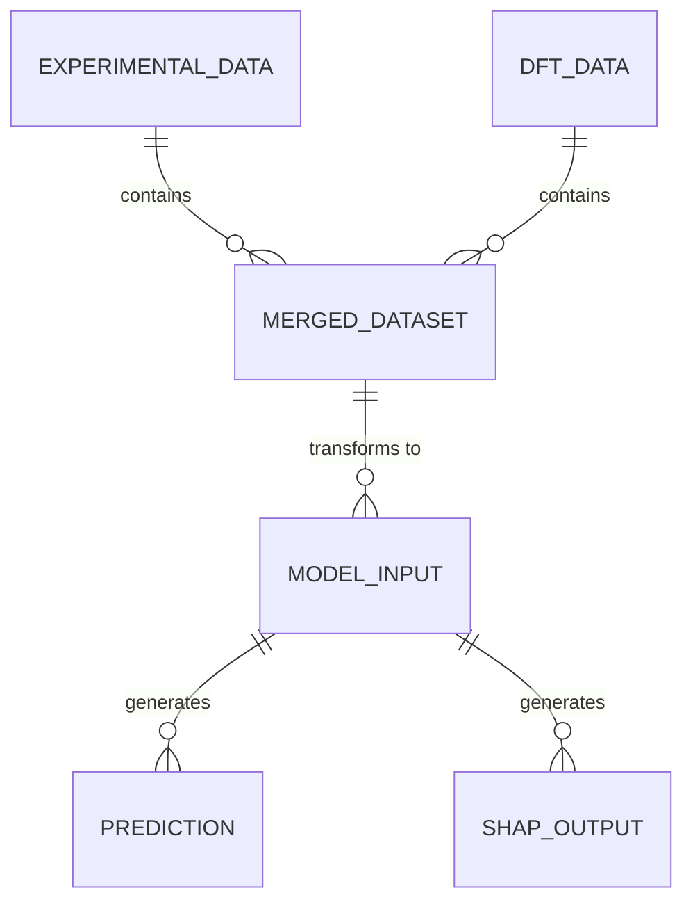

# Data Model: Predicting the Yield Strength of BCC Steels

## Entity Relationship Diagram (Conceptual)

## Schema Definitions

### 1. Raw Experimental Data (Verified Proxy)
- **Source**: `data/raw/experimental_raw.csv` (or JSONL)
- **Fields**:
  - `alloy_id`: String (Unique ID)
  - `chemical_formula`: String (e.g., "Fe0.95Cr0.05")
  - `yield_strength_MPa`: Float (Target)
  - `temperature_K`: Float
  - `source`: String
  - `uncertainty`: Float (Optional, for range values)

### 2. Raw DFT Data (Verified Proxy)
- **Source**: `data/raw/dft_raw.parquet`
- **Fields**:
  - `material_id`: String (Unique ID)
  - `chemical_formula`: String
  - `shear_modulus_GPa`: Float
  - `bulk_modulus_GPa`: Float
  - `crystal_structure`: String (e.g., "BCC", "FCC")
  - `space_group`: Integer

### 3. Merged Dataset (Processed)
- **Source**: `data/processed/merged_bcc_alloys.csv`
- **Fields**:
  - `alloy_id`: String
  - `chemical_formula`: String
  - `yield_strength_MPa`: Float (Target)
  - `shear_modulus_GPa`: Float (Feature)
  - `bulk_modulus_GPa`: Float (Feature)
  - `pughs_ratio`: Float (Derived: Bulk/Shear)
  - `elemental_fractions`: JSON (Dict of element -> fraction)
  - `is_valid`: Boolean (True if BCC and non-null)

### 4. Model Output
- **Source**: `data/processed/model_results.json`
- **Fields**:
  - `fold_id`: Integer
  - `model_type`: String ("RF_DFT", "RF_Baseline")
  - `r2_score`: Float
  - `mae`: Float
  - `rmse`: Float
  - `p_value`: Float (For t-test comparison, **only if n >= 20**)
  - `correlation_r`: Float (Pearson r for shear vs yield)
  - `correlation_p`: Float (Pearson p-value)
  - `feature_importance`: JSON (Dict of feature -> score)
  - `shap_values`: JSON (Dict of feature -> SHAP value)
  - `effect_size_cohen_d`: Float (Reported if n < 20)
  - `statistical_mode`: String ("Full" or "Exploratory")
  - `provenance`: JSON (Content hashes of scripts and data)

### 5. State Tracking (Versioning)
- **Source**: `state.json`
- **Fields**:
  - `scripts`: JSON (Content hash of `fetch_experimental.py`, `merge.py`, etc.)
  - `datasets`: JSON (Content hash of raw datasets)
  - `updated_at`: String (ISO 8601 timestamp)

## Data Transformations
1. **Filtering**: `crystal_structure` == "BCC" AND `space_group` in [229, 221, 222, 223, 224, 225, 226, 227, 228, 229] (BCC variants).
2. **Imputation**: No imputation allowed for `yield_strength` or `shear_modulus`. Rows with nulls are dropped.
3. **Feature Extraction**:
   - Parse `chemical_formula` to calculate atomic fractions.
   - Calculate `pughs_ratio` = `bulk_modulus_GPa` / `shear_modulus_GPa`.
4. **Splitting**: Stratified 5-fold split based on `yield_strength` bins.
5. **SHAP Generation**: Generate SHAP values for all features and store in `shap_values` field.
6. **Provenance Logging**: Record content hashes of all scripts and datasets in `provenance` field of output and `state.json`.
