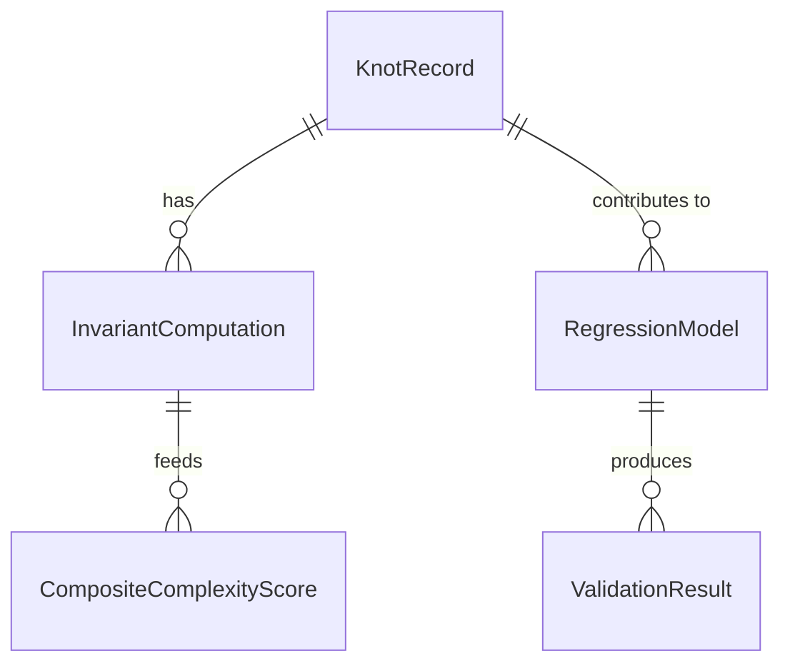

# Data Model: Quantifying the Complexity of Knot Diagrams via Crossing Number and Braid Index

## Entity Relationships



## Core Entities

### KnotRecord

Represents a single prime knot with all measured and computed attributes. Governed by `contracts/knot_record.schema.yaml`.

| Field | Type | Description | Source | Required |
|-------|------|-------------|--------|----------|
| knot_id | string | Unique identifier (e.g., "3_1", "4_1", "10_123") | Knot Atlas | Yes |
| crossing_number | integer | Minimal crossing number for the knot | Knot Atlas | Yes |
| braid_index | integer | Minimal braid index | Knot Atlas | Yes |
| hyperbolic_volume | float | Hyperbolic volume (null for torus/satellite) | Knot Atlas | Yes* |
| is_alternating | ["boolean", "null"] | Alternating classification (null if unclassifiable) | Knot Atlas | Yes* |
| dt_code | string | Dowker-Thistlethwaite code (diagram representation) | Knot Atlas | No |
| braid_word | string | Braid word representation (diagram representation) | Knot Atlas | No |
| arc_index | integer | Computed arc index (Birman-Menasco) | Computed | No |
| seifert_circle_count | integer | Computed Seifert circle count | Computed | No |
| bridge_number | integer | Computed bridge number (Schubert) | Computed | No |
| missing_invariant_flags | array | List of invariants that could not be computed | Computed | No |
| validation_status | string | "validated", "exploratory", or "unclassifiable" | Computed | Yes |

*Required for volume prediction analysis; records with undefined volume are filtered and documented.

### InvariantsDataset

Aggregated collection of KnotRecord entities with metadata.

| Field | Type | Description |
|-------|------|-------------|
| dataset_id | string | Unique identifier for dataset version |
| source | string | "knot_atlas" |
| download_timestamp | datetime | When data was downloaded |
| total_knots | integer | Total number of knot records (prime knots at a specified crossing number per OEIS A002863, https://oeis.org/A002863) |
| validated_knots | integer | Number of knots in validated scope (crossing number ≤10) |
| exploratory_knots | integer | Number of knots in exploratory scope (crossing number 11-13) |
| checksum_sha256 | string | SHA-256 checksum of dataset file |

### RegressionModel

Represents a fitted regression model with all metrics. Governed by `contracts/regression_output.schema.yaml`.

| Field | Type | Description |
|-------|------|-------------|
| model_id | string | Unique identifier |
| model_type | string | "linear", "polynomial", or "logarithmic" |
| formula | string | Mathematical formula representation |
| coefficients | object | Model coefficients (keyed by predictor) |
| r_squared | float | Coefficient of determination |
| aic | float | Akaike Information Criterion |
| bic | float | Bayesian Information Criterion |
| mae | float | Mean Absolute Error |
| vif_crossing | float | Variance Inflation Factor for crossing number |
| vif_braid | float | Variance Inflation Factor for braid index |
| residual_outliers | array | List of knot_ids that deviate significantly |

### CompositeComplexityScore

Represents the weighted complexity measure. **EXPLORATORY CONSTRUCT ONLY** - no predictive claims. Governed by `contracts/composite_score.schema.yaml`.

| Field | Type | Description |
|-------|------|-------------|
| score_id | string | Unique identifier |
| weight_crossing | float | Weight for crossing number (default 1.0) |
| weight_braid | float | Weight for braid index (default 1.0) |
| per_knot_scores | object | Mapping of knot_id to score value |
| correlation_pearson | float | Pearson correlation with hyperbolic volume |
| correlation_spearman | float | Spearman correlation with hyperbolic volume |
| effect_size_r | float | Effect size (r) for correlation |
| p_value | float | Statistical significance of correlation |

## Data Flow

```
Knot Atlas (raw download)
    ↓ [FR-002: Parse and clean]
Raw Dataset (data/raw/knot_atlas_download.csv)
    ↓ [FR-003: Compute invariants]
Invariants Dataset (data/processed/invariants_dataset.csv)
    ↓ [FR-004: Exploratory analysis]
Plots (data/plots/*.png)
    ↓ [FR-005: Regression modeling on FULL DATASET]
Regression Models (data/processed/regression_models.json)
    ↓ [FR-006: Composite score (exploratory ranking only)]
Composite Scores (data/processed/composite_scores.json)
    ↓ [FR-008: Statistical testing]
Validation Results (data/processed/validation_results.json)
```

## File Formats

### CSV Schema (invariants_dataset.csv)

```csv
knot_id,crossing_number,braid_index,hyperbolic_volume,is_alternating,dt_code,braid_word,arc_index,seifert_circle_count,bridge_number,missing_invariant_flags,validation_status
```

### JSON Schema (regression_models.json)

```json
{
  "models": [
    {
      "model_id": "linear_001",
      "model_type": "linear",
      "formula": "volume = β₀ + β₁×crossing + β₂×braid + ε",
      "coefficients": {"intercept": 0.0, "crossing": 0.5, "braid": 0.3},
      "r_squared": 0.85,
      "aic": 123.45,
      "bic": 125.67,
      "mae": 0.12,
      "vif_crossing": 1.2,
      "vif_braid": 1.1,
      "residual_outliers": ["10_123", "11_456"]
    }
  ]
}
```

### JSON Schema (composite_scores.json)

```json
{
  "score_id": "composite_001",
  "weight_crossing": 1.0,
  "weight_braid": 1.0,
  "per_knot_scores": {"3_1": 4.0, "4_1": 5.0},
  "correlation_pearson": 0.89,
  "correlation_spearman": 0.91,
  "effect_size_r": 0.89,
  "p_value": 0.001,
  "methodological_note": "EXPLORATORY CONSTRUCT - no predictive claims"
}
```