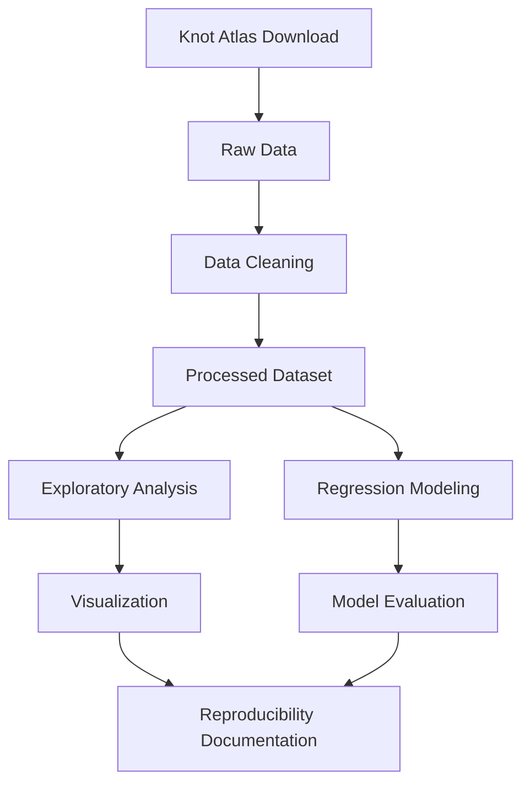

# Data Model: Quantifying the Complexity of Knot Diagrams via Crossing Number and Braid Index

## Entity Definitions

### KnotRecord
Represents a single prime knot with attributes including crossing number, braid index, alternating classification, and hyperbolic volume.

**Attributes**:
- `knot_id`: Unique identifier for the knot (string, e.g., "10_123", "11n42")
- `crossing_number`: Integer, number of crossings in minimal diagram (tabulated from Knot Atlas)
- `braid_index`: Integer, minimum number of strands for braid representation (tabulated from Knot Atlas)
- `hyperbolic_volume`: Float, hyperbolic volume of knot complement (NULL for torus/satellite knots)
- `is_alternating`: Boolean or NULL, alternating classification (NULL if ambiguous)
- `dt_code`: String or NULL, Dowker-Thistlethwaite code representation
- `braid_word`: String or NULL, braid word representation
- `data_quality_flags`: List of strings, general data quality issues (null values, format failures, duplicates)
- `missing_invariant_flags`: List of strings, invariants not computable from available representations
- `source`: String, data source identifier (e.g., "knot_atlas")
- `download_timestamp`: ISO 8601 timestamp, when data was downloaded
- `checksum`: String, SHA-256 checksum of raw record
- `validation_status`: String, validation status (validated, exploratory) based on crossing number range

### InvariantsDataset
Aggregated collection of KnotRecord entities with computed relationships and metadata about data source and computation timestamps.

**Attributes**:
- `dataset_id`: Unique identifier for the dataset
- `knot_records`: List of KnotRecord objects
- `total_knots`: Integer, total number of knots in dataset
- `hyperbolic_knots`: Integer, number of knots with hyperbolic volume > 0
- `alternating_knots`: Integer, number of alternating knots
- `non_alternating_knots`: Integer, number of non-alternating knots
- `crossing_number_range`: Tuple, (min_crossing, max_crossing)
- `data_source`: String, primary data source
- `download_timestamp`: ISO 8601 timestamp
- `checksum`: String, SHA-256 checksum of dataset
- `validation_status`: String, validation status (validated, exploratory, partial)

### RegressionModel
Represents fitted model with attributes including model type, coefficients, goodness-of-fit metrics, and training/validation split information.

**Attributes**:
- `model_id`: Unique identifier for the model
- `model_type`: String, type of regression (linear, polynomial, logarithmic)
- `predictors`: List of strings, predictor variable names
- `target`: String, target variable name
- `coefficients`: Dict, model coefficients with variable names as keys
- `r_squared`: Float, R² goodness-of-fit metric
- `aic`: Float, Akaike Information Criterion
- `bic`: Float, Bayesian Information Criterion
- `mae`: Float, Mean Absolute Error
- `vif_values`: Dict, variance inflation factors for each predictor
- `residual_analysis`: Dict, residual analysis results including outlier families
- `census_data_flag`: Boolean, always true for this census dataset
- `p_value_disclaimer`: String, explicit disclaimer text for p-values
- `fitted_timestamp`: ISO 8601 timestamp
- `random_seed`: Integer, random seed used for model fitting

## Data Flow



## Transformation Pipeline

### Step 1: Data Download
- **Input**: Knot Atlas web API
- **Output**: `data/raw/knot_atlas_raw.parquet`
- **Transformation**: Web scraping with exponential backoff retry logic
- **Validation**: Checksum recorded, null percentage computed

### Step 2: Data Cleaning
- **Input**: `data/raw/knot_atlas_raw.parquet`
- **Output**: `data/processed/knot_records_clean.parquet`
- **Transformation**: Parse, clean, flag quality issues, apply tie-breaking rules
- **Validation**: Format validation, duplicate detection, null percentage <1% (crossing number, hyperbolic volume); braid index <5% with algorithmic fallback

### Step 3: Invariant Computation (Phase 2+)
- **Input**: `data/processed/knot_records_clean.parquet`
- **Output**: `data/processed/invariants_computed.parquet`
- **Transformation**: Compute arc index, Seifert circle count, bridge number from available representations
- **Validation**: Algorithm validation against KnotInfo with ≥90% match threshold; Seifert circle computation per math/0303273 (https://arxiv.org/abs/math/0303273); bridge number via Schubert's bridge decomposition (2-bridge knot, https://en.wikipedia.org/wiki/2-bridge_knot)

### Step 4: Regression Analysis
- **Input**: `data/processed/invariants_computed.parquet` (or clean dataset for Phase 1)
- **Output**: `data/processed/regression_results.json`
- **Transformation**: Fit linear, polynomial, logarithmic models; compute goodness-of-fit metrics
- **Validation**: VIF assessment, residual analysis for outlier families; census_data_flag set to true with p-value disclaimers

### Step 5: Reproducibility Documentation
- **Input**: All data files and transformation outputs
- **Output**: `docs/reproducibility/` directory with checksums, logs, derivation notes
- **Transformation**: Generate SHA-256 checksums, timestamped logs, derivation notes
- **Validation**: Independent reproducibility check

## Data Quality Constraints

### Required Fields (No NULLs Allowed)
- `knot_id`
- `crossing_number`
- `braid_index`
- `source`
- `download_timestamp`

### Optional Fields (NULL Allowed with Flagging)
- `hyperbolic_volume` (NULL for torus/satellite knots, flagged with missing_invariant_flags)
- `is_alternating` (NULL if ambiguous, excluded from stratified analysis or marked unclassifiable)
- `dt_code` (NULL if representation not available)
- `braid_word` (NULL if representation not available)

### Derived Fields (Computed, Not Tabulated)
- `data_quality_flags`
- `missing_invariant_flags`
- `checksum`
- `validation_status`

## File Organization

```
data/
├── raw/
│   └── knot_atlas_raw.parquet          # Downloaded data (unchanged)
├── processed/
│   ├── knot_records_clean.parquet      # Cleaned dataset
│   ├── knot_records_hyperbolic.parquet # Filtered to hyperbolic knots
│   ├── regression_results.json         # Model fitting results
│   └── plots/                          # PNG figures (1200x900 minimum)
│       ├── crossing_vs_braid_alternating.png
│       ├── crossing_vs_braid_non_alternating.png
│       └── residual_analysis.png
└── checksums/
    └── data_checksums.json             # SHA-256 checksums for all data files
```

## Validation Rules

### Schema Validation
All data files MUST conform to schema definitions in `contracts/` directory. Validation performed via jsonschema/pydantic.

### Data Completeness
- Required invariant fields null percentage <1% (SC-013) for crossing number and hyperbolic volume
- Braid index null percentage <5% for tabulated values with algorithmic computation fallback documented
- Format validation pass rate ≥95% (SC-013)
- Duplicate count = 0 (SC-013)

### Reproducibility Validation
- All checksums recorded and verified
- All derivation notes present with formula citations
- All random seeds documented
- All timestamped logs complete
- All p-values explicitly marked as 'not applicable for census data'