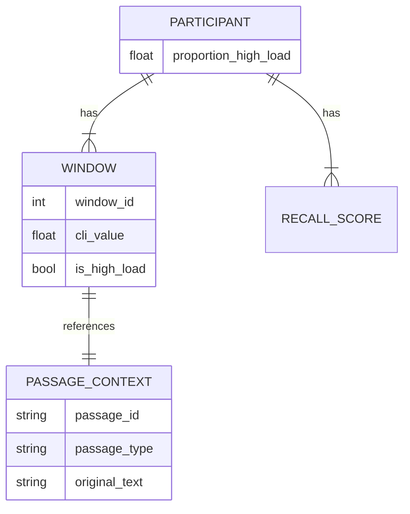

# Data Model: Memory Load‑Adaptive Text Presentation

## Overview

This document defines the data structures used for the `001-memory-load-adaptive-text` feature. The model is designed to support the transformation of raw physiological time series into a structured dataset suitable for Linear Mixed-Effects modeling. The "Adaptation" variable is redefined as **High Load Exposure** (aggregated proportion of time in high-load state) due to the absence of simplified text in the source dataset.

## Entity Relationship Diagram (Conceptual)

## Schema Definitions

### 1. Participant
Unique identifier for a subject in the study.
- `participant_id`: `string` (Unique ID from OpenNeuro)
- `baseline_mean`: `float` (Mean pupil diameter for baseline correction)
- `baseline_std`: `float` (Standard deviation for z-score)
- `proportion_high_load`: `float` (Aggregated metric: count of high-load windows / total windows)

### 2. Window (Time Series Slice)
A 2-second slice of the pupil data with computed metrics.
- `participant_id`: `string`
- `window_index`: `int` (Sequential index)
- `timestamp`: `float` (Start time of window)
- `cli_raw`: `float` (Raw z-score)
- `is_high_load`: `boolean` (True if `cli_raw > 0.5`)
- `passage_id`: `string` (Link to the text being read)

### 3. Passage Context
Metadata about the text segment.
- `passage_id`: `string`
- `passage_type`: `string` (Enum: "abstract", "concrete")
- `original_text`: `string`
- `simplified_text`: `null` (Explicitly noted as absent in source dataset)

### 4. Recall Score
Outcome variable.
- `participant_id`: `string`
- `recall_score`: `float` (0.0 to 1.0 or raw count)

### 5. Analysis Dataset (Derived)
The final aggregated dataset for the LME model.
- `participant_id`: `string`
- `passage_type`: `string`
- `proportion_high_load`: `float` (The "Adaptation" proxy)
- `recall_score`: `float`
- `n_windows_total`: `int`
- `n_windows_high_load`: `int`

## Data Flow

1.  **Input**: Raw Parquet (OpenNeuro ds004041) -> `preprocessing.py` -> **Cleaned Time Series**.
2.  **Transformation**: Cleaned Time Series + Baseline Stats -> `cli_engine.py` -> **Windowed CLI Data**.
3.  **Aggregation**: Windowed CLI -> `simulation.py` -> **Participant-level `proportion_high_load`**.
4.  **Aggregation**: `proportion_high_load` + Recall Scores -> `analysis.py` -> **Final LME Dataset**.
5.  **Output**: `results/model_summary.csv`, `results/permutation_pvalue.csv`.