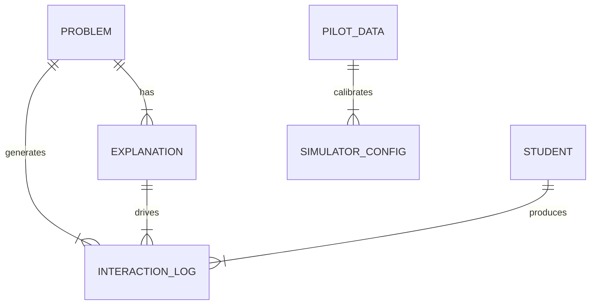

# Data Model: Neuro-Symbolic Learning Networks

## Overview

This document defines the data structures, schemas, and relationships for the Neuro-Symbolic Learning Networks project. It ensures data hygiene, traceability, and reproducibility as per the Project Constitution.

## Entity-Relationship Diagram (Conceptual)

## Data Entities

### 1. Problem
Represents a single mathematics or logic exercise.
- **Source**: ASSISTments dataset.
- **Attributes**:
  - `problem_id`: Unique identifier (string).
  - `prompt_text`: The problem statement (string).
  - `solution`: The correct answer or solution steps (string).
  - `subject`: Category (e.g., "algebra", "geometry").
  - `difficulty_score`: Inferred or provided difficulty metric (float).

### 2. Explanation
An artifact generated for a problem under a specific condition.
- **Storage**: `data/traces/` (JSON/Text).
- **Attributes**:
  - `explanation_id`: Unique hash.
  - `problem_id`: Foreign key to Problem.
  - `condition`: One of `neural`, `symbolic`, `neuro_symbolic`.
  - `content`: The generated text.
  - `model_version`: Version of the generator used.
  - `generation_timestamp`: ISO 8601 timestamp.

### 3. InteractionLog
A record of a student interaction with an explanation.
- **Storage**: `data/processed/interaction_logs.csv`.
- **Attributes**:
  - `log_id`: Unique identifier.
  - `problem_id`: Foreign key.
  - `explanation_id`: Foreign key.
  - `student_id`: Unique student identifier (simulated or real).
  - `condition`: Explanation condition used.
  - `correct`: Binary (0/1).
  - `rt_seconds`: Response time in seconds (float, 1 decimal).
  - `comprehension_rating`: Likert scale (1-5). **Generated as a function of knowledge_gap and explanation_complexity, NOT correctness.**
  - `data_source`: `simulated` or `real`.
- **Constraint**: **Between-Subjects Design**: A unique combination of `(student_id, problem_id)` must exist for only one `condition`. The ingestion process enforces this uniqueness.

### 4. PilotData
Calibration data for the BKT simulator.
- **Storage**: `data/pilot/`.
- **Attributes**: Same as `InteractionLog`, but specifically for the calibration phase. **Must be real human data (T030b) or the study is scope-reduced.**

## Data Flow

1.  **Ingestion**: Raw datasets (ASSISTments) → `data/raw/` (immutable).
2.  **Unification**: Raw datasets → `data/processed/unified_problems.csv` (filtered, schema-validated). **Handles partial success if Khan is missing.**
3.  **Generation**: Unified Problems → `data/traces/` (Explanations).
4.  **Calibration**: Pilot Data (T030b) → `code/simulation/simulator_config.yaml` (updated parameters). **If missing, skip calibration and enter Feasibility Mode.**
5.  **Simulation**: Explanations + BKT Model → `data/processed/interaction_logs.csv`.
6.  **Analysis**: Interaction Logs → `data/processed/regression_results.csv` + Markdown Report.

## Data Hygiene Rules

- **Immutability**: Files in `data/raw` are never modified. Derivations create new files.
- **Checksums**: SHA-256 hashes for all raw files are stored in `state/`.
- **PII**: No personally identifiable information is stored. Student IDs are random UUIDs.
- **Versioning**: Every artifact has a content hash. Changes invalidate dependent artifacts.
