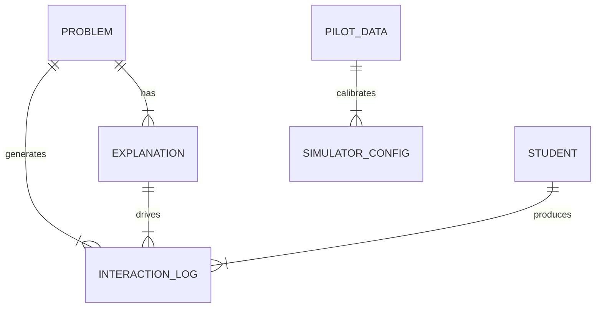

# Data Model: Neuro‑Symbolic Learning Networks

## Overview
Defines all entities, schemas, and relationships required for the pipeline, satisfying Constitution Principles III (Data Hygiene) and VII (Explanation Traceability).

## Entity‑Relationship Diagram

```mermaid
erDiagram
    PROBLEM ||--|{ EXPLANATION : "has"
    PROBLEM ||--|{ INTERACTION_LOG : "generates"
    EXPLANATION ||--|{ INTERACTION_LOG : "drives"
    STUDENT ||--|{ INTERACTION_LOG : "produces"
    PILOT_DATA ||--|{ SIMULATOR_CONFIG : "calibrates"
```

## Entities

| Entity | Description | Key Attributes |
|--------|-------------|----------------|
| **Problem** | Math/logic problem from ASSISTments **or** Khan Academy. | `problem_id`, `prompt_text`, `solution`, `subject`, `difficulty_score`, `dataset_source` |
| **Explanation** | Generated artifact per problem per condition. | `explanation_id`, `problem_id`, `condition`, `content`, `model_version`, `generation_timestamp` |
| **InteractionLog** | Student (simulated or real) interaction with an explanation. | `log_id`, `problem_id`, `explanation_id`, `student_id`, `condition`, `correct`, `rt_seconds`, `comprehension_rating`, `prior_knowledge_score`, `difficulty`, `data_source` |
| **PilotData** | Human pilot interactions used for BKT calibration. | Same fields as `InteractionLog` (excluding `explanation_id`), stored in `data/pilot/real_pilot_data.csv`. |
| **SimulationLog** | Alias for simulated `InteractionLog` (validated by `simulation_log.schema.yaml`). | Same as `InteractionLog` with `data_source = "simulated"`.|

## Data Flow (chronological)
1. **Download** raw datasets → `data/raw/`.  
2. **Unify & Stratify** → `data/processed/unified_problems.csv`.  
3. **Generate Explanations** → `data/traces/` (txt + JSON metadata).  
4. **Collect Pilot Data** → `data/pilot/real_pilot_data.csv`.  
5. **Calibrate BKT** → `code/simulation/simulator_config.yaml`.  
6. **Run Simulation** → `data/processed/interaction_logs_simulated.csv`.  
7. **Collect Real Data** → `data/processed/real_student_data.csv`.  
8. **Merge** → `data/processed/merged_interaction_logs.csv`.  
9. **Analyze** → `results/analysis_output.yaml` (validated against `analysis_output.schema.yaml`).  

## Data Hygiene Rules
- **Immutability**: Files under `data/raw/` are never overwritten; derived files receive new filenames.  
- **Checksums**: SHA‑256 checksums stored in `state/` for every raw and derived file; CI verifies integrity before use.  
- **PII Protection**: Human `student_id`s are random UUIDs; no personal identifiers are stored.  
- **Versioning**: Content hashes recorded in `state/projects/...yaml`; any change triggers artifact invalidation.  

## Schema References
- `contracts/problem.schema.yaml` – validates `unified_problems.csv`.  
- `contracts/explanation.schema.yaml` – validates each explanation JSON metadata.  
- `contracts/interaction_log.schema.yaml` – validates simulated & real interaction logs (includes `prior_knowledge_score`).  
- `contracts/pilot_data.schema.yaml` – validates pilot CSV.  
- `contracts/analysis_output.schema.yaml` – validates regression output.  
- `contracts/simulation_log.schema.yaml` – validates simulation‑only logs.  

## Notes on Dataset Availability
- The **ASSISTments** dataset is fully verified and will always be downloaded.  
- No verified open **Khan Academy** dataset is currently available; the pipeline treats its download as mandatory and will abort with a clear error if unavailable (see Phase 1 in the implementation plan). This limitation is recorded for future specification updates.  

---

