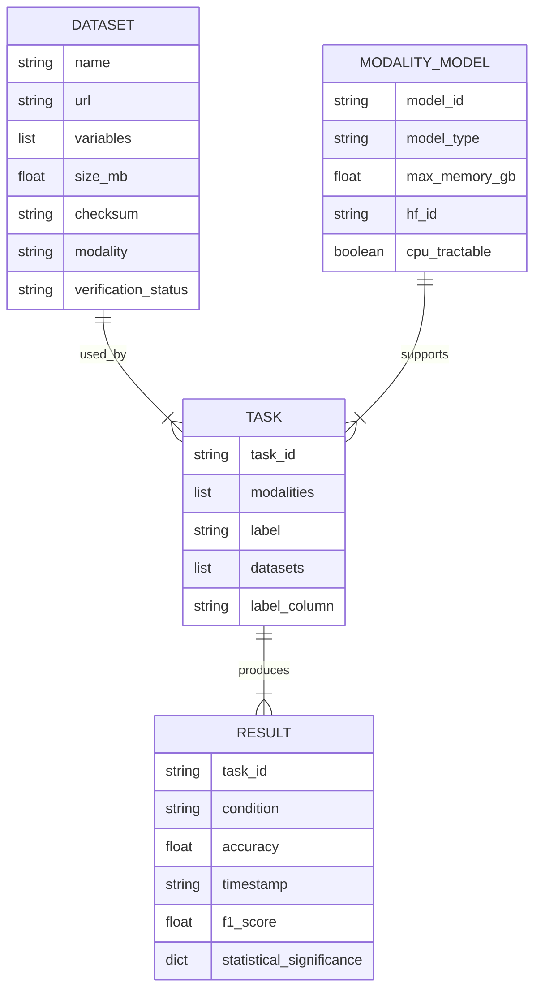

# Data Model

This document describes the entity relationships and schema references for the Heterogeneous Scientific Foundation Model Collaboration Benchmark.

## Entity Definitions

### Dataset

Represents a dataset used in the benchmark.

**Attributes**:
- `name` (string): Unique identifier for the dataset (e.g., "UCI_HAR", "DROP")
- `url` (string): Download URL or HuggingFace dataset identifier
- `variables` (list of strings): List of feature/column names in the dataset
- `size_mb` (float): Size of the dataset in megabytes
- `checksum` (string): SHA256 hash of the downloaded dataset for integrity verification
- `modality` (string): Data modality type (time-series, tabular, text)
- `verification_status` (string): Status from verification process (verified, failed, pending)
- `missing_variables` (list of strings): Variables that were expected but not found
- `impact_assessment` (string): Assessment of impact if variables are missing

**Schema Reference**: `contracts/dataset.schema.yaml`

### ModalityModel

Represents a model specialized for a specific data modality.

**Attributes**:
- `model_id` (string): Unique identifier for the model
- `model_type` (string): Type of model (TimeSeries-Transformer, TabPFN, DistilledLLM)
- `max_memory_gb` (float): Maximum memory usage in gigabytes (must be <1 for CPU tractability)
- `hf_id` (string): HuggingFace model identifier
- `inference_script` (string): Path to the inference script
- `cpu_tractable` (boolean): Whether the model can run on CPU only
- `config_file` (string): Path to the modality configuration YAML file

**Schema Reference**: `contracts/modality_model.schema.yaml`

### Task

Represents a benchmark task to be executed.

**Attributes**:
- `task_id` (string): Unique identifier (e.g., "T001", "T002")
- `modalities` (list of strings): List of modalities required for this task
- `label` (string): Task description or label
- `datasets` (list of strings): List of dataset names required for this task
- `label_column` (string): Name of the target/label column in the dataset
- `priority` (string): Task priority (P1, P2, P3)
- `user_story` (string): Associated user story (US1, US2, US3)
- `timeout_seconds` (integer): Maximum execution time in seconds

**Schema Reference**: `contracts/task.schema.yaml`

### Result

Represents the output of a task execution.

**Attributes**:
- `task_id` (string): Reference to the executed task
- `condition` (string): Execution condition (heterogeneous, unified)
- `accuracy` (float): Accuracy metric for the task
- `timestamp` (string): ISO 8601 timestamp of execution
- `seed` (integer): Random seed used for reproducibility
- `f1_score` (float): F1 score metric
- `mape` (float): Mean Absolute Percentage Error
- `execution_time_seconds` (float): Time taken to execute the task
- `modality_contributions` (dict): Contribution of each modality to the final prediction
- `statistical_significance` (dict): Statistical test results (p-value, effect_size, ci)

**Schema Reference**: `contracts/results.schema.yaml`

## Relationship Diagram

## Cardinality Specifications

### Dataset to Task
- **One Dataset** can be used by **Many Tasks** (1:N)
- **One Task** can use **Many Datasets** (N:M)
- Implementation: Many-to-Many relationship resolved through `task_definitions.yaml`

### ModalityModel to Task
- **One ModalityModel** supports **Many Tasks** (1:N)
- **One Task** requires **Many ModalityModels** (one per modality) (N:M)
- Implementation: Resolved through modality configuration files in `src/benchmark/config/modalities/`

### Task to Result
- **One Task** produces **Many Results** (one per seed/condition) (1:N)
- **One Result** belongs to **One Task** (N:1)
- Implementation: Results stored in `data/statistical_summary.yaml` and `results.csv`

### Dataset to ModalityModel
- **One Dataset** has **One Modality** (1:1)
- **One Modality** is supported by **One ModalityModel** (1:1)
- Implementation: Direct mapping through dataset configuration

## Schema References

All entities must conform to their respective schema definitions:

- **Dataset Schema**: `contracts/dataset.schema.yaml`
 - Required fields: name, url, variables, size_mb, checksum
 - Validation performed by `tests/contract/test_dataset_schema.py`

- **Task Schema**: `contracts/task.schema.yaml`
 - Required fields: task_id, modalities, label, datasets
 - Validation performed by `tests/contract/test_task_schema.py`

- **Results Schema**: `contracts/results.schema.yaml`
 - Required fields: task_id, condition, accuracy, timestamp
 - Validation performed by `tests/contract/test_results_schema.py`

- **ModalityModel Schema**: `contracts/modality_model.schema.yaml`
 - Required fields: model_id, model_type, max_memory_gb
 - Validation performed by `tests/contract/test_modality_model_schema.py`

## Data Flow

1. **Dataset Verification Phase** (Phase 0):
 - Datasets are verified and registered in the system
 - Metadata is recorded in `research.md`
 - Checksums are computed and stored

2. **Task Definition Phase** (Phase 2):
 - Tasks are defined in `src/tasks/task_definitions.yaml`
 - Each task references required datasets and modalities
 - Schema validation is performed

3. **Execution Phase** (Phase 3+):
 - Tasks are executed with specified seeds
 - Results are collected and stored
 - Statistical analysis is performed

4. **Reporting Phase**:
 - Results are aggregated in `data/statistical_summary.yaml`
 - CSV and PDF reports are generated
 - Statistical significance is computed

## State Management

All artifacts are tracked in `state/projects/PROJ-573-https-arxiv-org-abs-2604-27351.yaml`:

- `artifact_hashes`: SHA256 hashes of all tracked files
- `updated_at`: Last modification timestamp
- `checksum_tracking`: Integrity verification data

Updates to this file are managed by `src/utils/versioning.py` and `src/utils/checksum_utils.py`.