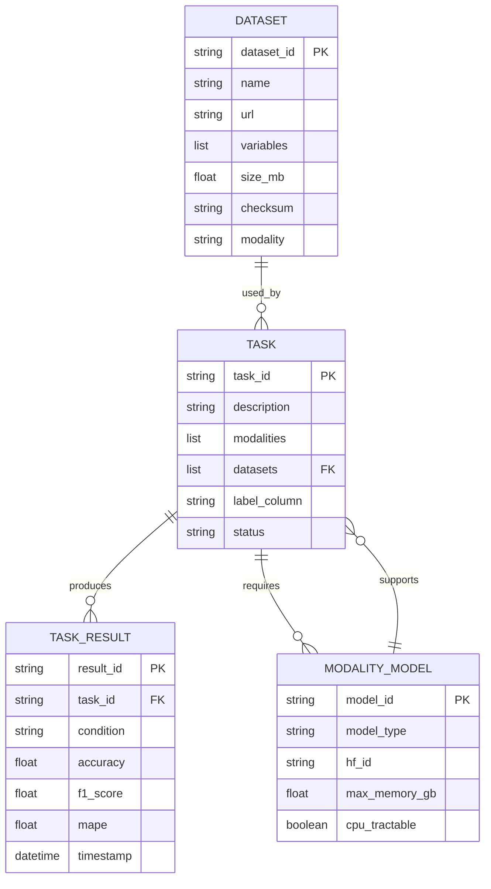

# Data Model: Heterogeneous Scientific Foundation Model Collaboration Benchmark

This document defines the core entities, attributes, relationships, and cardinalities for the benchmarking system. It serves as the canonical reference for data persistence, API contracts, and state management.

## 1. Entity Definitions

### 1.1 Dataset
Represents an external data source used for benchmarking tasks.

**Attributes:**
- `dataset_id` (string, PK): Unique identifier (e.g., "UCI_HAR", "DROP").
- `name` (string): Human-readable name.
- `url` (string): Source URL or HuggingFace dataset ID.
- `variables` (list[string]): List of column/feature names available.
- `size_mb` (float): Size in megabytes.
- `checksum` (string): SHA-256 hash of the downloaded artifact for integrity.
- `modality` (enum): "time-series", "tabular", "text".
- `verification_status` (string): Status from Phase 0 verification (e.g., "verified", "failed").

### 1.2 ModalityModel
Represents a machine learning model specialized for a specific data modality.

**Attributes:**
- `model_id` (string, PK): Unique identifier.
- `model_type` (string): e.g., "TimeSeries-Transformer", "TabPFN", "DistilledLLM".
- `hf_id` (string): HuggingFace model identifier.
- `max_memory_gb` (float): Maximum memory footprint for CPU inference.
- `cpu_tractable` (boolean): True if the model runs within constraints (< 1GB).
- `modalities` (list[string]): List of modalities this model can process.

### 1.3 Task
Represents a specific benchmarking scenario requiring one or more modalities and datasets.

**Attributes:**
- `task_id` (string, PK): Unique identifier (e.g., "T001", "T020").
- `description` (string): Brief description of the task.
- `modalities` (list[string]): Required modalities (e.g., ["time-series", "text"]).
- `datasets` (list[string]): List of `dataset_id`s required.
- `label_column` (string): The target variable name for supervised tasks.
- `status` (enum): "pending", "running", "completed", "failed".

### 1.4 TaskResult (Derived/Transient)
Represents the outcome of executing a Task.

**Attributes:**
- `result_id` (string, PK): Unique identifier.
- `task_id` (string, FK): Reference to Task.
- `condition` (string): "heterogeneous" or "unified".
- `accuracy` (float): Performance metric.
- `f1_score` (float): F1 metric.
- `mape` (float): Mean Absolute Percentage Error.
- `timestamp` (datetime): Execution time.
- `statistical_summary` (dict): Aggregated stats (p-value, effect_size, ci).

## 2. Relationship Diagram

The following Mermaid diagram illustrates the relationships between entities.

## 3. Cardinality Specifications

### 3.1 Dataset to Task
- **Relationship**: Many-to-Many
- **Description**: A single `Dataset` can be used in multiple `Tasks` (e.g., UCI_HAR used in T022 and T029). A single `Task` may require multiple `Datasets` (e.g., a multi-modal task requiring both a time-series dataset and a text dataset).
- **Implementation**: Resolved via the `datasets` list attribute in the `Task` entity.

### 3.2 ModalityModel to Task
- **Relationship**: Many-to-Many
- **Description**: A `ModalityModel` can support multiple `Tasks` (e.g., TabPFN used for all tabular tasks). A `Task` may require multiple models if it involves multiple modalities (e.g., TimeSeries-Transformer + TextModel).
- **Implementation**: Resolved via the `modalities` list in `Task` and the `modalities` list in `ModalityModel`.

### 3.3 Task to TaskResult
- **Relationship**: One-to-Many
- **Description**: A single `Task` is executed multiple times (across different seeds or conditions), producing multiple `TaskResult` records.
- **Implementation**: `TaskResult` contains a foreign key `task_id`.

## 4. Plan Consistency

This data model aligns with the project plan (`plan.md`) and the following schema contracts:
- `contracts/dataset.schema.yaml` (T010)
- `contracts/task.schema.yaml` (T011)
- `contracts/results.schema.yaml` (T012)
- `contracts/modality_model.schema.yaml` (T013)

All entities defined above map directly to the required fields in these schema contracts.