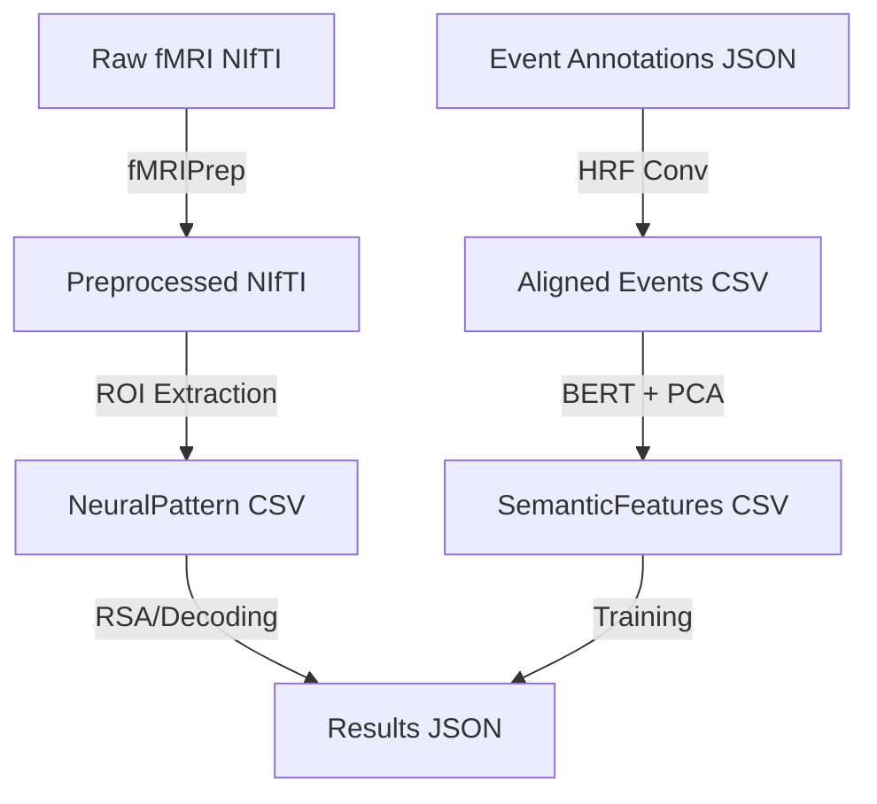

# Data Model: Narrative Archaeology

## Overview

This document defines the data structures used throughout the pipeline, ensuring type safety and schema compliance. All data flows from raw downloads to processed artifacts, with strict versioning and checksums.

## Entity Definitions

### 1. NeuralPattern
A vector representing the BOLD signal amplitude across voxels in a specific ROI at a specific timepoint (or averaged over an event window).

*   **Fields**:
    *   `subject_id`: string (e.g., "sub-01")
    *   `roi_name`: string (e.g., "hippocampus")
    *   `event_id`: string (e.g., "evt_001")
    *   `pattern_vector`: list[float] (normalized BOLD signal values)
    *   `timestamp`: datetime (ISO 8601)

### 2. NarrativeEvent
A discrete unit of the story defined by its type, timestamp, and semantic content.

*   **Fields**:
    *   `event_id`: string (unique identifier)
    *   `type`: string (enum: "plot", "character", "theme")
    *   `onset`: float (seconds from scan start)
    *   `duration`: float (seconds)
    *   `text_content`: string (the narrative segment)
    *   `semantic_features`: list[float] (BERT embedding, post-PCA)

### 3. DecodingModel
A trained linear classifier mapping SemanticFeature inputs to NarrativeEvent labels.

*   **Fields**:
    *   `model_id`: string
    *   `algorithm`: string (e.g., "RidgeRegression")
    *   `roi_name`: string
    *   `feature_dim`: int
    *   `weights`: list[float]
    *   `accuracy`: float (cross-validated)
    *   `chance_level`: float
    *   `p_value`: float
    *   `fdr_corrected`: bool

## Data Flow Diagram

## Storage Locations

| Artifact | Path | Format | Checksum |
| :--- | :--- | :--- | :--- |
| Raw Data | `data/raw/ds000234/` | NIfTI, JSON | SHA-256 |
| Preprocessed | `data/processed/sub-*/` | NIfTI, JSON | SHA-256 |
| Event Table | `data/processed/events_aligned.csv` | CSV | SHA-256 |
| Error Log | `data/errors.log` | JSON Lines | SHA-256 |
| Results | `data/results/` | JSON, CSV | SHA-256 |
