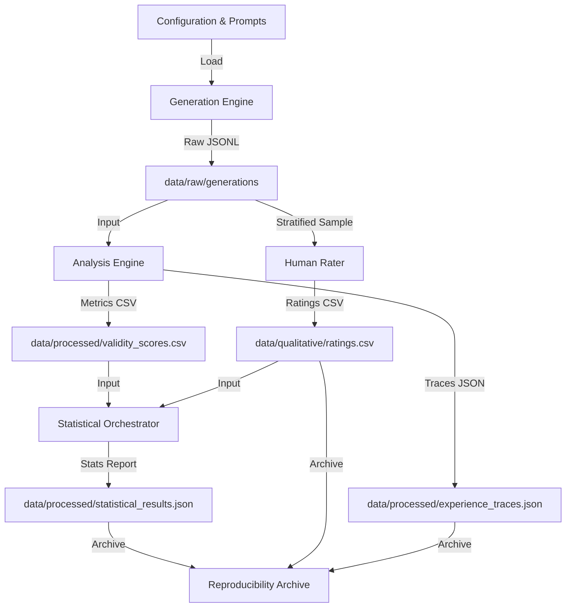
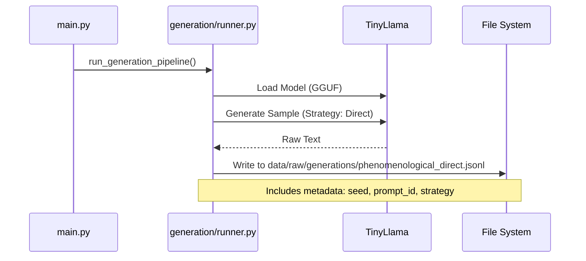
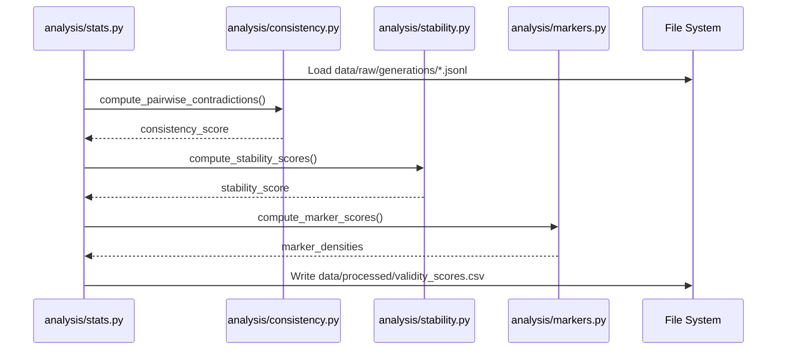
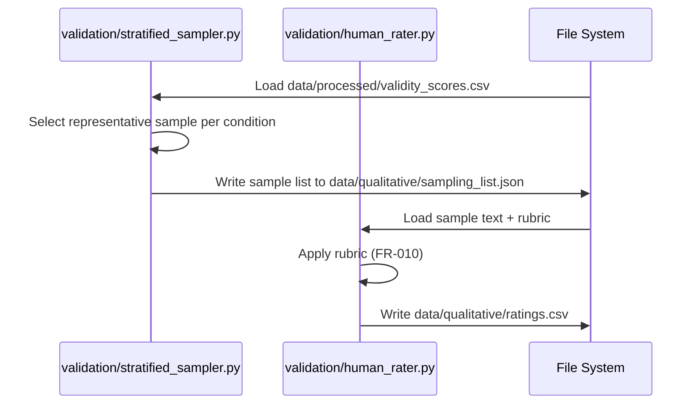

# Data Model: Phenomenological AI First-Person Experience

This document describes the data schemas, artifact formats, and flow diagrams for the Phenomenological AI research pipeline. It defines how data moves from generation through analysis to validation.

## 1. Data Flow Overview

The pipeline consists of three main stages: **Generation**, **Analysis**, and **Validation**.



## 2. Artifact Schemas

### 2.1. Raw Generation Output (`data/raw/generations/*.jsonl`)

Generated phenomenological reports stored in JSON Lines format. Each line represents a single sample.

```yaml
type: object
properties:
 sample_id:
 type: string
 description: Unique identifier (e.g., "T009_S1_P12_S2")
 strategy:
 type: string
 enum: [Direct, Hypothetical, Comparative, Role-play]
 prompt_id:
 type: string
 description: Reference to the base prompt used
 prompt_text:
 type: string
 description: The full prompt sent to the model
 model_id:
 type: string
 description: The specific model checkpoint used
 seed:
 type: integer
 description: Random seed for reproducibility
 generation_text:
 type: string
 description: The raw text output from the model
 metadata:
 type: object
 properties:
 generation_time_ms:
 type: integer
 token_count:
 type: integer
 temperature:
 type: number
required:
 - sample_id
 - strategy
 - prompt_id
 - generation_text
 - seed
```

### 2.2. Validity Scores (`data/processed/validity_scores.csv`)

Aggregated metric scores for each sample, computed by the Analysis Engine.

```csv
sample_id,strategy,consistency_score,stability_score,sensory_marker_density,temporal_marker_density,intentional_marker_density,overall_phenomenological_index
T009_S1_P12_S2,Direct,0.85,0.92,0.15,0.08,0.12,0.78
...
```

**Column Definitions:**
- `consistency_score`: Float (0.0-1.0). Derived from NLI contradiction checks (T014).
- `stability_score`: Float (0.0-1.0). Derived from embedding cosine similarity of repeated generations (T015).
- `*_marker_density`: Float. Count of specific marker types per 100 tokens (T016).
- `overall_phenomenological_index`: Weighted composite score used for statistical testing.

### 2.3. Experience Traces (`data/processed/experience_traces.json`)

Attention mapping data for specific phenomenological keywords, addressing the "internal state legibility" requirement (T034).

```json
{
 "sample_id": "T009_S1_P12_S2",
 "keyword": "feel",
 "token_index": 142,
 "attention_heads": [
 {
 "layer": 12,
 "head": 3,
 "attention_weight": 0.045,
 "target_token": "now"
 },
 {
 "layer": 11,
 "head": 7,
 "attention_weight": 0.032,
 "target_token": "light"
 }
 ],
 "activation_pattern": "high_sensory_coupling"
}
```

### 2.4. Qualitative Ratings (`data/qualitative/ratings.csv`)

Human rater evaluations based on the validation rubric.

```csv
rater_id,sample_id,rubric_category,score,comments
R001,T009_S1_P12_S2,Phenomenological_Fidelity,4,"Strong use of sensory markers, slightly disjointed temporal flow."
...
```

## 3. Data Flow Diagrams

### 3.1. Generation Phase



### 3.2. Analysis Phase



### 3.3. Validation Phase



## 4. Schema Validation Rules

All data artifacts must pass validation before being used in downstream tasks.

- **Generations**: Must contain non-empty `generation_text` and valid `strategy` enum.
- **Scores**: All metric columns must be numeric and within [0.0, 1.0] range.
- **Ratings**: `score` must be an integer 1-5; `rubric_category` must match `code/validation/rubric.md`.

## 5. Versioning & Archiving

Final artifacts are archived by `code/utils/archiver.py` into a reproducible tarball. The archive includes:
- `data/raw/` (selected samples)
- `data/processed/` (all scores and traces)
- `data/qualitative/` (anonymized ratings)
- `specs/contracts/` (schema definitions)
- `code/` (scripts used)
- `docs/` (this data model)

The `manifest.json` within the archive records the exact git commit hash and environment hash for full reproducibility.