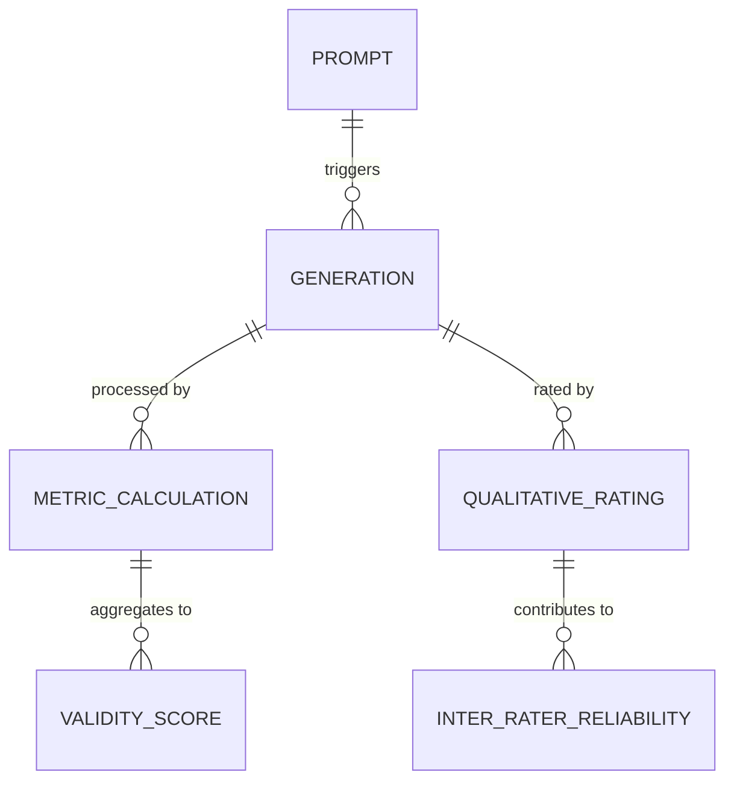

# Data Model: Phenomenological AI: First-Person Experience Modeling

## 1. Overview

This document defines the data structures for the Phenomenological AI project. All data is stored in CSV or JSONL formats to ensure readability and reproducibility. The model adheres to the **Single Source of Truth** principle: all analysis results must trace back to these files.

## 2. Entity Relationships

## 3. Schemas

### 3.1 Prompt Definition
Defines the input stimuli for generation.

| Field | Type | Description |
| :--- | :--- | :--- |
| `prompt_id` | string | Unique identifier (e.g., "P001") |
| `strategy` | string | One of: Direct, Hypothetical, Comparative, Role-play |
| `text` | string | The actual prompt text |

### 3.2 Generation Output
Raw text generated by the LLM.

| Field | Type | Description |
| :--- | :--- | :--- |
| `generation_id` | string | Unique UUID |
| `prompt_id` | string | FK to Prompt |
| `model_id` | string | e.g., "tinyllama-1.1b" (Note: 7B models excluded from CI) |
| `seed` | integer | Random seed used |
| `text` | string | Generated report |
| `timestamp` | datetime | Generation time |
| `status` | string | "success", "timeout", "oom" |

### 3.3 Metric Components
Individual scores for each validity criterion.

| Field | Type | Description |
| :--- | :--- | :--- |
| `generation_id` | string | FK to Generation |
| `consistency_score` | float | NLI-based contradiction rate (0-1) |
| `stability_score` | float | Cosine similarity (0-1) |
| `marker_count` | integer | Total phenomenological markers found |
| `marker_density` | float | marker_count / word_count |

### 3.4 Validity Score
Composite metric.

| Field | Type | Description |
| :--- | :--- | :--- |
| `generation_id` | string | FK to Generation |
| `validity_score` | float | Weighted sum (0-1) |
| `weights` | json | {consistency: 0.33, stability: 0.33, markers: 0.34} |

### 3.5 Qualitative Rating
Human evaluation.

| Field | Type | Description |
| :--- | :--- | :--- |
| `rating_id` | string | Unique ID |
| `generation_id` | string | FK to Generation |
| `rater_id` | string | Anonymized rater ID |
| `coherence_score` | integer | 1-5 Likert scale |
| `comments` | string | Optional notes |

## 4. Storage Constraints

- **Raw Data**: Stored in `data/raw/` as JSONL.
- **Processed Data**: Stored in `data/processed/` as CSV.
- **Checksums**: SHA-256 hashes recorded in `state/projects/PROJ-...yaml`.
- **PII**: No PII allowed in `data/`. Rater IDs must be anonymized.
