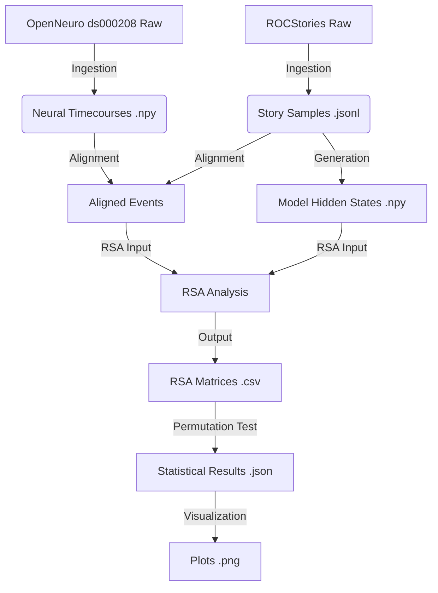

# Data Model: Neural Narrative Networks

## Overview
This document defines the data structures used throughout the pipeline, ensuring type safety and contract compliance. All data flows from `raw` (downloaded) to `processed` (cleaned) to `results` (analyzed).

## Data Entities

### 1. Neural Timecourse
Represents the BOLD signal for a specific ROI and subject.
*   **Source**: OpenNeuro ds000208 (processed via `01_data_ingestion.py`).
*   **Format**: `.npy` (NumPy array).
*   **Shape**: `(n_timepoints, n_voxels)` or `(n_timepoints, 1)` if averaged.
*   **Attributes**:
    *   `subject_id`: String (e.g., "sub-001").
    *   `roi`: Enum ["hippocampus_left", "hippocampus_right", "dlpfc_left", "dlpfc_right"].
    *   `story_event_ids`: List of integers linking timepoints to story events (aligned via semantic similarity).

### 2. Narrative Representation
Vector representation of a story event from the model.
*   **Source**: Model outputs (`02_model_generation.py`).
*   **Format**: `.npy` or `.csv`.
*   **Shape**: `(n_events, embedding_dim)`.
*   **Attributes**:
    *   `model_type`: Enum ["brain_inspired", "baseline_sae"].
    *   `story_id`: Integer.
    *   `event_index`: Integer.
    *   `activation_vector`: List of floats.

### 3. RSA Matrix
Pairwise similarity matrix.
*   **Source**: RSA Analysis (`03_rsa_analysis.py`).
*   **Format**: `.csv` (symmetric).
*   **Shape**: `(n_events, n_events)`.
*   **Attributes**:
    *   `model_type`: Enum.
    *   `roi`: Enum.
    *   `similarity_metric`: String ("pearson_correlation").

### 4. Permutation Result
Statistical test output.
*   **Source**: RSA Analysis (`03_rsa_analysis.py`).
*   **Format**: `.json`.
*   **Structure**:
    ```json
    {
      "observed_difference": float,
      "p_value": float,
      "permutations": a sufficiently large number,
      "convergence_variance": float,
      "is_significant": boolean
    }
    ```

## Data Flow Diagram



## Processing Rules

1.  **Immutability**: Raw files in `data/raw/` are never modified.
2.  **Checksum**: Every file in `data/processed/` and `data/results/` must have a corresponding SHA-256 hash recorded in the project state file (via `utils/checksums.py`).
3.  **Chunking**: fMRI data loading must implement chunking if `n_timepoints * n_voxels * 4 bytes` > 1GB.
4.  **Alignment**: Story event IDs in neural data must align with story indices in model outputs via semantic similarity. Mismatches are logged and excluded.
