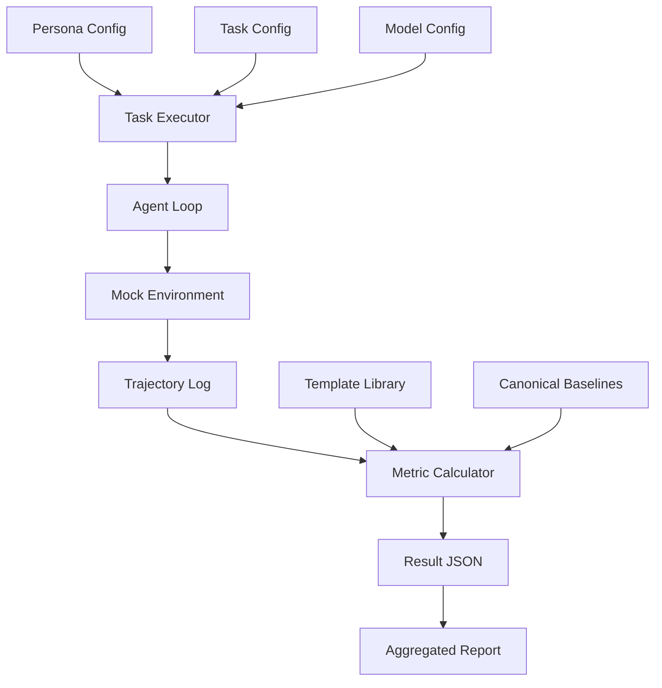

# Data Model: $π$-Bench: Evaluating Proactive Personal Assistant Agents in Long-Horizon Workflows

## Overview

This document defines the data structures used for input configuration, task execution, and result aggregation in the $π$-Bench evaluation pipeline. The primary data flow is: `Persona Config` + `Task Config` -> `Agent Execution` -> `Trajectory Log` -> `Result JSON`.

## Input Data Models

### 1. Persona Profile (`profile.yaml`)
Defines the user context, skills, and hidden needs for a specific persona.

```yaml
# Example: Financier
persona_id: "financier_001"
name: "Financier"
skills: ["budgeting", "investment", "tax_planning"]
hidden_intents:
  - id: "hi_001"
    description: "User wants to save on taxes but didn't say it."
    trigger_keywords: ["spending", "income"]
    expected_action: "suggest_tax_deduction"
```

### 2. Task Definition (`task.yaml`)
Defines a single unit of work, including explicit instructions and hidden intents. **Crucially, includes a set of valid explicit-only baselines.**

```yaml
# Example: Task for Financier
task_id: "fin_task_001"
persona_id: "financier_001"
instructions: "Review my monthly spending report."
hidden_intent_id: "hi_001"
expected_outcome: "Report generated with tax-saving suggestions."
# A set of valid explicit-only paths (no hidden intent actions)
canonical_baselines:
  - ["fetch_report", "analyze_spending", "display_report"]
  - ["fetch_report", "download_csv", "display_report"]
```

### 3. Model Configuration (`model_config.yaml`)
Defines the LLM backend and execution parameters.

```yaml
model_id: "minimax_m2.5"
provider: "minimax"
device: "cpu"  # Enforced
precision: "float32"
temperature: 0.0  # Deterministic for reproducibility
```

### 4. Retrieval Template Library (`config/templates.yaml`)
A population of known retrieval templates used to calculate the Sequence Novelty Index.
```yaml
templates:
  - id: "tpl_001"
    name: "Standard Report Fetch"
    actions: ["fetch_report", "display_report"]
  - id: "tpl_002"
    name: "Basic Search"
    actions: ["search", "select_item"]
```

## Output Data Models

### 1. Task Result (`results/<persona>/<task_id>.json`)
The primary artifact generated for each task.

```json
{
  "task_id": "fin_task_001",
  "model_id": "minimax_m2.5",
  "persona_id": "financier_001",
  "completion_status": "success",
  "proactivity_score": 0.85,
  "novelty_index": 0.72,
  "latency_ms": 4500,
  "action_trace": [
    {"step": 1, "action": "fetch_report", "observation": "Report loaded"},
    {"step": 2, "action": "analyze_spending", "observation": "Spending high"},
    {"step": 3, "action": "suggest_tax_deduction", "observation": "Suggestion made"}
  ],
  "novelty_check": {
    "is_proactive": true,
    "deviation_score": 0.72,
    "reason": "Action sequence deviates from all canonical baselines and retrieval templates."
  },
  "errors": []
}
```

### 2. Aggregated Report (`results/summary.json`)
Aggregates results across all tasks and models.

```json
{
  "summary_date": "2026-05-27",
  "total_tasks": 100,
  "models": ["minimax_m2.5", "claude_haiku_4_5"],
  "metrics": {
    "minimax_m2.5": {
      "task_completion_rate": 0.92,
      "avg_proactivity_score": 0.78,
      "avg_novelty_index": 0.65,
      "ci_proactivity_diff": [0.02, 0.15]
    },
    "claude_haiku_4_5": {
      "task_completion_rate": 0.88,
      "avg_proactivity_score": 0.82,
      "avg_novelty_index": 0.70,
      "ci_proactivity_diff": [0.01, 0.12]
    }
  },
  "statistical_method": "Bootstrapping (a sufficient number of resamples)"
}
```

## Error Handling Models

### 1. Environment Failure
Logged when a mock API simulation fails.

```json
{
  "error_type": "environment_failure",
  "task_id": "fin_task_001",
  "message": "Mock Gmail API schema mismatch.",
  "excluded_from_metrics": true
}
```

### 2. Timeout Failure
Logged when a task exceeds the time limit.

```json
{
  "error_type": "timeout",
  "task_id": "fin_task_001",
  "message": "Task exceeded a threshold of turns.",
  "completion_status": "timeout",
  "proactivity_score": 0.0
}
```

## Data Flow Diagram



## Constraints & Validation

*   **Proactivity Score**: Must be in range [0.0, 1.0].
*   **Novelty Index**: Must be in range [0.0, 1.0].
*   **Completion Status**: Must be one of: `success`, `failure`, `timeout`, `environment_failure`.
*   **Latency**: Must be a positive integer (ms).
*   **Trace**: Must be a list of steps with `step`, `action`, and `observation`.
*   **Statistical Method**: Must be reported as "Bootstrapping" or "Descriptive" in summary.