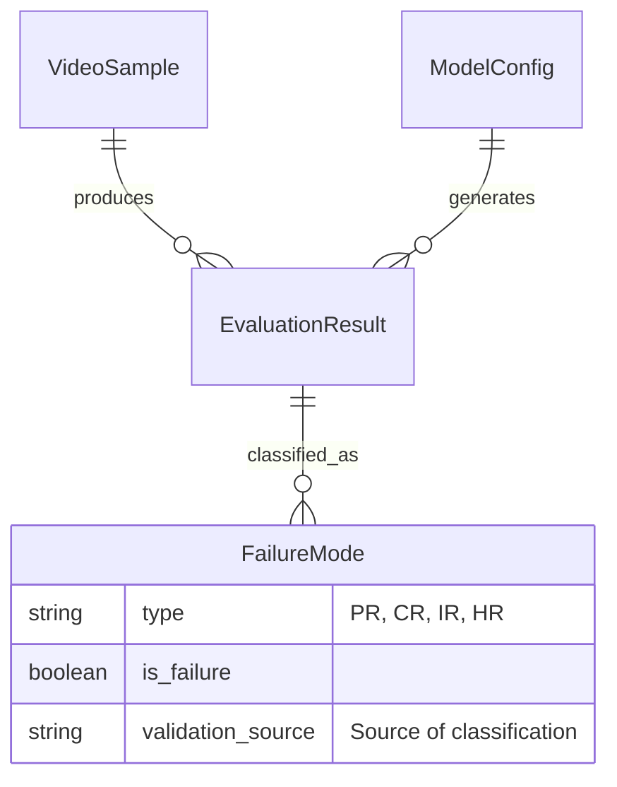

# Data Model: Reproduction of MM-OCEAN Benchmark

## Overview

This document defines the data structures used in the MM-OCEAN reproduction pipeline. The data flow moves from raw video/annotations to intermediate inference results, and finally to aggregated metrics and reports.

## Entity Relationship Diagram (Conceptual)



## Data Schemas

### 1. Video Sample (Input)
Represented by a JSON file paired with a video file in `data/test/`.

```yaml
# Contract: contracts/video_sample.schema.yaml
$schema: "http://json-schema.org/draft-07/schema#"
title: VideoSample
type: object
properties:
  video_path:
    type: string
    description: "Relative path to the video file"
  annotation:
    type: object
    properties:
      big_five_scores:
        type: object
        properties:
          openness: {type: number}
          conscientiousness: {type: number}
          extraversion: {type: number}
          agreeableness: {type: number}
          neuroticism: {type: number}
        required: [openness, conscientiousness, extraversion, agreeableness, neuroticism]
      behavioral_cues:
        type: array
        items: {type: string}
    required: [big_five_scores, behavioral_cues]
required: [video_path, annotation]
```

### 2. Evaluation Result (Intermediate)
Generated by `evaluate.py` for each video sample. **Crucially, the `failure_modes` object now includes a `validation_source` to track the derivation of the classification.**

```yaml
# Contract: contracts/evaluation_result.schema.yaml
$schema: "http://json-schema.org/draft-07/schema#"
title: EvaluationResult
type: object
properties:
  sample_id:
    type: string
    description: "Unique identifier for the video sample"
  model_id:
    type: string
    description: "Identifier of the MLLM used"
  rating:
    type: number
    description: "Model's rating of the personality trait"
  reasoning_trace:
    type: string
    description: "The model's textual reasoning"
  grounding_evidence:
    type: array
    items: {type: string}
    description: "Citations to video frames or segments"
  failure_modes:
    type: object
    properties:
      is_prejudice: {type: boolean}
      is_confabulation: {type: boolean}
      is_integration_failure: {type: boolean}
      is_holistic_grounding: {type: boolean}
      validation_source:
        type: string
        description: "Source of the classification: 'vendored_code', 'heuristic', 'human_review'"
        enum: ["vendored_code", "heuristic", "human_review"]
    required: [is_prejudice, is_confabulation, is_integration_failure, is_holistic_grounding, validation_source]
  status:
    type: string
    enum: ["success", "timeout", "load_error"]
  dropout_metadata:
    type: object
    description: "Present only if status is 'timeout' or 'load_error'"
    properties:
      reason: {type: string}
      video_length_seconds: {type: number}
    required: [reason]
required: [sample_id, model_id, rating, reasoning_trace, failure_modes, status]
```

### 3. Aggregated Metrics (Output)
Computed summary statistics for the report.

```yaml
# Contract: contracts/aggregated_metrics.schema.yaml
$schema: "http://json-schema.org/draft-07/schema#"
title: AggregatedMetrics
type: object
properties:
  model_id:
    type: string
  total_samples:
    type: integer
  metrics:
    type: object
    properties:
      prejudice_rate:
        type: number
        description: "Percentage of samples with is_prejudice=true"
      confabulation_rate:
        type: number
        description: "Percentage of samples with is_confabulation=true"
      integration_failure_rate:
        type: number
        description: "Percentage of samples with is_integration_failure=true"
      holistic_grounding_rate:
        type: number
        description: "Percentage of samples with is_holistic_grounding=true"
    required: [prejudice_rate, confabulation_rate, integration_failure_rate, holistic_grounding_rate]
  validation_summary:
    type: object
    description: "Summary of validation sources used"
    properties:
      vendored_code_count: {type: integer}
      heuristic_count: {type: integer}
      human_review_count: {type: integer}
required: [model_id, total_samples, metrics]
```

## Data Flow

1. **Ingestion**: `VideoSample` objects are loaded from `data/test/`.
2. **Inference**: `evaluate.py` processes each sample, generating `EvaluationResult` objects.
3. **Aggregation**: `failure_mode_calculator.py` reads all `EvaluationResult` objects and computes `AggregatedMetrics`.
4. **Reporting**: `report_generator.py` consumes `AggregatedMetrics` to produce `summary_report.md` and `failure_mode_distribution.png`.

## Heuristic Logic Definition

To support the `validation_source` field, the following logic is defined for the "heuristic" source:
- **Heuristic**: A keyword-based classifier that scans the `reasoning_trace` for common stereotyping indicators (e.g., "typically", "usually", "men are", "women are", "stereotypically"). If any keyword is found, `is_prejudice` is flagged as true for the heuristic check.
- **Human Review**: If resources permit, a random subset of samples will be manually annotated by human raters to determine the true "Prejudice" label. This is currently marked as "N/A" unless explicitly enabled in the configuration.