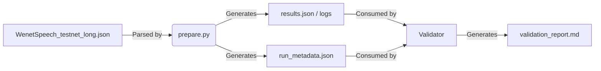

# Data Model: Reproduce & Validate StepAudio 2.5 Technical Report

## Overview

This document defines the data structures used for input configuration, execution metadata, and validation results. All data models are strictly typed to ensure the `validation_report.md` and `run_metadata.json` are machine-readable and contract-compliant.

## Entities

### 1. WenetSpeech Configuration (Input)

The input JSON file that defines the scope of the reproduction run.

*   **Source**: `external/wenetspeech-testnet-long/WenetSpeech_testnet_long.json`
*   **Format**: JSON
*   **Description**: Contains a list of audio entries to be processed. **Crucially, the `transcription` field must contain the ground truth annotations from the official WenetSpeech test set, not generated by the model.**
*   **Constraint**: The `audio_path` or `audio_url` field MUST point to a **remote** resource. Local paths implying bundled data are deprecated and will cause the run to fail with `E_DISK_EXCEEDED`.

### 2. Run Metadata (Output)

Captures the environment and execution details for reproducibility auditing (FR-004).

*   **Source**: `output/run_metadata.json`
*   **Format**: JSON
*   **Description**: Immutable record of the run. Includes sampling strategy details (`strata_columns`, `method`) and statistical method used (`statistical_method`).

### 3. Reproduction Artifact (Output)

The primary output of the `prepare.py` script.

*   **Source**: `output/results.json` (or similar)
*   **Format**: JSON / CSV
*   **Description**: Contains the ASR/TTS results (transcriptions, scores, audio paths).

### 4. Validation Report (Output)

The human-readable summary of the validation process (FR-005).

*   **Source**: `output/validation_report.md`
*   **Format**: Markdown
*   **Description**: Compares observed metrics against paper claims.

## Data Flow

## Schema Definitions

See `contracts/` directory for the formal YAML schema definitions.
- `wenetspeech-config.schema.yaml`: Validates the input JSON.
- `run-metadata.schema.yaml`: Validates the execution metadata.
- `validation-report.schema.yaml`: (Implicit) Defines the structure of the Markdown report sections.

## Constraints & Rules

1.  **Immutability**: `run_metadata.json` must not be modified after the script exits.
2.  **Completeness**: `results.json` must contain an entry for every item in the input configuration (unless a sampling strategy is explicitly logged in `run_metadata`).
3.  **Error Handling**: If the input JSON is invalid, the system must exit with code `E_INVALID_INPUT` (non-zero) and produce no partial artifacts.
4.  **Ground Truth Independence**: The `transcription` field in the input JSON must be sourced from the **official WenetSpeech test set annotations**. If the input JSON lacks these, the run halts with `E_MISSING_GROUND_TRUTH`.
5.  **Remote Data Only**: The input JSON must not contain local paths that imply data bundling >14GB. If detected, the run halts with `E_DISK_EXCEEDED`.