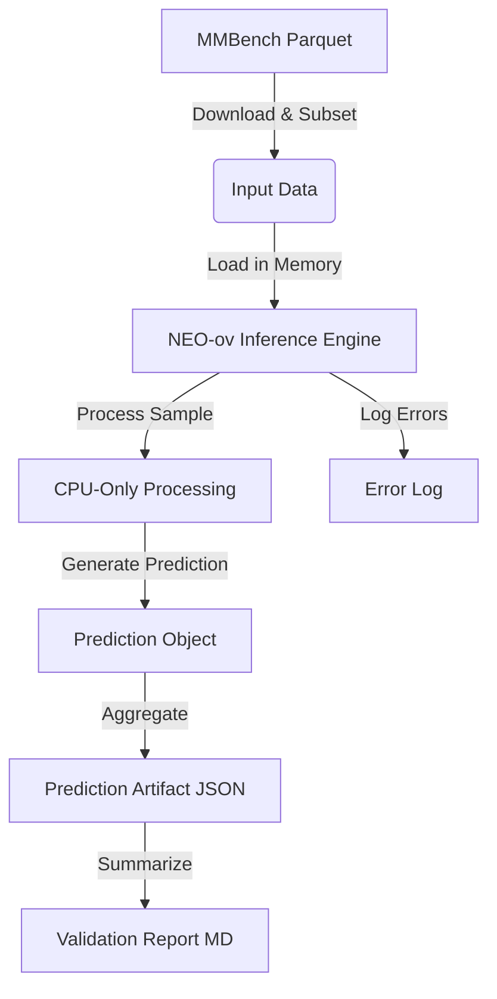

# Data Model: Reproduce & Validate NEO-ov One-Vision Model

## Overview

This document defines the data structures used for input, processing, and output in the NEO-ov validation pipeline. The primary data flow involves downloading a subset of the MMBench dataset, processing it through the NEO-ov inference engine, and generating a structured prediction artifact.

## Input Data Schema

### MMBench Subset
The input dataset is a subset of the MMBench benchmark, containing image-text pairs. The data is loaded from a Parquet file and processed as a list of records.

**Source**: ` (Dev) or `test` split.

**Structure**:
- `question_id` (string): Unique identifier for the question.
- `image` (bytes or path): The image data (base64 or local path).
- `question` (string): The text prompt/question.
- `answer` (string): The ground truth answer.
- `category` (string): The category of the question (e.g., "OCR", "Science").

**Constraints**:
- The dataset is capped at a manageable scale appropriate for the study.
- Images are processed sequentially or in small batches to fit within 7 GB RAM.

## Output Data Schema

### Prediction Artifact (JSON)
The primary output is a JSON file containing the model's predictions, ground truths, and calculated metrics for each sample.

**File Path**: `outputs/predictions/prediction_results.json`

**Schema Definition**:
```yaml
type: array
items:
 type: object
 required:
 - question_id
 - question
 - prediction
 - ground_truth
 - is_correct
 - confidence_score
 properties:
 question_id:
 type: string
 description: "Unique identifier for the question."
 question:
 type: string
 description: "The input question text."
 prediction:
 type: string
 description: "The model's generated answer text."
 minLength: 1
 ground_truth:
 type: string
 description: "The ground truth answer."
 is_correct:
 type: boolean
 description: "True if prediction matches ground truth after normalization (lowercase, strip punctuation, collapse whitespace)."
 confidence_score:
 type: number
 format: float
 minimum: 0.0
 maximum: 1.0
 description: "Model's confidence score (if available, else 0.0)."
 category:
 type: string
 description: "The category of the question."
 processing_time_ms:
 type: integer
 description: "Time taken to process this sample in milliseconds."
```

### Validation Report (Markdown)
A human-readable report summarizing the execution status, metrics, and limitations.

**File Path**: `outputs/reports/validation_report.md`

**Sections**:
1. **Execution Summary**: Status (Success/Failed), Total Samples, Time Elapsed.
2. **Performance Metrics**: Accuracy (with 95% Wilson score CI), Exact Match, Average Confidence.
3. **Methodological Notes**:
 - **Mandatory Content**: Must explicitly state that "single-point validation cannot refute or confirm scaling laws, only functional correctness at a fixed scale."
 - Must explicitly state that "no scaling law analysis (exponent fitting) was performed."
4. **Error Log**: Summary of any skipped samples or errors.

## Data Flow Diagram



## Constraints & Assumptions

- **Memory**: The dataset is not fully loaded into memory if it exceeds a significant size threshold. Instead, it is iterated in chunks or loaded one by one.
- **Image Handling**: Images are decoded to tensors on the CPU. If the image format is unsupported, the sample is skipped with a warning.
- **Text Normalization**: Ground truth and predictions are normalized (lowercase, stripped punctuation, whitespace collapsed) before comparison to calculate `is_correct`.
- **Missing Data**: If a sample lacks an image or question, it is skipped, and the `question_id` is recorded in the error log.
- **Statistical Aggregation**: Accuracy is reported with a Wilson score confidence interval. to provide variance estimates on the subset.