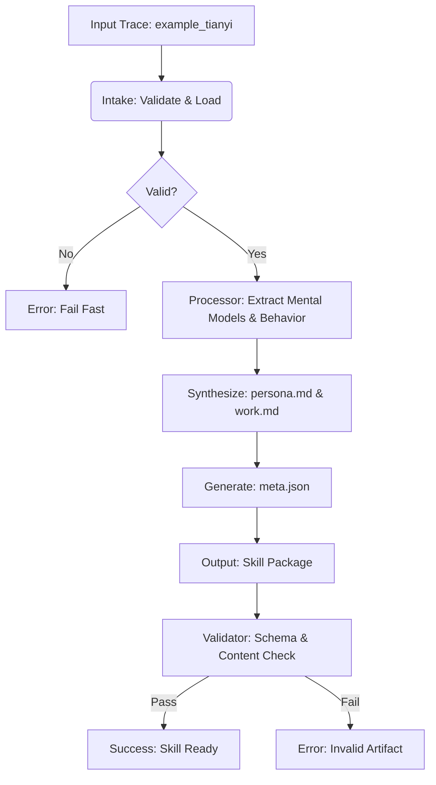

# Data Model: Automated AI Skill Generation via Expert Knowledge Distillation

## Overview

This document defines the data model for the "Skill Package" generated by the COLLEAGUE.SKILL distillation pipeline. The model consists of three primary files: `meta.json`, `persona.md`, and `work.md`. The structure is strictly defined by the `contracts/skill_package.schema.yaml` (JSON Schema) to ensure validity and portability.

## Single Source of Truth (SSoT)

*   **Contract Definition**: `contracts/skill_package.schema.yaml` is the **Single Source of Truth** for the schema.
*   **Implementation Reference**: `tools/skill_schema.py` is the Python implementation of the schema. It **must be generated from or manually synced to match** the YAML contract to ensure consistency.
*   **Validation**: The `validation/schema_validator.py` uses the YAML contract (or its Python equivalent) to validate artifacts.

## Entities

### 1. Skill Package (Directory)
A versioned directory containing the three artifact files.
*   **Path**: `skills/<skill_id>/`
*   **Contents**: `meta.json`, `persona.md`, `work.md`

### 2. meta.json
Metadata file describing the skill package.
*   **Format**: JSON
*   **Schema**: Defined in `contracts/skill_package.schema.yaml`
*   **Key Fields**:
    *   `skill_id`: Unique identifier (UUID or string).
    *   `version`: Semantic version string (e.g., "1.0.0").
    *   `source`: Reference to the input dataset (e.g., "example_tianyi").
    *   `created_at`: ISO 8601 timestamp.
    *   `distillation_method`: String describing the method used (e.g., "template-based extraction").

### 3. persona.md
Markdown file containing the "Capability Track" and "Bounded Behavior Track".
*   **Format**: Markdown
*   **Structure**:
    *   **Header**: Skill Name, Version, Source.
    *   **Capability Track**:
        *   `Mental Models`: List of core principles.
        *   `Heuristics`: List of decision rules.
        *   `Knowledge Base`: Key facts or domains.
    *   **Bounded Behavior Track**:
        *   `Communication Style`: Tone, phrasing, preferred formats.
        *   `Interaction Rules`: Constraints on behavior (e.g., "Never do X").
        *   `Edge Case Handling`: How to handle unknown or ambiguous inputs.
*   **Validation**: Must contain at least 3 distinct sections under "Heuristics" or "Mental Models" (SC-004). **Note**: Validation uses **Keyword Density** and **Section Presence** as a syntactic proxy for content.

### 4. work.md
Markdown file containing the distilled "work" or "output" examples.
*   **Format**: Markdown
*   **Structure**:
    *   **Examples**: 3+ distinct decision heuristics or interaction rules derived from the input trace.
    *   **Context**: Brief description of the scenario for each example.
    *   **Outcome**: The expected result or behavior.

## Data Flow

## Constraints

*   **Immutability**: Once generated, the Skill Package files should not be modified.
*   **Versioning**: Each package must have a unique `version` and `skill_id`.
*   **Format**: `meta.json` must be valid JSON; `persona.md` and `work.md` must be valid Markdown.
*   **Content**: `persona.md` must contain at least 3 distinct heuristics (SC-004) as measured by **Keyword Density/Section Presence**.
*   **Schema Consistency**: `tools/skill_schema.py` must be kept in sync with `contracts/skill_package.schema.yaml`.